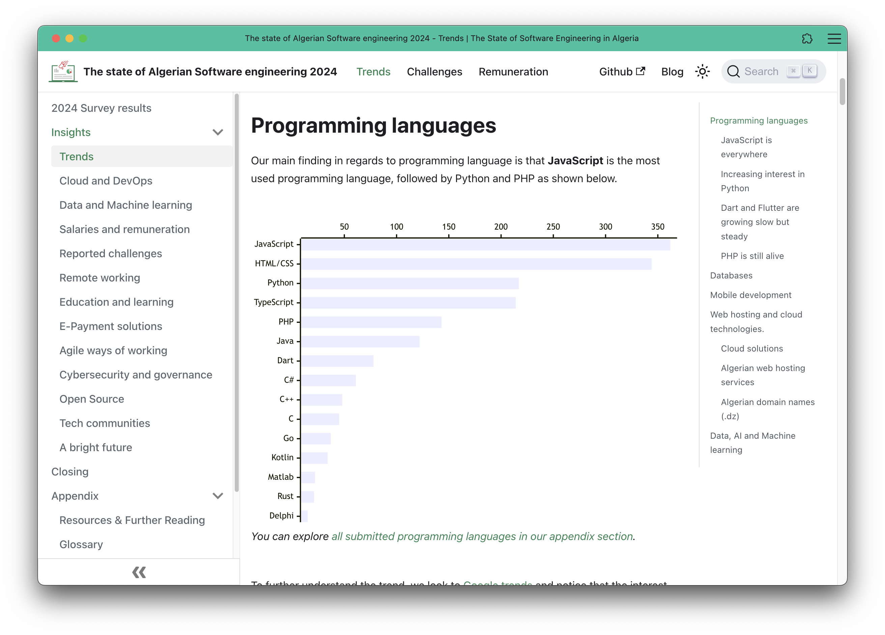

# The state of Algerian Software engineering 2024

Welcome to the official repository for [**The state of Algerian Software engineering 2024** (state-of-algeria.dev)](https://state-of-algeria.dev/) report and website.

This project is dedicated to providing a comprehensive overview of the software engineering landscape in Algeria as of 2024. The report aims to capture key trends, challenges, and opportunities in the Algerian software engineering sector, serving as a valuable resource for developers, companies, educators, and policymakers.

We based this study on a survey we ran from February to March 2024, where we collected inputs from 517 participants. Then we conducted several interviews with experts and different actors in IT fields.

The report is published as a website ([state-of-algeria.dev](https://state-of-algeria.dev/)), and we are working on providing a PDF summary for it.

> [!TIP]
> The website is also available as a [progressive web app (PWA)](https://developer.mozilla.org/en-US/docs/Web/Progressive_web_apps/Guides/What_is_a_progressive_web_app) and it can be browsed offline
> 

We intentionally used [MermaidJS](https://mermaid.js.org/) for plots and graphs to make content translatable and searchable by website users, and to make it easier for us in code-reviews, also, it's fun to work with!

## About this repository

This repository contains the website's content under [`website`](https://github.com/Fcmam5/state-of-dz-swe-2024/tree/master/website) directory.

The website is build with [`Docusaurus`](https://docusaurus.io/), a framework that just makes sense. 

We used it for different reasons:

1. Easy setup, with a comprehensive documentation.
2. Allows to both use Markdown and React. Markdown made it easier convenient to just focus on writing the content and not caring much about the website's structure. And React made things flexible enough when needed.
3. It had enough tools and integrations to get the job done (e.g. Algolia and Mermaid libraries).
4. Developers, who are our main target audience, are (or should be) used to navigate in documentation websites, or some OSS books online, and we wanted to provide the same UX to them.

In the second folder ([`data-processing`](https://github.com/Fcmam5/state-of-dz-swe-2024/tree/master/data-processing)) I shamelessly pushed some dirty and hacky scripts I used to perform some operations, transformations and formatting to markdown or Mermaid graphs.

Some data science was done by my brother [Oussama Fortas](https://github.com/spertch9a), and he pushed its code on a private repository.

## Support

If you want to support this initiative, head to our support page: https://state-of-algeria.dev/support (since you're on Github: [`website/src/pages/support.md`](website/src/pages/support.md))

You can donate through the platforms we linked to in that page, or on this repository's sponsor button.

## Contributing

We would like to freeze the content for this first edition, we appreciate your feedback and we are collecting it from different sources (social media, [our feedback page](https://state-of-algeria.dev/feedback), etc).

If you want to improve our website's usability, SEO, etc. Please [create a Github issue](https://github.com/Fcmam5/state-of-dz-swe-2024/issues/new).

And if you want to extend our content, please contact us first and we see how to incorporate your contribution. It would most likely be published in an appendix or as a page in our blog (https://state-of-algeria.dev/blog).

### Help us spread the word about this project, and start conversations around it

Please use `#dzDevSurvey24` and/or tag me (Abdeldjalil Fortas, or "Fcmam5") when you start a discussion about one of the topic we brought in this report.

If you are a content creator, and you mentioned our work, please link to it [here in `mentions-and-discussions.md` file](website/src/pages/mentions-and-discussions.md), it will appear in: https://state-of-algeria.dev/mentions-and-discussions

## License

This project is licensed under the [MIT License](./LICENSE).