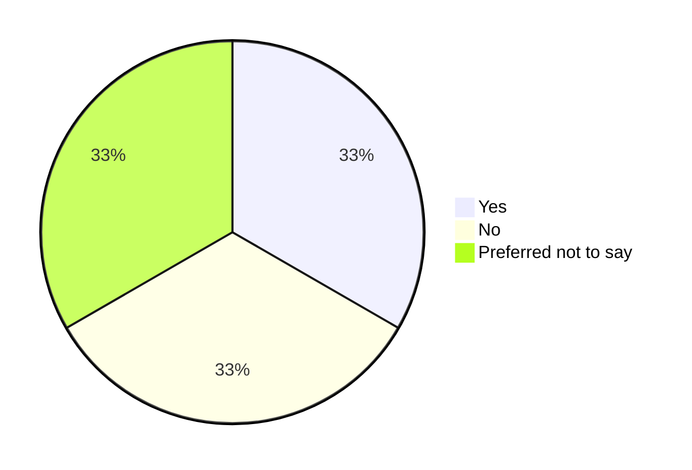

After one month of [starting this initiative](/blog/kickstart-survey-2024), we come to end for this first sprint of collecting input.

We want to thank each and every one of you who participated, shared our links or gave constructive feedback.

Thanks to all who endorsed this initiative and shared it on their social media with their networks, and many thanks to all people who feedbacked the first drafts and iterations of the forms.

With this first sprint coming to an end, we are thrilled to start the second (and most fun 🤓) part of our study: Cleaning up, then analyzing the data, then hopefully presented to you in a nice format in this website.

<!-- truncate -->

## What's next?

In order to provide good insights, we want to go through each entry and cleanup fake or non-meaningful entries. After the cleanup phase, we want to merge inputs from all 3 forms programmatically then start processing them.

Our survey used Google Forms, and we ran the research with 3 forms, one for each language ([Arabic](https://forms.gle/gZWWXLC9Gh1d1BJFA), [English](https://forms.gle/CCks5wiEXB7MgBqV7), and [French](https://forms.gle/D9GLGqS7bR3qQr43A)), therefor we have to merge them, then translate them to one language to make clustering and aggregation possible for us.

This second phase of clustering should produce our first output: A page for graphs per question (exactly as we were watching on our Google Forms UI).

Since that page won't be enough, we want to go an extra mile and run analysis to extract insights by clustering data. We want to answer questions like: 

- What's the most used programming language? 
- Do Algerians with no degrees in IT get paid as well as IT graduates?
- What roles IT are missing?
- Do Algerians move to other Wilayas for a job in IT? What perks (besides the salary) their jobs offer?

Some answers cannot be answered with our data sample only, so we will need to interview experts who are working in the Algerian market, and/or have a long experience working in IT fields in Algeria. And that would be our phase three.

Then in the last phase, we will draft a document in this website and publish it publicly.

## When are we gonna publish the results?

That's one of the most frequent questions we had, and the answer is: Hopefully by Ramdhan, mid-March 2024.

This work will take time, and we all have jobs and personal responsibilities which prevents us from pushing more for this project to deliver it sooner.

## Where will we publish the results? 

The results will be published in [this](https://fcmam5.me/state-of-dz-swe-2024/) (https://fcmam5.me/state-of-dz-swe-2024/) website.

## In which format?

Results format will be textual, tabular and in graphs.

Example

**Do you live in Algeria?**

|        Label         | Count |
| :------------------: | :---: |
|         Yes          |   1   |
|          No          |   1   |
| Preferred not to say |   1   |

## How can I support?

You can support us by contributing to [this initiative's repository](https://github.com/Fcmam5/state-of-dz-swe-2024), by fixing typos, or by improving this website.

You can also contribute by asking questions you think our data can answer to have a richer website, and a more interesting analysis for everyone.

And if you want to support me (Abdeldjalil), you are also very welcome to [buy me a coffee](https://ko-fi.com/fcmam5) online, or let's catch up to have a real coffee in Berlin, in Oran or probably anywhere else ☕️🇩🇿.

I refused, and I refuse to sell raw data. The raw answers/entries are not for sale! We stated in our privacy note that we won't share individual answers, and we keep that promise.

## How can I stay notified when new results are published?

When results are ready, I will publish the link to this website again on all of my social media ([@Fcmam5 on Twitter](https://twitter.com/fcmam5), on [LinkedIn](https://www.linkedin.com/in/fcmam5/), and on multiple groups on Facebook).

I wouldn't enable Push notifications, or bother to ask you to insert your email to stay on touch.

----

Until the results are ready, I wish you all happy and fun hacking! May your pipelines be always green 🙏
