# Raw results (charts only)

> *(\*) Answers with "Prefer not to say" or non-meaningful free text inputs were removed*
> 
> *(\*\*)Some questions were MCQ, which explains counts over the total of 517 participant*

## Demographics (1/2)

### What is your age?

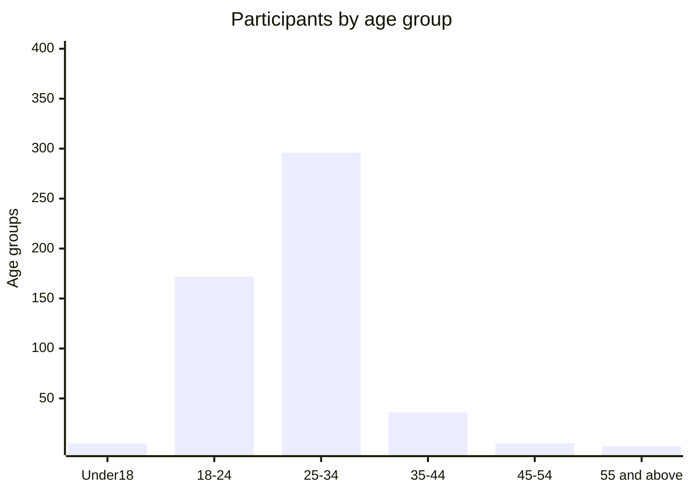
```mermaid
xychart-beta
    title "Participants by age group"
    x-axis [Under 18, "18-24", "25-34", "35-44", "45-54", "55 and above"]
    y-axis "Age groups" 1 --> 400
    bar [5, 172, 296, 36, 5, 2]
```

Table representation (See more!)

| Under 18 | 18-24 yo | 25-34 yo | 35-44 yo | 45-54 yo | 55 yo and above |
| :------: | :------: | :------: | :------: | :------: | :-------------- |
|    5     |   172    |   296    |    36    |    5     | 2               |

### What is your gender?*

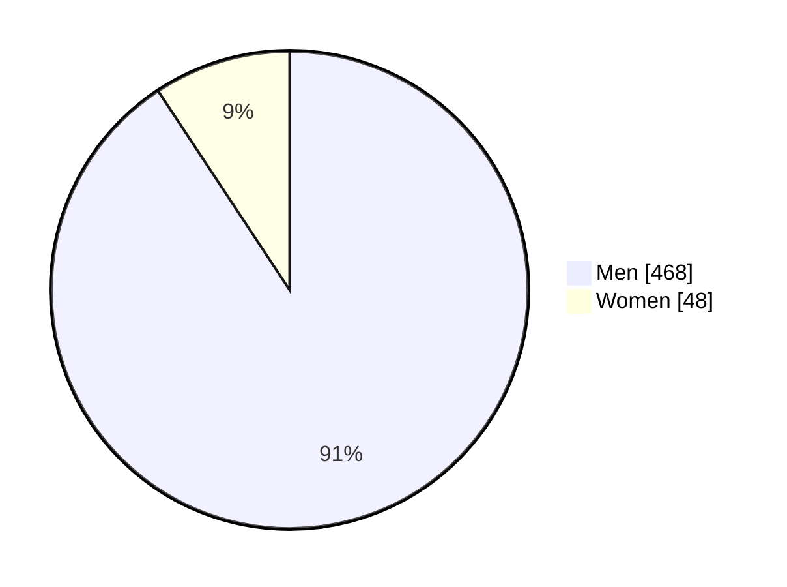
```mermaid
pie showData
    "Men" : 468
    "Women" : 48
```

### What is your highest level of education completed?

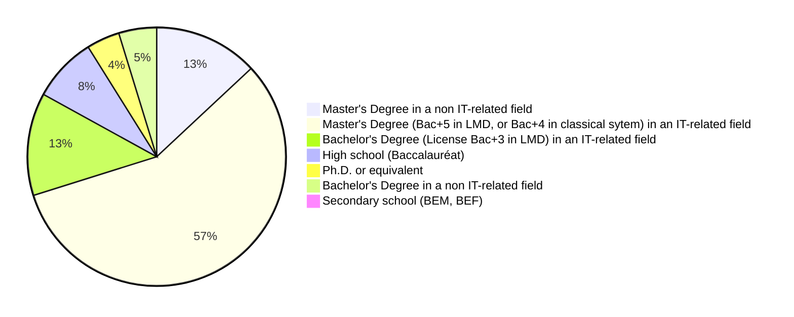
```mermaid
pie
    "Master's Degree in a non IT-related field" : 66
    "Master's Degree (Bac+5 in LMD, or Bac+4 in classical sytem) in an IT-related field" : 289
    "Bachelor's Degree (License Bac+3 in LMD) in an IT-related field" : 65
    "High school (Baccalauréat)" : 41
    "Ph.D. or equivalent" : 21
    "Bachelor's Degree in a non IT-related field" : 24
    "Secondary school (BEM, BEF)" : 2
```

Table representation (See more!)

| Label                                                                              | Count |
| :--------------------------------------------------------------------------------- | :---: |
| Primary school                                                                     |   0   |
| Secondary school (BEM, BEF)                                                        |   2   |
| High school (Baccalauréat)                                                         |  41   |
| Bachelor's Degree (License Bac+3 in LMD) in an IT-related field                    |  65   |
| Bachelor's Degree in a non IT-related field                                        |  24   |
| Master's Degree (Bac+5 in LMD, or Bac+4 in classical sytem) in an IT-related field |  289  |
| Master's Degree in a non IT-related field                                          |  66   |
| Ph.D. or equivalent                                                                |  21   |

###	Do you live in Algeria?

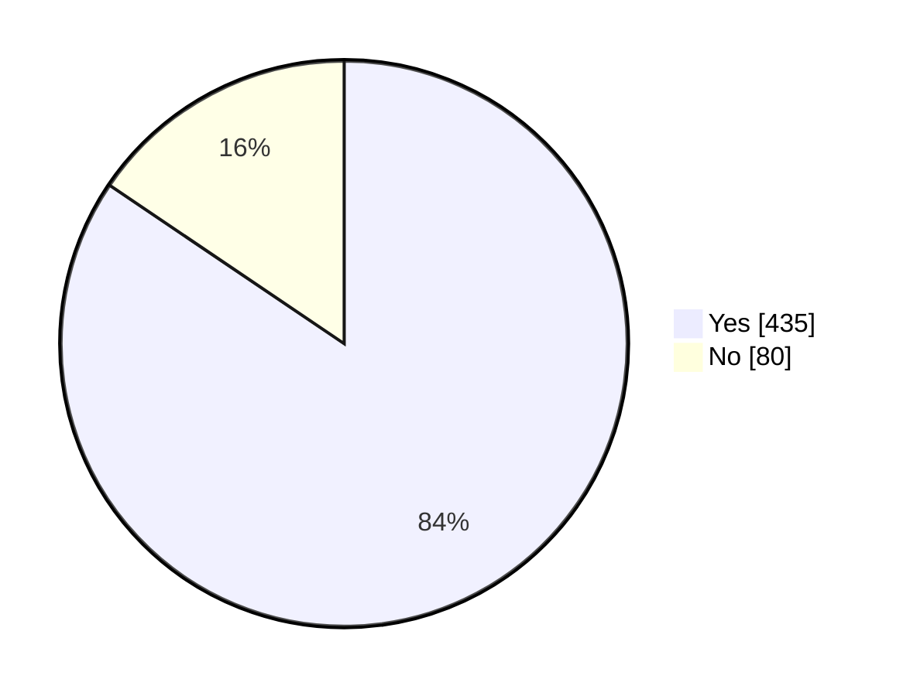
```mermaid
pie showData
    "Yes": 435
    "No": 80
```

## Demographics (2/2): Living abroad

### Where do you live?

<iframe title="[ Insert title here ]" aria-label="Map" id="datawrapper-chart-nGfoY" src="https://datawrapper.dwcdn.net/nGfoY/1/" scrolling="no" frameborder="0" width="100%" height="294" data-external="1"></iframe>

Table representation (See more!)

| Country              | Count |
| :------------------- | :---: |
| Portugal             |   1   |
| Netherlands          |   4   |
| France               |  34   |
| Canada               |   7   |
| Denmark              |   1   |
| Germany              |  12   |
| Saudi Arabia         |   1   |
| Turkey               |   3   |
| United Arab Emirates |   5   |
| Spain                |   1   |
| Luxembourg           |   2   |
| United Kingdom       |   1   |
| Czech Republic       |   1   |
| Belgium              |   1   |
| Ireland (Republic)   |   1   |
| Malaysia             |   1   |
| Austria              |   1   |

### Do you you have an Algerian degree in IT fields?

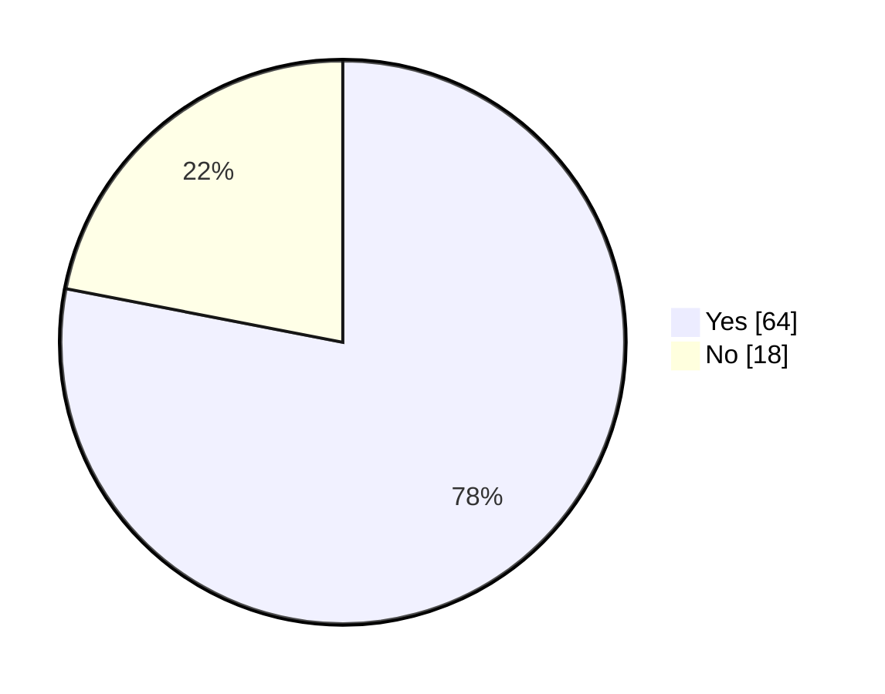
```mermaid
pie showData
    "Yes": 64
    "No": 18
```

###	Did you relocate to study abroad?

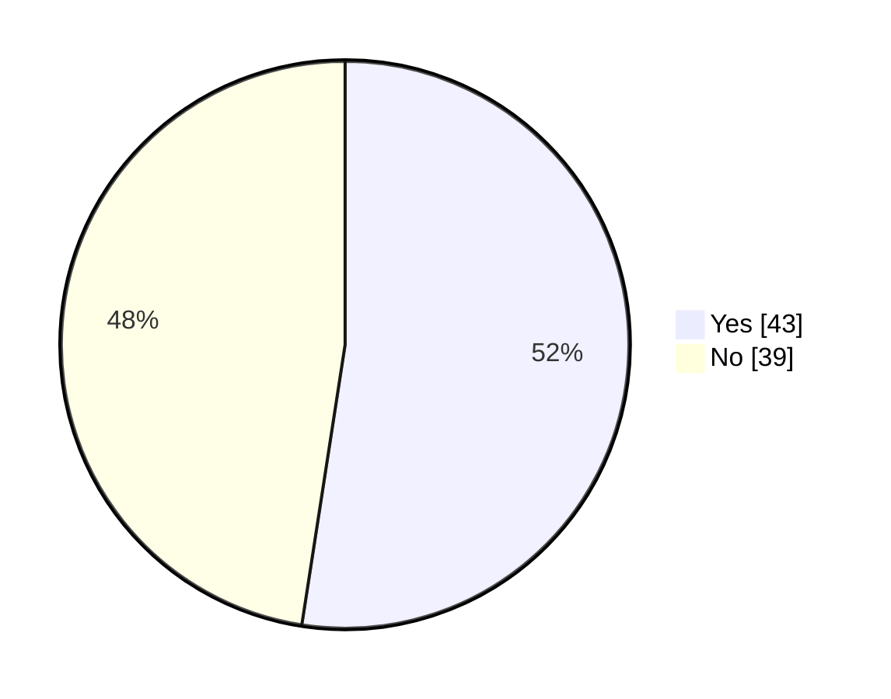
```mermaid
pie showData
    "Yes": 43
    "No": 39
   
```

###	Did you relocate to work abroad?

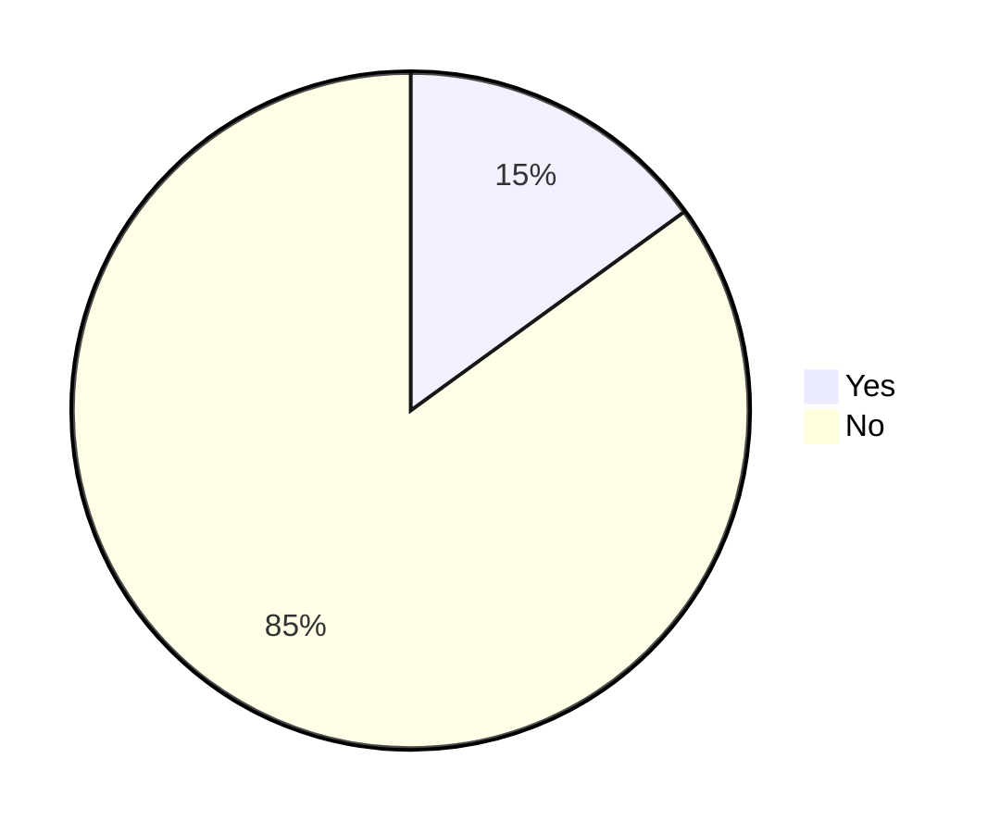
```mermaid
pie
    "Yes": 12
    "No": 68
   
```

## Demographics (2/2): Living in Algeria

### From where do you primarily work?**

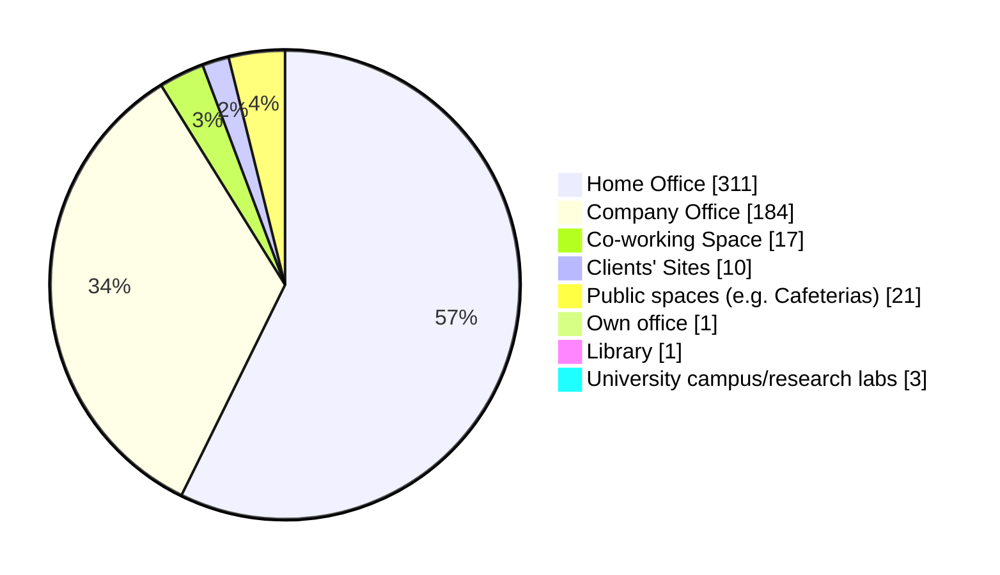
```mermaid
pie showData
    "Home Office" : 311
    "Company Office" : 184
    "Co-working Space" : 17
    "Clients' Sites" : 10
    "Public spaces (e.g. Cafeterias)" : 21
    "Own office" : 1
    "Library" : 1
    "University campus/research labs" : 3
```

### Where do you live (Wilaya)?	

<iframe title="Participants by Wilaya" aria-label="Map" id="datawrapper-chart-yWQh1" src="https://datawrapper.dwcdn.net/yWQh1/1/" scrolling="no" frameborder="0" width="100%" height="693" data-external="1"></iframe>

Table representation (See more!)

| Wilaya             | Count |
| :----------------- | :---: |
| Alger              |  118  |
| Sidi Bel Abbès     |  10   |
| Boumerdès          |   9   |
| Tlemcen            |  11   |
| Oran               |  60   |
| Béjaïa             |   3   |
| Tiaret             |  11   |
| Blida              |  19   |
| Sétif              |  21   |
| Adrar              |   2   |
| Tipaza             |  10   |
| Constantine        |  17   |
| Khenchela          |   1   |
| Médéa              |   8   |
| Naâma              |   1   |
| Chlef              |   5   |
| Skikda             |   4   |
| Mila               |   3   |
| Aïn Defla          |   3   |
| Ghardaïa           |   5   |
| El Oued            |   4   |
| Djelfa             |  14   |
| Bordj Bou Arreridj |   6   |
| Annaba             |  13   |
| Touggourt          |   2   |
| M'Sila             |   7   |
| Relizane           |   7   |
| Tissemsilt         |   2   |
| Jijel              |   7   |
| Ouled Djellal      |   1   |
| Guelma             |   1   |
| El Tarf            |   2   |
| Aïn Témouchent     |   6   |
| Batna              |   5   |
| Ouargla            |   4   |
| Béchar             |   4   |
| Tébessa            |   2   |
| Tizi Ouzou         |   7   |
| Bouira             |   5   |
| El Bayadh          |   1   |
| Biskra             |   3   |
| Souk Ahras         |   1   |
| Mascara            |   1   |
| Saïda              |   3   |
| Mostaganem         |   1   |
| Oum El Bouaghi     |   1   |

### Did you have to travel to that city (wilaya) to work in IT?

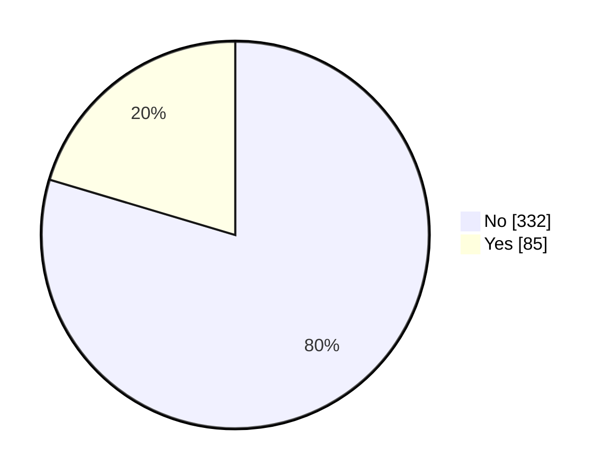
```mermaid
pie showData
    "No" : 332
    "Yes" : 85
```

###	If you find a better opportunity to work in a different city (wilaya), would you relocate?

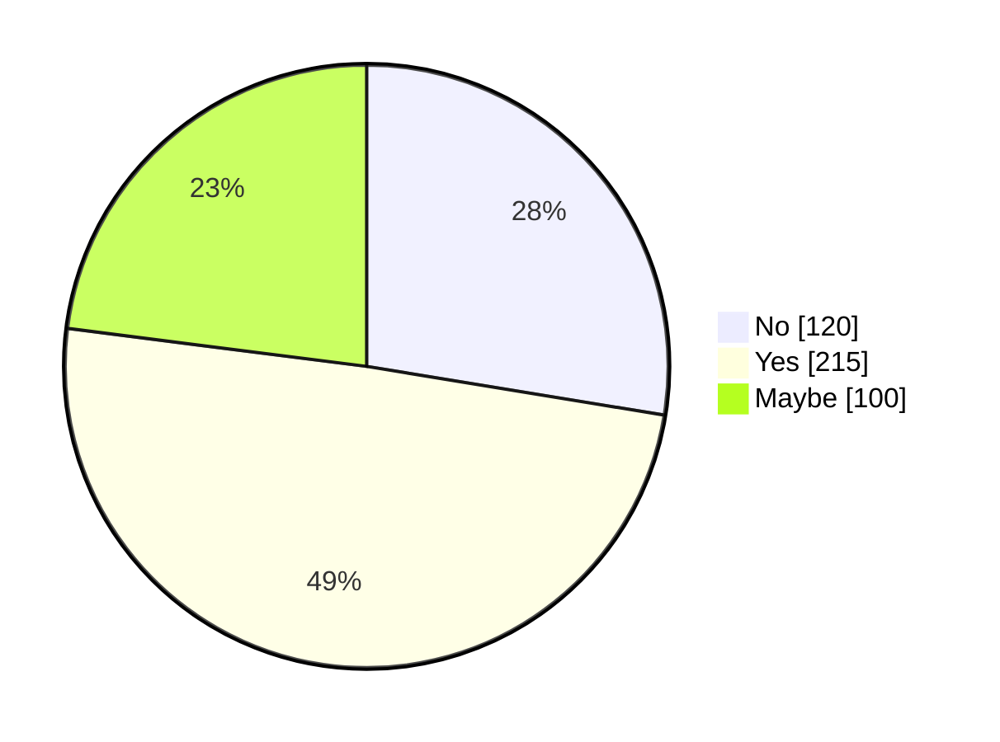
```mermaid
pie showData
    "No" : 120
    "Yes" : 215
    "Maybe" : 100
```

### In addition to your salary, what other benefits or perks do you receive in your current role?**

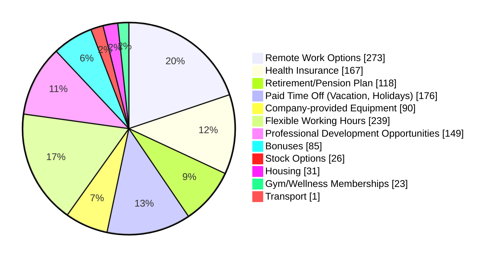
```mermaid
pie showData
    "Remote Work Options" : 273
    "Health Insurance" : 167
    "Retirement/Pension Plan" : 118
    "Paid Time Off (Vacation, Holidays)" : 176
    "Company-provided Equipment" : 90
    "Flexible Working Hours" : 239
    "Professional Development Opportunities" : 149
    "Bonuses" : 85
    "Stock Options" : 26
    "Housing" : 31
    "Gym/Wellness Memberships" : 23
    "Transport" : 1
```
### If you are willing to leave the country, what would be your destination (Leave it empty if not applicable)?**

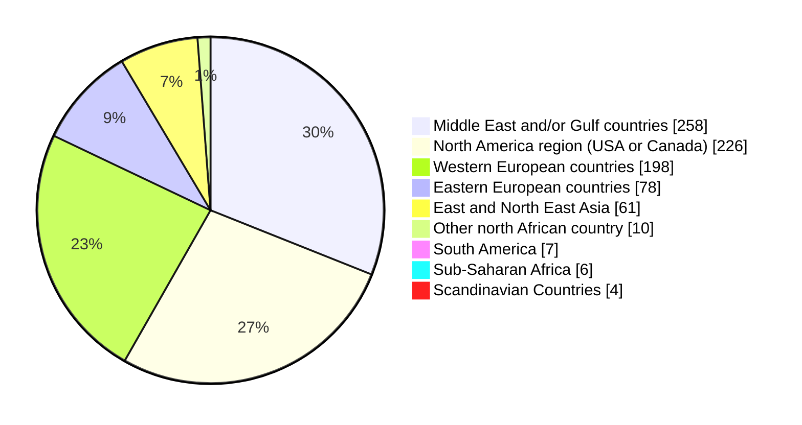
```mermaid
pie showData
    "Middle East and/or Gulf countries" : 258
    "North America region (USA or Canada)" : 226
    "Western European countries" : 198
    "Eastern European countries" : 78
    "East and North East Asia" : 61
    "Other north African country" : 10
    "South America" : 7
    "Sub-Saharan Africa" : 6
    "Scandinavian Countries" : 4
```

Table representation (See more!)

| Region                               | Count |
| :----------------------------------- | :---: |
| Middle East and/or Gulf countries    |  258  |
| North America region (USA or Canada) |  226  |
| Western European countries           |  198  |
| Eastern European countries           |  78   |
| East and North East Asia             |  61   |
| Other north African country          |  10   |
| Australia                            |   2   |
| Netherlands                          |   1   |
| South America                        |   7   |
| Sub-Saharan Africa                   |   6   |
| Scandinavian Countries               |   1   |
| Russia                               |   1   |
| Norway                               |   1   |
| Sweden                               |   1   |
| Swiftzerland                         |   1   |
| Finland                              |   1   |
| Japan                                |   1   |
| China                                |   1   |
| Indonesia                            |   1   |
| England                              |   1   |

## Employment

###	What is your current employment status?**

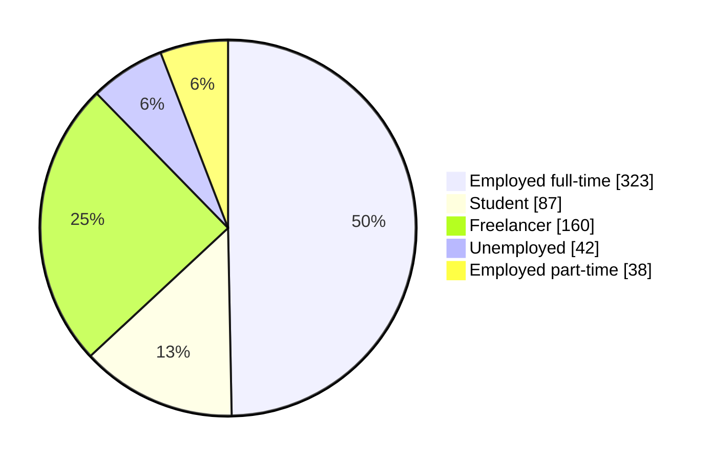
```mermaid
pie showData
    "Employed full-time" : 323
    "Student" : 87
    "Freelancer" : 160
    "Unemployed" : 42
    "Employed part-time" : 38
```

### Which statement is true for your case (choose more than one if you have a hybrid working model)?

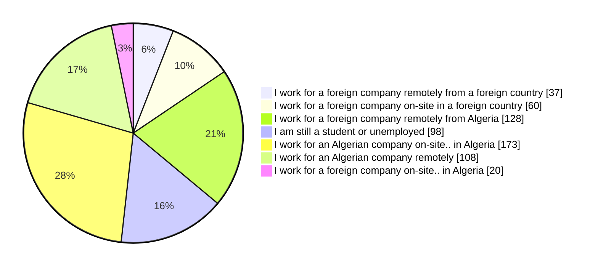
```mermaid
pie showData
    "I work for a foreign company remotely from a foreign country" : 37
    "I work for a foreign company on-site in a foreign country" : 60
    "I work for a foreign company remotely from Algeria" : 128
    "I am still a student or unemployed" : 98
    "I work for an Algerian company on-site.. in Algeria" : 173
    "I work for an Algerian company remotely" : 108
    "I work for a foreign company on-site.. in Algeria" : 20
```

###	What is your current professional level?

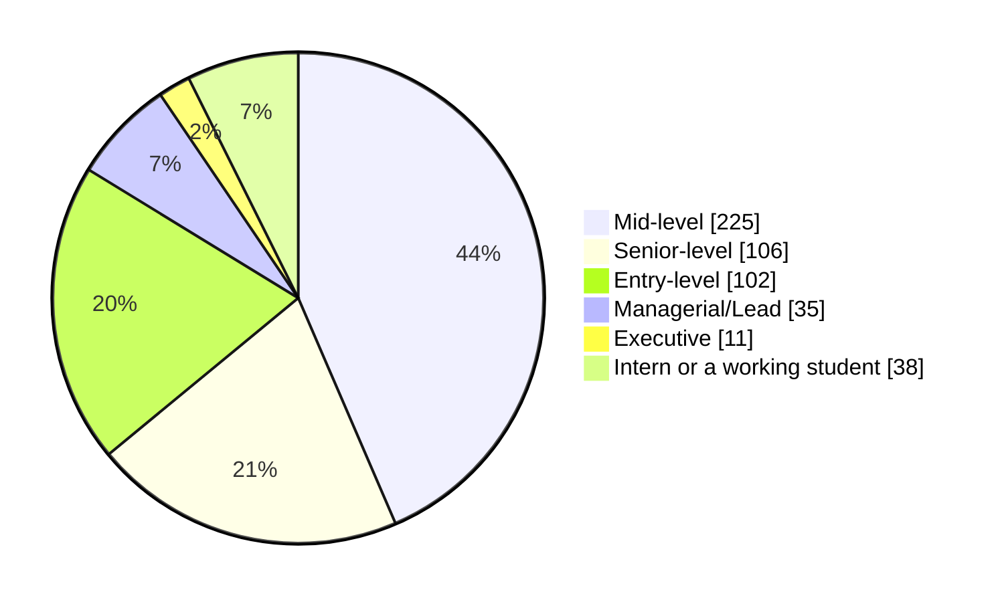
```mermaid
pie showData
    "Mid-level" : 225
    "Senior-level" : 106
    "Entry-level" : 102
    "Managerial/Lead" : 35
    "Executive" : 11
    "Intern or a working student" : 38
```

###	How many years of professional experience do you have in the software engineering field?

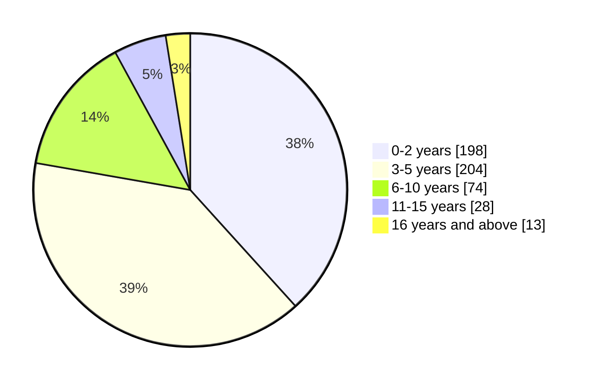
```mermaid
pie showData
    "0-2 years" : 198
    "3-5 years" : 204
    "6-10 years" : 74
    "11-15 years" : 28
    "16 years and above" : 13
```

###	How many people work at your organization, including yourself?

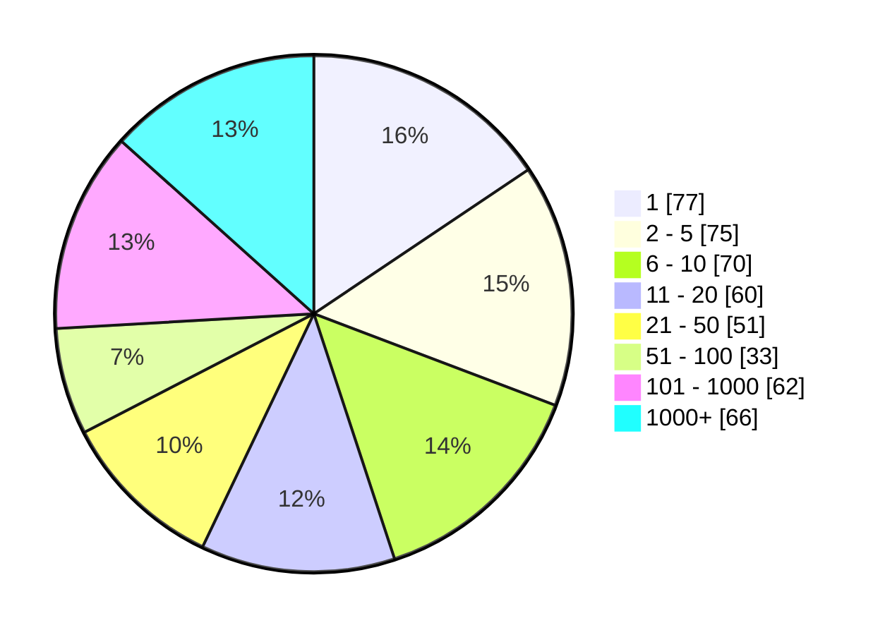
```mermaid
pie showData
    "1" : 77
    "2 - 5" : 75
    "6 - 10" : 70
    "11 - 20" : 60
    "21 - 50" : 51
    "51 - 100" : 33
    "101 - 1000" : 62
    "1000+" : 66
```

###	What's your main role?	

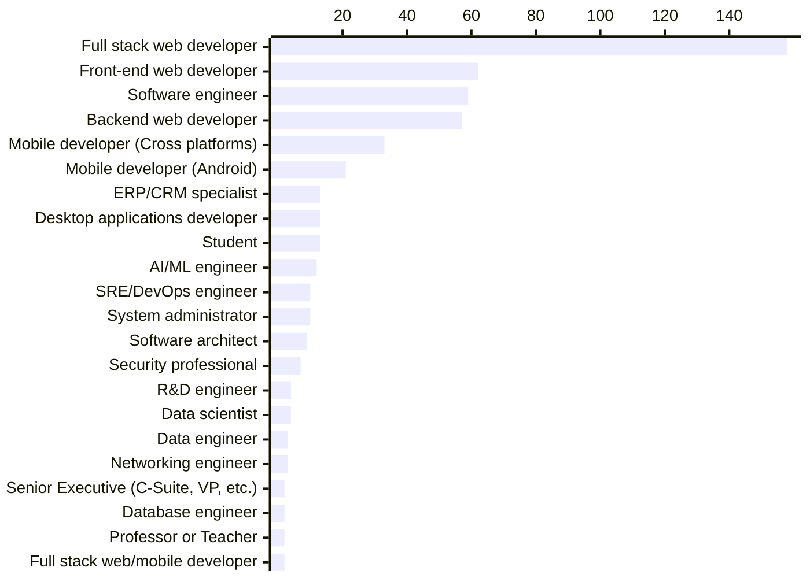
```mermaid
xychart-beta horizontal
  x-axis ["Full stack web developer","Front-end web developer","Software engineer","Backend web developer","Mobile developer (Cross platforms)","Mobile developer (Android)","ERP/CRM specialist","Desktop applications developer","Student","AI/ML engineer","SRE/DevOps engineer","System administrator","Software architect","Security professional","R&D engineer","Data scientist","Data engineer","Networking engineer","Senior Executive (C-Suite, VP, etc.)","Database engineer","Professor or Teacher","Full stack web/mobile developer"]
  bar [158,62,59,57,33,21,13,13,13,12,10,10,9,7,4,4,3,3,2,2,2,2]

```

### If you are working for an Algerian company, What's your average monthly salary in DZD (Algerian dinars)?

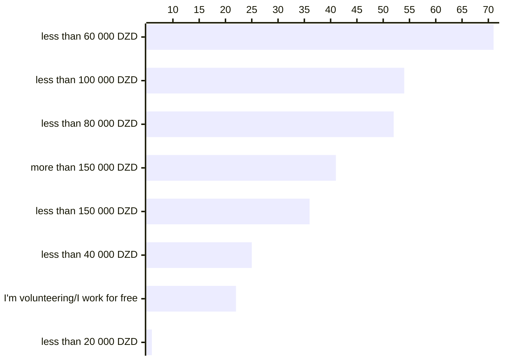
```mermaid
xychart-beta horizontal
  x-axis ["less than 60 000 DZD","less than 100 000 DZD","less than 80 000 DZD","more than 150 000 DZD","less than 150 000 DZD","less than 40 000 DZD","I'm volunteering/I work for free","less than 20 000 DZD"]
  bar [71,54,52,41,36,25,22,6]
```

:::tip

Do you want to understand the corelation between salaries, job titles and years of experience? Check our [remunerations insights page](/docs/insights/remuneration)
:::

### If you are working for a foreign company from Algeria, What's your average yearly gross income in EUR?

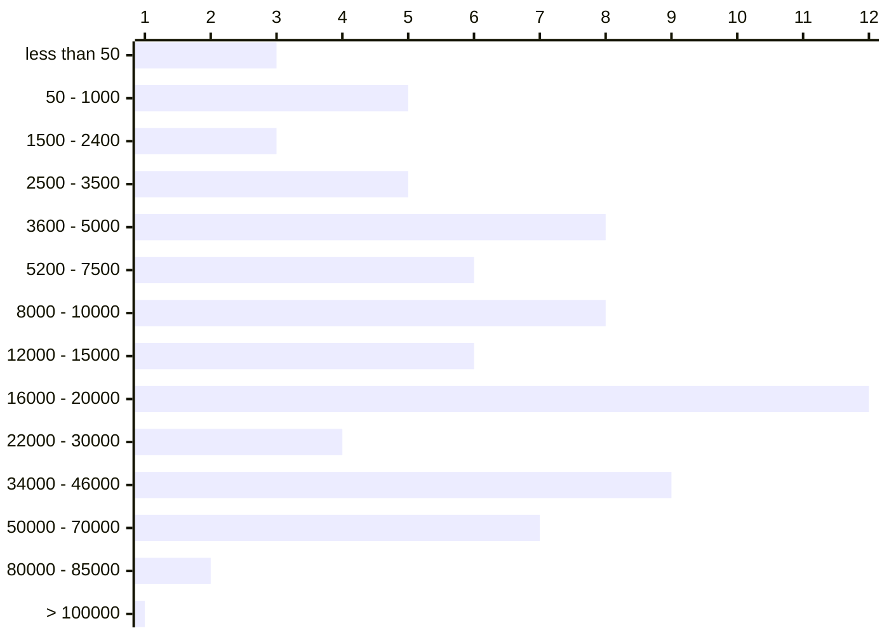
```mermaid
xychart-beta horizontal
  x-axis ["less than 50","50 - 1000","1500 - 2400","2500 - 3500","3600 - 5000","5200 - 7500","8000 - 10000","12000 - 15000","16000 - 20000","22000 - 30000","34000 - 46000","50000 - 70000","80000 - 85000","> 100000"]
  bar [3,5,3,5,8,6,8,6,12,4,9,7,2,1]
```

Table representation (See more!)

| Challenge | Count |
| :-------- | :---: |
| 10        |   1   |
| 20        |   1   |
| 22        |   1   |
| 200       |   1   |
| 800       |   1   |
| 850       |   1   |
| 920       |   1   |
| 1000      |   1   |
| 1500      |   1   |
| 1700      |   1   |
| 2400      |   1   |
| 2500      |   1   |
| 2800      |   1   |
| 3000      |   1   |
| 3400      |   1   |
| 3500      |   1   |
| 3600      |   2   |
| 4000      |   1   |
| 4500      |   2   |
| 5000      |   3   |
| 5200      |   1   |
| 6000      |   4   |
| 7500      |   1   |
| 8000      |   3   |
| 10000     |   5   |
| 12000     |   1   |
| 13000     |   1   |
| 14000     |   1   |
| 15000     |   3   |
| 16000     |   2   |
| 17000     |   1   |
| 18000     |   6   |
| 20000     |   3   |
| 22000     |   1   |
| 28000     |   1   |
| 29000     |   1   |
| 30000     |   1   |
| 34000     |   1   |
| 36000     |   2   |
| 40000     |   3   |
| 42000     |   1   |
| 44000     |   1   |
| 46000     |   1   |
| 50000     |   2   |
| 60000     |   3   |
| 65000     |   1   |
| 70000     |   1   |
| 80000     |   1   |
| 85000     |   1   |
| 300000    |   1   |

### On a scale from 1 to 10, how satisfied are you with your current job in the software engineering field?

```mermaid
xychart-beta
  x-axis ["1","2","3","4","5","6","7","8","9","10"]
  bar [34,14,33,31,58,59,87,104,52,45]

```

### What are the main challenges you face in your role as a software engineer in Algeria?**

```mermaid
pie showData
    "Bad Internet and 4G network coverage" : 232
    "Lack of Recognition or Career Growth Opportunities" : 220
    "Mandatory military service" : 208
    "Banking systems (unclarity on how to pay and receive wages)" : 207
    "Insufficient Government Support for the Tech Industry" : 189
    "Unavailability or unclarity on how to implement Algerian e-payment solutions" : 160
    "Lack of challenging opportunities" : 143
    "Lack of Collaboration Between Academia and Industry" : 136
    "The unfair use of private relations (nepotism; favoritism; etc.) in the hiring process" : 132
    "Limited Access to Advanced Training or Courses" : 132
    "Regulatory or Compliance Challenges (Unclear laws or unregulated activities)" : 104
    "High Workload or Overtime Demands" : 101
    "Challenges in Collaboration and Team Communication" : 97
    "Language Barriers in Professional Communication" : 51
    "Gender Bias or Discrimination" : 40
    "Bad/incompetent management" : 5
    "Low Salary" : 3
    "Market competition for developers (hard to be competitive with remote jobs in hiring)" : 2

```

Table representation (See more!)

| Challenge                                                                                                                                       | Count |
| :---------------------------------------------------------------------------------------------------------------------------------------------- | :---: |
| Bad Internet and 4G network coverage                                                                                                            |  232  |
| Lack of Recognition or Career Growth Opportunities                                                                                              |  220  |
| Mandatory military service                                                                                                                      |  208  |
| Banking systems (unclarity on how to pay and receive wages)                                                                                     |  207  |
| Insufficient Government Support for the Tech Industry                                                                                           |  189  |
| Unavailability or unclarity on how to implement Algerian e-payment solutions                                                                    |  160  |
| Lack of challenging opportunities                                                                                                               |  143  |
| Lack of Collaboration Between Academia and Industry                                                                                             |  136  |
| The unfair use of private relations (nepotism; favoritism; etc.) in the hiring process                                                          |  132  |
| Limited Access to Advanced Training or Courses                                                                                                  |  132  |
| Regulatory or Compliance Challenges (Unclear laws or unregulated activities)                                                                    |  104  |
| High Workload or Overtime Demands                                                                                                               |  101  |
| Challenges in Collaboration and Team Communication                                                                                              |  97   |
| Language Barriers in Professional Communication                                                                                                 |  51   |
| Gender Bias or Discrimination                                                                                                                   |  40   |
| Bad/incompetent management                                                                                                                      |   5   |
| Low Salary                                                                                                                                      |   3   |
| Bad dinars rate compared to other currencies                                                                                                    |   1   |
| Difficulty in billing services for companies                                                                                                    |   1   |
| Market competition for developers (hard to be competitive with remote jobs in hiring)                                                           |   1   |
| You can earn money, but at the end you will not get a quality life (parks, clean neighborhood, good health care, freedom to travel (visas) ...) |   1   |
| Studying in the same time                                                                                                                       |   1   |
| Timezone difference                                                                                                                             |   1   |
| Not having a degree in an IT Field                                                                                                              |   1   |
| Bad work environment                                                                                                                            |   1   |
| Diplomas and graduates from small southern universities are often not taken seriously                                                           |   1   |
| remote work need more and more work permit if you aim other countries                                                                           |   1   |
| Clients not aligning with my principles, like banks or foreign companies offering non-halal products                                            |   1   |

###	How did you get into the field of software engineering or technology?**

```mermaid
pie showData
    "Passion for coding and problem-solving" : 390
    "Interest in technology and innovation" : 307
    "I was assigned to an IT-related branch in university after my baccalauréat (BAC)" : 142
    "Job market demand and opportunities" : 110
    "Financial prospects and earning potential" : 101
    "Influence of friends or family in the industry" : 57
    "Ability to go and work abroad" : 2
    "Ability to go and work remotely" : 1

```

Table representation (See more!)

| Reason                                                                           | Count |
| :------------------------------------------------------------------------------- | :---: |
| Passion for coding and problem-solving                                           |  390  |
| Interest in technology and innovation                                            |  307  |
| I was assigned to an IT-related branch in university after my baccalauréat (BAC) |  142  |
| Job market demand and opportunities                                              |  110  |
| Financial prospects and earning potential                                        |  101  |
| Influence of friends or family in the industry                                   |  57   |
| Ability to go and work abroad                                                    |   2   |
| I was fed up with accounting I wanted to try                                     |   1   |
| Ability to work remotely                                                         |   1   |
| Curiosity                                                                        |   1   |

## Technologies

### Which languages do you frequently use in your work?**

```mermaid
xychart-beta horizontal
  x-axis ["JavaScript","HTML/CSS","SQL","Python","TypeScript","PHP","Bash/Shell (all shells)","Java","Dart","C#","C++","C","PowerShell","Go","Kotlin","MATLAB","Rust","Visual Basic (.Net)","Delphi","Assembly","R","Swift","VBA","Scala","Groovy","Ruby","OCaml","Objective-C","Perl","Lua","Windev","Lisp","Elixir","Solidity","Apex","Haskell","F#"]
  bar [362,344,298,217,214,143,135,122,78,61,48,45,39,37,34,22,21,17,15,14,9,7,6,6,5,4,4,4,3,3,3,3,3,2,2,2,2]
```

Table representation (See more!)

| Language                | Count |
| :---------------------- | :---: |
| JavaScript              |  362  |
| HTML/CSS                |  344  |
| SQL                     |  298  |
| Python                  |  217  |
| TypeScript              |  214  |
| PHP                     |  143  |
| Bash/Shell (all shells) |  135  |
| Java                    |  122  |
| Dart                    |  78   |
| C#                      |  61   |
| C++                     |  48   |
| C                       |  45   |
| PowerShell              |  39   |
| Go                      |  37   |
| Kotlin                  |  34   |
| MATLAB                  |  22   |
| Rust                    |  21   |
| Visual Basic (.Net)     |  17   |
| Delphi                  |  15   |
| Assembly                |  14   |
| R                       |   9   |
| Swift                   |   7   |
| VBA                     |   6   |
| Scala                   |   6   |
| Groovy                  |   5   |
| Ruby                    |   4   |
| OCaml                   |   4   |
| Objective-C             |   4   |
| Perl                    |   3   |
| Lua                     |   3   |
| Windev                  |   3   |
| Lisp                    |   3   |
| Elixir                  |   3   |
| Solidity                |   2   |
| Apex                    |   2   |
| Haskell                 |   2   |
| F#                      |   2   |
| Prolog                  |   1   |
| Oracle                  |   1   |
| LD - FBD                |   1   |
| Fortran                 |   1   |
| Ladder & SCL            |   1   |
| IEC 61131-3 languages   |   1   |
| Erlang                  |   1   |
| Liquid                  |   1   |
| XQuery                  |   1   |
| XSLT                    |   1   |
| Clojure                 |   1   |
| GDScript                |   1   |
| solidity                |   1   |
| X++                     |   1   |
| Verilog                 |   1   |
| VHDL                    |   1   |

###	Which database engines do you commonly work with?**

```mermaid
pie showData
    "MySQL" : 337
    "PostgreSQL" : 296
    "MongoDB" : 207
    "SQLite" : 154
    "Redis" : 96
    "Firebase Realtime Database" : 93
    "Microsoft SQL Server" : 88
    "MariaDB" : 86
    "Oracle Database" : 65
    "Elasticsearch" : 50
    "Cassandra" : 15
    "Dynamodb" : 14
    "Neo4J" : 10
    "Snowflake" : 8
```

Table representation (See more!)

| Database                   | Count |
| :------------------------- | :---: |
| MySQL                      |  337  |
| PostgreSQL                 |  296  |
| MongoDB                    |  207  |
| SQLite                     |  154  |
| Redis                      |  96   |
| Firebase Realtime Database |  93   |
| Microsoft SQL Server       |  88   |
| MariaDB                    |  86   |
| Oracle Database            |  65   |
| Elasticsearch              |  50   |
| Cassandra                  |  15   |
| Dynamodb                   |  14   |
| Neo4J                      |  10   |
| Snowflake                  |   8   |
| BigQuery                   |   3   |
| Firebird                   |   1   |
| sembast                    |   1   |
| Microsoft Dataverse        |   1   |
| Plsql                      |   1   |
| hfsql                      |   1   |
| Databricks                 |   1   |
| Hive                       |   1   |
| cloud firestore            |   1   |
| Salesforce DB              |   1   |
| rethinkDb                  |   1   |
| eXist-db                   |   1   |
| SDP                        |   1   |
| Apache HBase               |   1   |
| InfluxDB                   |   1   |
| Milvus                     |   1   |
| DuckDB                     |   1   |

### If applicable, which web hosting services do you use?	

```mermaid
pie showData
    "Cloud Hosting (e.g. AWS, Azure, GCP)" : 246
    "Non-Algerian VPS or Shared hosting providers" : 168
    "I use my own, or my organization's servers" : 154
    "Algerian hosting service providers" : 68
```

Table representation (See more!)

| Hosting solution                             | Count |
| :------------------------------------------- | :---: |
| Cloud Hosting (e.g. AWS; Azure; GCP)         |  246  |
| Non-Algerian VPS or Shared hosting providers |  167  |
| I use my own; or my organization's servers   |  154  |
| Algerian hosting service providers           |  68   |
| Firebase                                     |   2   |
| DigitalOcean                                 |   1   |
| Heroku                                       |   1   |
| Vercel                                       |   1   |
| Netlify                                      |   1   |
| Railway                                      |   1   |

### Which web frameworks do you use?

```mermaid
xychart-beta horizontal
  x-axis ["React","Next.js","Express","Laravel","Django","Vue.js","jQuery","WordPress","NestJS","Angular","Spring Boot","Flask","FastAPI","ASP.NET CORE","Nuxt.js","ASP.NET","Svelte","AngularJS","Symfony","Blazor","CodeIgniter","Fastify","Remix","Ruby on Rails","Gatsby","Odoo","Phoenix","Lit","Solid.js","Alpinejs","livewire","Deno","Qwik","Drupal"]
  bar [261,155,141,122,103,95,74,71,64,62,52,44,43,35,25,24,20,18,17,12,9,7,7,5,4,4,3,3,3,2,2,2,2,2]
```

Table representation (See more!)

| Framework/Library                           | Count |
| :------------------------------------------ | :---: |
| React                                       |  261  |
| Next.js                                     |  155  |
| Express                                     |  141  |
| Laravel                                     |  122  |
| Django                                      |  103  |
| Vue.js                                      |  95   |
| jQuery                                      |  74   |
| WordPress                                   |  71   |
| NestJS                                      |  64   |
| Angular                                     |  62   |
| Spring Boot                                 |  52   |
| Flask                                       |  44   |
| FastAPI                                     |  43   |
| ASP.NET CORE                                |  35   |
| Nuxt.js                                     |  25   |
| ASP.NET                                     |  24   |
| Svelte                                      |  20   |
| AngularJS                                   |  18   |
| Symfony                                     |  17   |
| Blazor                                      |  12   |
| CodeIgniter                                 |   9   |
| Fastify                                     |   7   |
| Remix                                       |   7   |
| Ruby on Rails                               |   5   |
| Gatsby                                      |   4   |
| Odoo                                        |   4   |
| Phoenix                                     |   3   |
| Lit                                         |   3   |
| Solid.js                                    |   3   |
| Alpinejs                                    |   2   |
| livewire                                    |   2   |
| Deno                                        |   2   |
| Qwik                                        |   2   |
| Drupal                                      |   2   |
| Yii                                         |   2   |
| JSF                                         |   1   |
| Qt                                          |   1   |
| Java EE                                     |   1   |
| Hugo                                        |   1   |
| Quasar                                      |   1   |
| Vuetify                                     |   1   |
| hibernate                                   |   1   |
| Poem (Rust)                                 |   1   |
| Astro                                       |   1   |
| HTMX                                        |   1   |
| Honojs                                      |   1   |
| AdonisJS                                    |   1   |
| hapi.js                                     |   1   |
| Nativescript                                |   1   |
| ASP .NET Framework                          |   1   |
| Scrapy                                      |   1   |
| QT                                          |   1   |
| Magento                                     |   1   |
| Web components (we built our own framework) |   1   |

### Which mobile development frameworks/languages do you use?	

```mermaid
pie showData
    "Flutter" : 132
    "React Native" : 118
    "HTML/CSS and JavaScript for PWA" : 71
    "Android with Java" : 59
    "Android with Kotlin" : 46
    "Swift" : 16
    "Xamarin (C#)" : 12
    "Ionic" : 6
    "Objective C" : 5
```

Table representation (See more!)

| Framework/Language              | Count |
| :------------------------------ | :---: |
| Flutter                         |  132  |
| React Native                    |  118  |
| HTML/CSS and JavaScript for PWA |  71   |
| Android with Java               |  59   |
| Android with Kotlin             |  46   |
| Swift                           |  16   |
| Xamarin (C#)                    |  12   |
| Ionic                           |   6   |
| Objective C                     |   5   |
| Capacitor                       |   2   |
| Qt                              |   1   |
| Maui                            |   1   |
| Nativescript                    |   1   |

### If you build Desktop applications, what technologies do you use?	

```mermaid
pie showData
    "Electron" : 98
    "JavaFX" : 51
    "Java Swing" : 45
    ".NET Core" : 42
    "WPF (Windows Presentation Foundation)" : 28
    "Tkinter (Python)" : 27
    "WinForms (Windows Forms)" : 27
    "Qt" : 21
    "Delphi" : 21
    "WinDev" : 17
    "Tauri" : 12
    "Kivy (Python)" : 8
    "Flutter" : 8
```

Table representation (See more!)

| Framework/Language                    | Count |
| :------------------------------------ | :---: |
| Electron                              |  98   |
| JavaFX                                |  51   |
| Java Swing                            |  45   |
| .NET Core                             |  42   |
| WPF (Windows Presentation Foundation) |  28   |
| Tkinter (Python)                      |  27   |
| WinForms (Windows Forms)              |  27   |
| Qt                                    |  21   |
| Delphi                                |  21   |
| WinDev                                |  17   |
| Tauri                                 |  12   |
| Kivy (Python)                         |   8   |
| Flutter                               |   8   |
| PyQT                                  |   3   |
| GTK (GIMP Toolkit)                    |   3   |
| Kotlin                                |   2   |
| Cocoa (macOS)                         |   1   |
| PySide2 (Qt python)                   |   1   |
| WxWidgets                             |   1   |

### Which e-payment solution did you use?

```mermaid
xychart-beta horizontal
  x-axis ["Stripe","SATIM API","Chargily","SLICK-PAY","Paypal","Baridimob","Paddle","Guiddini"]
  bar [147,68,41,12,5,3,2,1]
```

Table representation (See more!)

| Solution          | Count |
| :---------------- | :---: |
| Stripe            |  147  |
| SATIM API 🇩🇿       |  68   |
| Chargily 🇩🇿        |  41   |
| SLICK-PAY 🇩🇿       |  12   |
| Paypal            |   5   |
| Baridimob 🇩🇿       |   3   |
| Paddle            |   2   |
| CIC               |   1   |
| Tap               |   1   |
| Paysera           |   1   |
| Guiddini 🇩🇿        |   1   |
| Lemon Squeezy     |   1   |
| Thawani           |   1   |
| Sellix            |   1   |
| Binance           |   1   |
| Algerie Poste API |   1   |
| Mangopay          |   1   |

### How would you describe your involvement with open source software development?

```mermaid
pie showData
    "Regular user of open source tools/libraries" : 189
    "Passive observer, but not actively involved" : 145
    "No involvement in open source projects" : 116
    "Active contributor to open source projects" : 48
    "I'm not familiar with open source software" : 19
```

Table representation (See more!)

| Answer                                      | Count |
| :------------------------------------------ | :---: |
| Regular user of open source tools/libraries |  189  |
| Passive observer, but not actively involved |  145  |
| No involvement in open source projects      |  116  |
| Active contributor to open source projects  |  48   |
| I'm not familiar with open source software  |  19   |

## DevOps

###	Which software development methodology you, or your organization use?	

```mermaid
xychart-beta horizontal
  x-axis ["Scrum","We don't follow any specific methodology","I don't work in teams","Kanban","Other Agile methodologies","Extreme Programming (XP)","Waterfall","Scrumban","SAFe"]
  bar [205,113,76,43,36,19,8,8,3]

```

Table representation (See more!)

| Answer                                   | Count |
| :--------------------------------------- | :---: |
| Scrum                                    |  205  |
| We don't follow any specific methodology |  113  |
| I don't work in teams                    |  76   |
| Kanban                                   |  43   |
| Other Agile methodologies                |  36   |
| Extreme Programming (XP)                 |  19   |
| Waterfall                                |   8   |
| Scrumban                                 |   8   |
| SAFe                                     |   3   |

### Which online collaboration tools you use for work?	

```mermaid
xychart-beta horizontal
  x-axis ["Github projects","Jira","Slack","Google Docs","Instant messaging applications","Trello","Microsoft teams","Notion","Microsoft 365 suite","Confluence","My company's internal tools","Skype","ClickUp","Discord","Azure DevOps","Gitlab","Asana","Odoo","Zoho","Shortcut","Teamwork.com","Google Meet"]
  bar [191,187,166,141,136,122,100,97,73,63,61,26,21,12,4,3,3,3,3,2,2,2]
```

Table representation (See more!)

| Tool                                                                         | Count |
| :--------------------------------------------------------------------------- | :---: |
| Github projects                                                              |  191  |
| Jira                                                                         |  187  |
| Slack                                                                        |  166  |
| Google Docs                                                                  |  141  |
| Instant messaging applications (Facebook Messenger, WhatAapp, Telegram, etc) |  136  |
| Trello                                                                       |  122  |
| Microsoft teams                                                              |  100  |
| Notion                                                                       |  97   |
| Microsoft 365 suite                                                          |  73   |
| Confluence                                                                   |  63   |
| My company's internal communication tools                                    |  61   |
| Skype                                                                        |  26   |
| ClickUp                                                                      |  21   |
| Discord                                                                      |  12   |
| Azure DevOps                                                                 |   4   |
| Gitlab                                                                       |   3   |
| Asana                                                                        |   3   |
| Odoo                                                                         |   3   |
| Zoho                                                                         |   3   |
| Shortcut                                                                     |   2   |
| Teamwork.com                                                                 |   2   |
| Google Meet                                                                  |   2   |
| Workplace                                                                    |   1   |
| Google spaces                                                                |   1   |
| Wekan                                                                        |   1   |
| Lucidchart                                                                   |   1   |
| bitrix                                                                       |   1   |
| Linear                                                                       |   1   |
| Freelance platforms built-in chats (e.g: Upwork)                             |   1   |
| Rocket.Chat                                                                  |   1   |
| Microsoft TFS                                                                |   1   |
| Taiga                                                                        |   1   |
| Microsoft To Do                                                              |   1   |
| Backstage                                                                    |   1   |
| Monday                                                                       |   1   |
| Miro                                                                         |   1   |
| YouTrack                                                                     |   1   |
| Mattermost                                                                   |   1   |
| Whereby                                                                      |   1   |

### Which cloud providers do you primarily use?

```mermaid
xychart-beta horizontal
  x-axis ["Amazon Web Services (AWS)","Google Cloud Platform (GCP)","Vercel","Microsoft Azure","DigitalOcean","Heroku","Oracle Cloud","IBM Cloud or Watson","OVHcloud","Alibaba Cloud","OpenShift","Contabo","Salesforce","Vultr","Hostinger","Hetzner"]
  bar [168,117,101,92,60,44,14,8,5,4,3,2,2,2,2,2]
```

Table representation (See more!)

| Cloud service               | Count |
| :-------------------------- | :---: |
| Amazon Web Services (AWS)   |  168  |
| Google Cloud Platform (GCP) |  117  |
| Vercel                      |  101  |
| Microsoft Azure             |  92   |
| DigitalOcean                |  60   |
| Heroku                      |  44   |
| Oracle Cloud                |  14   |
| IBM Cloud or Watson         |   8   |
| OVHcloud                    |   5   |
| Alibaba Cloud               |   4   |
| OpenShift                   |   3   |
| Contabo                     |   3   |
| Salesforce                  |   2   |
| Vultr                       |   2   |
| Hostinger                   |   2   |
| Hetzner                     |   2   |
| Internal infra              |   1   |
| Scaleway                    |   1   |
| IONOS                       |   1   |
| Jelastic                    |   1   |
| PythonAnywhere              |   1   |
| Octenium                    |   1   |
| NameCheap                   |   1   |
| Cloudways                   |   1   |
| NextCloud                   |   1   |
| Cloudflare                  |   1   |
| Icosnet Cloud               |   1   |
| Laravel Vapor               |   1   |
| HUAWEI CLOUD                |   1   |
| Infomaniak                  |   1   |
| Netlify                     |   1   |
| A2                          |   1   |

### Which version control systems do you primarily use for managing your software projects?	

```mermaid
xychart-beta horizontal
  x-axis ["Git","We don't use any VCS at work","SVN (Subversion)","Mercurial","PTFs"]
  bar [471,35,5,3,1]
```

Table representation (See more!)

| VCS                                                         | Count |
| :---------------------------------------------------------- | :---: |
| Git                                                         |  471  |
| We don't use any VCS at work                                |  35   |
| SVN (Subversion)                                            |   5   |
| Mercurial                                                   |   3   |
| [PTFs](https://en.wikipedia.org/wiki/Program_temporary_fix) |   1   |

### What tools do you use for deployment and infrastructure provisioning?

```mermaid
xychart-beta horizontal
  x-axis ["Docker","Shell scripts","Kubernetes","Jenkins","Google Cloud Deployment Manager","Terraform","Ansible","Heroku","Puppet","Chef","Internal company tools"]
  bar [266,141,89,62,38,38,34,29,3,2,2]
```

Table representation (See more!)

| Tool                            | Count |
| :------------------------------ | :---: |
| Docker                          |  266  |
| Shell scripts                   |  141  |
| Kubernetes                      |  89   |
| Jenkins                         |  62   |
| Google Cloud Deployment Manager |  38   |
| Terraform                       |  38   |
| Ansible                         |  34   |
| Heroku                          |  29   |
| Puppet                          |   3   |
| Chef                            |   2   |
| Internal company tools          |   2   |
| Azure Piplines                  |   1   |
| Github actions                  |   1   |
| VMWare VMs for ESXi hypervisors |   1   |
| Proxmox                         |   1   |
| Azure devops                    |   1   |
| AWS CDK                         |   1   |
| Laravel Forge                   |   1   |
| Pulumi                          |   1   |
| Vercel                          |   1   |
| I do it manually                |   1   |
| IIS                             |   1   |

### Which CI/CD technology do you use?	

```mermaid
xychart-beta horizontal
  x-axis ["Github Actions","We don't have CI/CD pipelines","GitlabCI","Jenkins","Microsoft Azure DevOps","Bitbucket Pipelines","CircleCI","Travis CI","Ploi","TeamCity","Internal tools","Bitrise","Google Cloud Build","drone.io","Concourse","Buddy.Works","AWS CodePipeline"]
  bar [234,159,71,57,51,22,9,8,4,4,2,2,1,1,1,1,1]
```

Table representation (See more!)

| Tool                          | Count |
| :---------------------------- | :---: |
| Github Actions                |  234  |
| We don't have CI/CD pipelines |  159  |
| GitlabCI                      |  71   |
| Jenkins                       |  57   |
| Microsoft Azure DevOps        |  51   |
| Bitbucket Pipelines           |  22   |
| CircleCI                      |   9   |
| Travis CI                     |   8   |
| Ploi                          |   4   |
| TeamCity                      |   4   |
| Internal tools                |   2   |
| Bitrise                       |   2   |
| Google Cloud Build            |   1   |
| drone.io                      |   1   |
| Concourse                     |   1   |
| Buddy.Works                   |   1   |
| AWS CodePipeline              |   1   |

## Learning and staying up-to-date

### How did you acquire your IT skills in your specific field? And how did you learn to code?

```mermaid
xychart-beta horizontal
  x-axis ["Self-Taught (Books; Documentation; Tutorials)","Formal Education (University)","Online Courses (e.g. Coursera; Udacity)","On-the-Job Training","Coding Bootcamp","Mentorship","Internships","Institute (TS)"]
  bar [445,335,332,167,67,43,1,1]
```

Table representation (See more!)

| Answer                                        | Count |
| :-------------------------------------------- | :---: |
| Self-Taught (Books; Documentation; Tutorials) |  445  |
| Formal Education (University)                 |  335  |
| Online Courses (e.g. Coursera; Udacity)       |  332  |
| On-the-Job Training                           |  167  |
| Coding Bootcamp                               |  67   |
| Mentorship                                    |  43   |
| Internships                                   |   1   |
| Institute (TS)                                |   1   |

###	In which language did you primarily learn and acquire your IT skills?	

```mermaid
xychart-beta horizontal
  x-axis ["English","French","Arabic","Darija (Algerian dialect)","German","Spanish","deutsche","Egyptian Dialect","Russian"]
  bar [498,179,171,59,1,1,1,1,1]
```

### If you are involved in or aware of tech communities or meetups in Algeria, please specify the names or types of communities you are associated with or know of

```mermaid
pie showData
    "GDG" : 19
    "Students clubs" : 8
    "MakersLab" : 3
    "dzcode.io" : 2
    "DZ DÉVELOPPEURS (Facebook group)" : 4
    "Other events": 24
```

Table representation (See more!)

| Communities                                    | Count |
| :--------------------------------------------- | :---: |
| Des rencontre Discord entre amis               |   1   |
| GDG                                            |   9   |
| Vooxed                                         |   1   |
| Dzair IA                                       |   1   |
| team open minds                                |   1   |
| DevFest (Google events)                        |   1   |
| StartHack                                      |   1   |
| Injaz                                          |   1   |
| Google Hackathon                               |   1   |
| Algerian Tech Makers                           |   1   |
| لقاءات المحددة من طرف الشركة مع الشركات الاخرى |   1   |
| Algeria Fintech & E-commerce Summit            |   1   |
| GDG Ghardaia                                   |   1   |
| membre at ITC club                             |   1   |
| Google Developer Group                         |   1   |
| GDG Events                                     |   1   |
| GDG Algiers                                    |   3   |
| MakersLab                                      |   3   |
| dzcode.io                                      |   2   |
| gomycode                                       |   1   |
| Itchallenge                                    |   1   |
| Club IT community                              |   1   |
| School clubs                                   |   1   |
| Alphabit                                       |   1   |
| Ingeniums                                      |   1   |
| GDG SBA                                        |   1   |
| GDSC ESI SBA                                   |   1   |
| Scientific clubs like alphabit club            |   1   |
| Digital-Corner                                 |   1   |
| Annaba Tech days                               |   1   |
| GDG Tizi Ouzou                                 |   1   |
| Mainly facebook groups                         |   1   |
| DZ DÉVELOPPEURS (Facebook group)               |   4   |
| Women Tech makers Algiers                      |   1   |
| School Of AI Algiers                           |   1   |
| Hanooty                                        |   1   |
| meet up dev                                    |   1   |
| Zeontech                                       |   1   |
| IT for all                                     |   1   |
| Mozilla Campus Club                            |   1   |
| Icosium Culture (Kouba)                        |   1   |
| Micro Club                                     |   2   |

