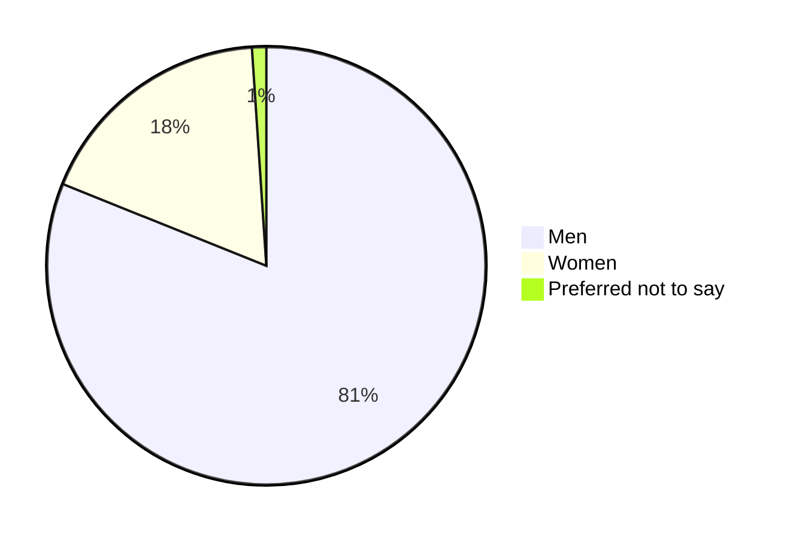
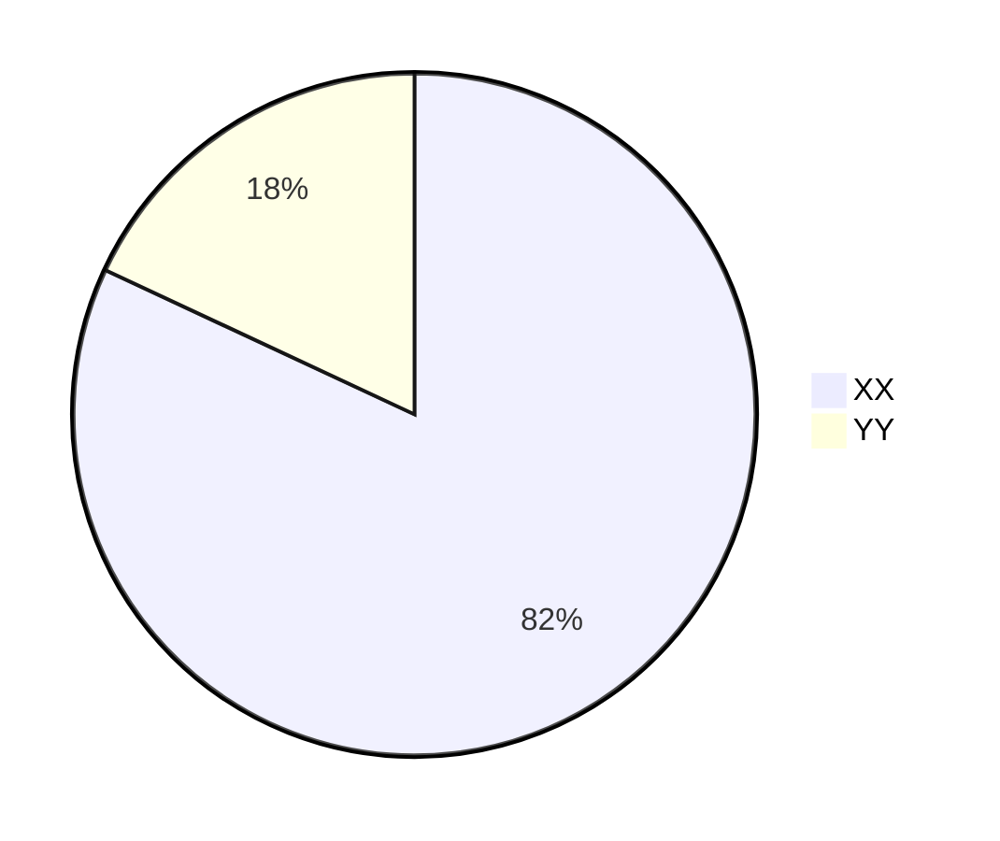

# 2024 Survey results

Welcome to the Algeria Developer Survey 2024 Results Page!

In February 2024, [Number of Participants] IT professionals shared their perspectives, shaping the narrative of Algeria's tech landscape. Join us as we delve into the insights gathered from this diverse community of [Number of Participants] participants.

Conducted in three languages: Arabic, English, and French. This survey has captured insights from a diverse group of participants. Here's a breakdown of participation by language:

- Arabic: [Number of Participants]
- English: [Number of Participants]
- French: [Number of Participants]

## Demographics

To segment our participants better, we asked them for some questions about their age, gender and where they live and work.

### Age

```
TBD do pie graph
```

### Gender

The vast majority of the participants were men with X% while women only represented X%.



### Education

We asked our participants about the highest level of education they completed, and the distribution was the following:



Which means that XX of our participants have a degree in IT-related field.

Among all participants, XX% obtained an Algerian degree in IT. And XX% relocated to study abroad.

### Location

X% of the participants live in Algeria. Our XXX participants live in XX wilayas.

```
SHOW pie of participants by wilaya
```

And we had Y% of participation from outside Algeria. Most of the participants live in XXX, XXX, and XXXX.

### Professional status

We aimed to input from professional developers to reflect the market challenges. So could get XXX participant working full-time on IT, XXX freelancers and XXX students.

```
TBD
```

### Professional level

X of our participants are executives, X seniors .. tbd

### Employment model

XX of our participants work for Algerian companies

###

## Methodology

The survey was fielded form February 1st to [End Date], and collected [Number of Participants].

We estimated that the survey should take between 5 to 10 minutes to complete. The form was first designed in English then we made sure to translate it to Arabic and French.

We used [Google Forms](https://www.google.com/forms/about/) to capture answers to have a user experience that our participants are used to, and because it was a free and easy option to go for.

The survey was anonymous, we didn't collect any personal identifiable information, and we didn't use any analytics tools on the forms, or on [the landing page](/blog/kickstart-survey-2024/).

### Confidentiality & data usage

Participation in the survey was entirely voluntary. All responses were kept confidential. No personally identifiable information were collected or disclosed in any reports or publications.

All data was analyzed and reported in aggregate, ensuring that individual responses cannot be traced back to specific participants.

To ensure compliance with Algerian regulations, we went through the law N°18-07, and we requested a confirmation from [ANPDP](https://anpdp.dz/fr/quand-et-a-qui-sapplique-la-loi-n18-07/) that we are not collecting any personally identifiable information.

### Data analysis

In the first phase of our data analysis we mapped data from different forms with [our script ](https://github.com/Fcmam5/state-of-dz-swe-2024/tree/master/data-processing). Then we cleaned up our data from fake entries.

To determine "fake entries" we cross checked some inputs, compared salaries to role and experience levels and checked free-text answers.

```
TBD
```

We then conducted a set of interviews with experts and active members of Algerian tech community so collect more insights from them, to understand our results and to enrich our final report.

