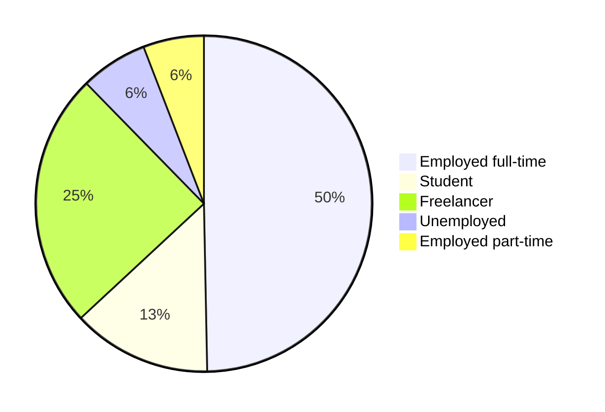

import Admonition from '@theme/Admonition';

# 2024 Survey results

Welcome to the Algeria Developer Survey 2024 Results Page!

In February 2024, IT professionals and students shared their perspectives, shaping the narrative of Algeria's tech landscape. Join us as we delve into the insights gathered from this diverse community of **more than 500** participants.

<Admonition type="warning" icon="🚧" title="Coming soon">
**This page is a placeholder!**

In this page, we will share the key findings from our survey and research with links to different areas of our [insights section](/docs/insights)
</Admonition>

<!-- 
Conducted in three languages: Arabic, English, and French. This survey has captured insights from a diverse group of participants. Here's a breakdown of participation by language:

- English: 314
- Arabic: 151
- French: 52


TBD: Have a full summary here -->


<!-- ## Demographics

To segment our participants better, we asked them for some questions about their age, gender and where they live and work.

### Age

Our participants 


### Gender

The vast majority of the participants were men with 90% while women only represented 9%.


### Education

We asked our participants about the highest level of education they completed, and the distribution was the following:


Which means that around **70%** of our participants have a degree in IT-related field.

### Location

84.1% of the participants live in Algeria. Our participants live in 46 Wilayas, with the majority being from Algiers, Oran, Sétif, Blida and Constantine.

<iframe title="Participants by Wilaya" aria-label="Map" id="datawrapper-chart-yWQh1" src="https://datawrapper.dwcdn.net/yWQh1/1/" scrolling="no" frameborder="0" width="100%" height="693" data-external="1"></iframe>

We also had 80 other participants (15.5%) living abroad. Most of the participants live in France, Germany, Canada and and the UAE.

### Professional status

Our participant groups consist of full-time and part-time employees in IT, freelancers, and IT students.



Their experience and job titles varies between entry-level to managerial and executive roles.

```mermaid
pie
    "Mid-level" : 225
    "Senior-level" : 106
    "Entry-level" : 102
    "Managerial/Lead" : 35
    "Executive" : 11
    "Intern or a working student" : 38
``` -->


----------------


<!-- # Insights

We could gather some data by clustering answers, and to have an unbiased and a constructive analysis we conducted a series of interviews with experts and actors in Algerian IT ecosystem.

In our reports we will use "we" and "ours" to refer to the authors/researchers:

- I, myself: Abdeldjalil Fortas (or Fcmam5, the nickname you see in the repository in the previous [domain name](https://fcmam5.me/)).
- Other contributors and people I reached out to for help, cross-checking and validation.

We will use "our experts", "stakeholders", or "actors" to refer to people we interviewed as actors in Algerian IT ecosystem. Some of our experts preferred to stay anonymous so we won't refer to them by name. We will just list them as the following:

- An engineer who works full time on Open Source software and who contributed to world-class projects.
- A CTO of a leading startup in logistics field in Algeria, with a long experience in Algerian startups as a lead.
- Engineers who work remotely for a foreign company from Algeria.
- Engineers who studied in Algeria and live abroad.
- A cybersecurity engineers who worked in Algeria in a cybersecurity company.

As X% of our contributors are from Oran and Algiers, we wanted to amplify other Wilayas' voices by interviewing:

- A developer from a small wilaya in the east of the country who waked for a company in a bigger wilaya, then went back to their wilaya to work for a foreign company remotely.
- A CEO of a rising startup from Mostaganem.
- A lead in an agency running in Djelfa and maintaining open-source projects.
- TBD.

And since X% of our participants said work remotely for foreign companies, we had to interview:

- An entrepreneur who owned a co-working space in a big Algerian city.
- An entrepreneur has a co-working space in big Algerian city.

To clarify the gap between Algerian engineers and business owners, and to understand some of the challenges and the missing opportunities, we interviewed more people, for example:

- A business owner
- TBD

By interviewing we mean asking people direct questions (often accompanied with numbers) to better understand the challenges and to have an unbiased view when writing the report.

If you are interested in the raw questions, feel free to check [this link](/docs/appendix/raw-interviews). We did not keep a transcript of the answers to give more freedom and privacy to our interviewees. -->
