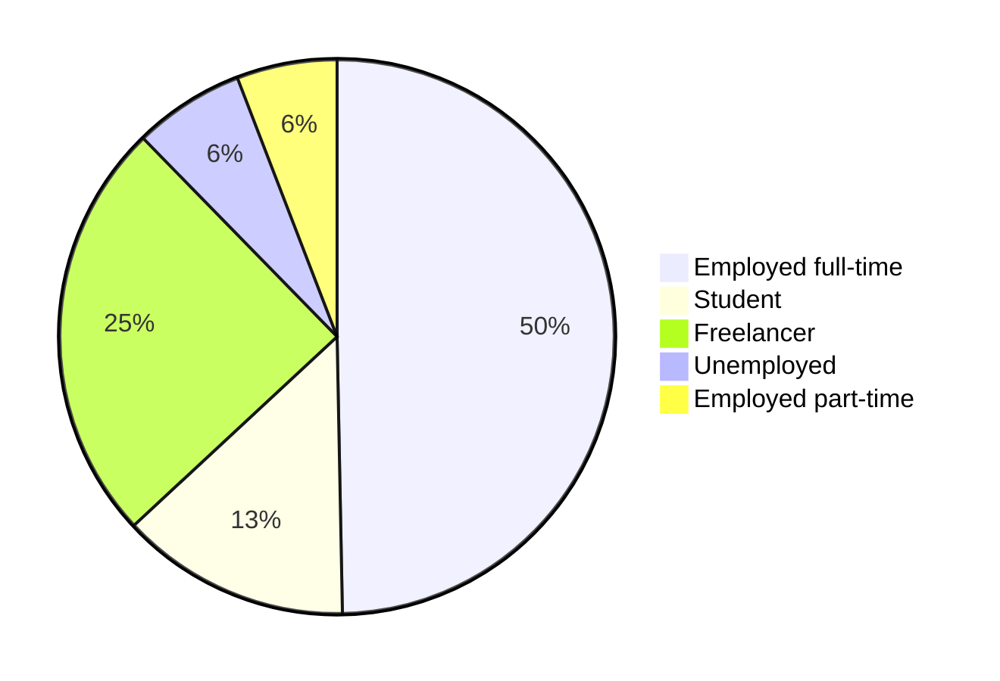
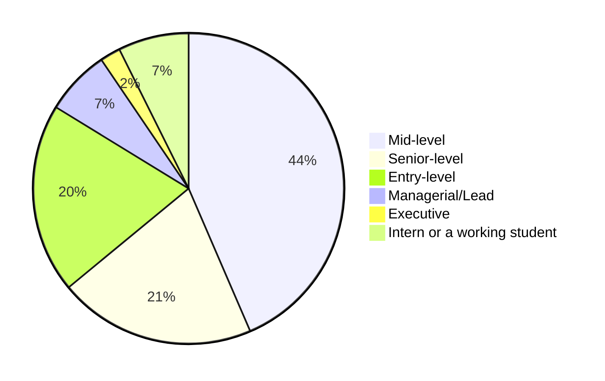

# 2024 Survey results

Welcome to the Algeria Developer Survey 2024 Results Page!

In February 2024, IT professionals and students shared their perspectives, shaping the narrative of Algeria's tech landscape. Join us as we delve into the insights gathered from this diverse community of **more than 500** participants.

Conducted in three languages: Arabic, English, and French. This survey has captured insights from a diverse group of participants. Here's a breakdown of participation by language:

- English: 314
- Arabic: 151
- French: 52

## Demographics

To segment our participants better, we asked them for some questions about their age, gender and where they live and work.

### Age

Our participants 

:::note
xx
:::

### Gender

The vast majority of the participants were men with 90% while women only represented 9%.

### Education

We asked our participants about the highest level of education they completed, and the distribution was the following:

Which means that around **70%** of our participants have a degree in IT-related field.

### Location

84.1% of the participants live in Algeria. Our participants live in 46 Wilayas, with the majority being from Algiers, Oran, Sétif, Blida and Constantine.

<iframe title="Participants by Wilaya" aria-label="Map" id="datawrapper-chart-yWQh1" src="https://datawrapper.dwcdn.net/yWQh1/1/" scrolling="no" frameborder="0" width="100%" height="693" data-external="1"></iframe>

We also had 80 other participants (15.5%) living abroad. Most of the participants live in France, Germany, Canada and and the UAE.

### Professional status

Our participant groups consist of full-time and part-time employees in IT, freelancers, and IT students.

Their experience and job titles varies between entry-level to managerial and executive roles.

## Methodology

The survey was fielded form February 1st to February 29th, 2024. It collected **517**.

We estimated that the survey should take between 5 to 10 minutes to complete. The form was first designed in English then we made sure to translate it to Arabic and French.

We used [Google Forms](https://www.google.com/forms/about/) to capture answers to have a user experience that our participants are used to, and because it was a free and easy option to go for.

The survey was anonymous, we didn't collect any personal identifiable information, and we didn't use any analytics tools on the forms, or on [the landing page](/blog/kickstart-survey-2024/).

### Confidentiality & data usage

Participation in the survey was entirely voluntary. All responses were kept confidential. No personally identifiable information were collected or disclosed in any reports or publications.

All data was analyzed and reported in aggregate, ensuring that individual responses cannot be traced back to specific participants.

To ensure compliance with Algerian regulations, we went through the law N°18-07, and we requested a confirmation from [ANPDP](https://anpdp.dz/fr/quand-et-a-qui-sapplique-la-loi-n18-07/) that we are not collecting any personally identifiable information.

### Data analysis

In the first phase of our data analysis we mapped data from different forms with [our scripts](https://github.com/Fcmam5/state-of-dz-swe-2024/tree/master/data-processing). Then we cleaned up our data from fake entries.

To determine "fake entries" we cross checked some inputs, compared salaries to role and experience levels and checked free-text answers.

Data cleaning was done in serval phases:

#### 1. Cleaning pass 1: Manually flagging entries

We ran a manual scan (yes, we went through 500+ lines of Excel) and flagged entries with 3 colors:

1. 🟩 **Green**: Entries that seems coherent (e.g. age, years of experience, job title/level and salary) is reasonable.
2. 🟧 **Orange**: Entries that seem "odd", an exaggerated salary, or a high title for few years of experience, a long list of selected "used" technologies, etc.
3. 🟥 **Red**: Entries that have conflicting data and it's clear that it's fake (for example we had an entry from a student who has 2 years of experience and who claimed that their salary is 2000000000 euros per year), or duplicated.

While doing that, we redacted company names and swear words in some entries (some company names were mentioned in free text fields in "challenges" question).

After flagging all entries, we did a second pass on the dataset to cross-check the flags before we export the "clean" dataset.

#### 2. Cleaning pass 2: Creating data clusters and find anomalies

In this phase we clustered data to identify abnormal entries that we might missed, or mis-flagged in the first phase.

#### 2. Cleaning pass 3: Interviewing experts and actors in Algerian tech industry

Since data is unavailable or outdated, and our team is not working in the Algerian market.. It was only fair to run our findings through experts and personas who are working day-to-day in the Algerian tech industry.

The experts and personas are defined in our [insights page](/docs/insights).
