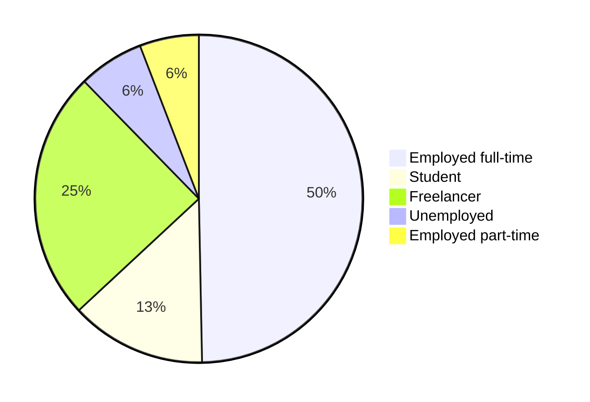

# 2024 Survey results

Welcome to the Algeria Developer Survey 2024 Results Page!

In February 2024, IT professionals and students shared their perspectives, shaping the narrative of Algeria's tech landscape. Join us as we delve into the insights gathered from this diverse community of **more than 500** participants.

Conducted in three languages: Arabic, English, and French. This survey has captured insights from a diverse group of participants. Here's a breakdown of participation by language:

- English: 314
- Arabic: 151
- French: 52


TBD: Have a full summary here

# GOTO [Insights page](/docs/insights)


<!-- ## Demographics

To segment our participants better, we asked them for some questions about their age, gender and where they live and work.

### Age

Our participants 


### Gender

The vast majority of the participants were men with 90% while women only represented 9%.


### Education

We asked our participants about the highest level of education they completed, and the distribution was the following:


Which means that around **70%** of our participants have a degree in IT-related field.

### Location

84.1% of the participants live in Algeria. Our participants live in 46 Wilayas, with the majority being from Algiers, Oran, Sétif, Blida and Constantine.

<iframe title="Participants by Wilaya" aria-label="Map" id="datawrapper-chart-yWQh1" src="https://datawrapper.dwcdn.net/yWQh1/1/" scrolling="no" frameborder="0" width="100%" height="693" data-external="1"></iframe>

We also had 80 other participants (15.5%) living abroad. Most of the participants live in France, Germany, Canada and and the UAE.

### Professional status

Our participant groups consist of full-time and part-time employees in IT, freelancers, and IT students.



Their experience and job titles varies between entry-level to managerial and executive roles.

```mermaid
pie
    "Mid-level" : 225
    "Senior-level" : 106
    "Entry-level" : 102
    "Managerial/Lead" : 35
    "Executive" : 11
    "Intern or a working student" : 38
``` -->
