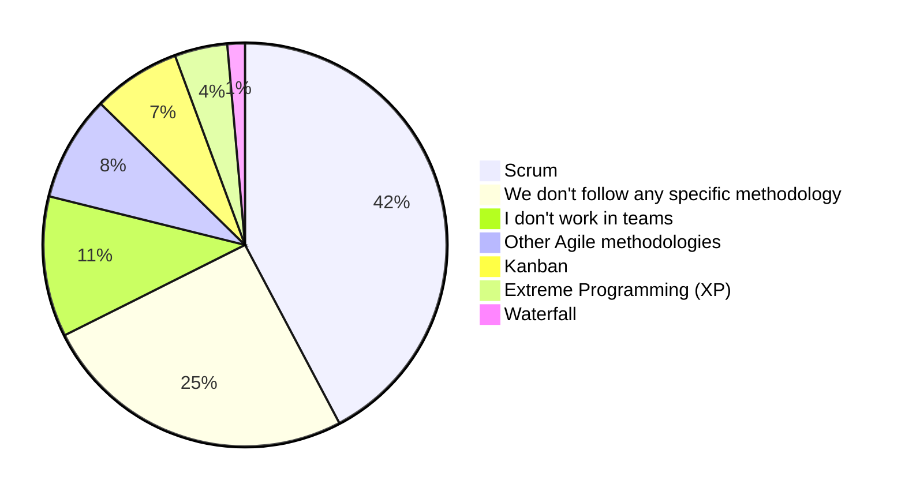
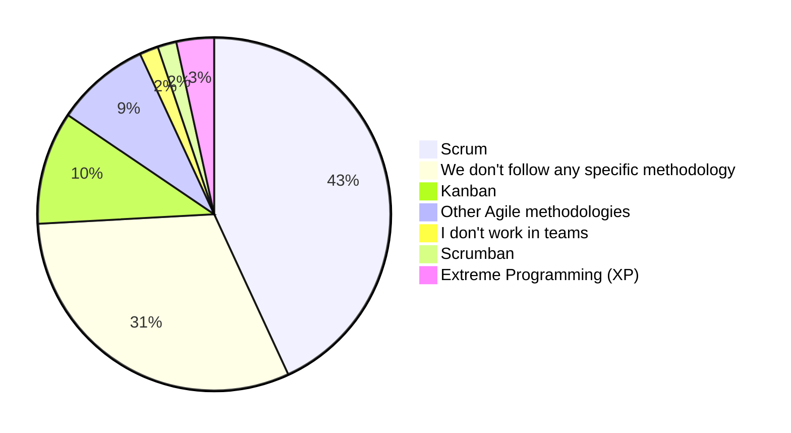
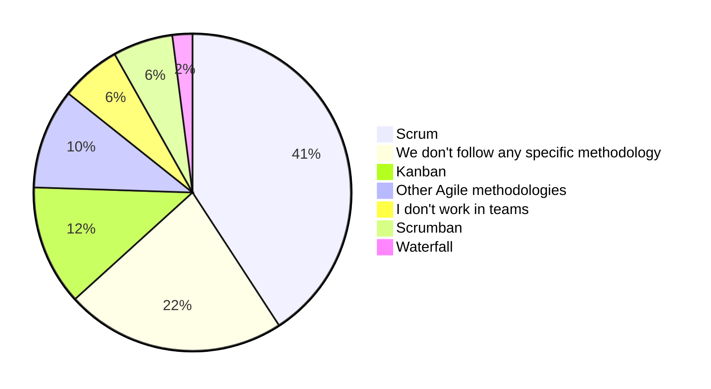
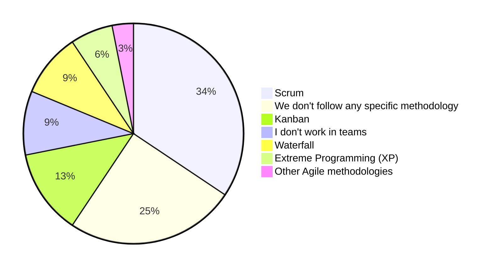
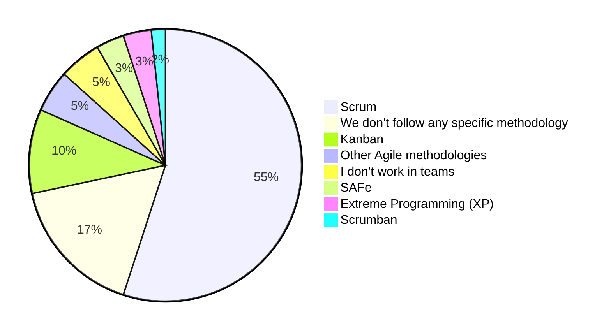
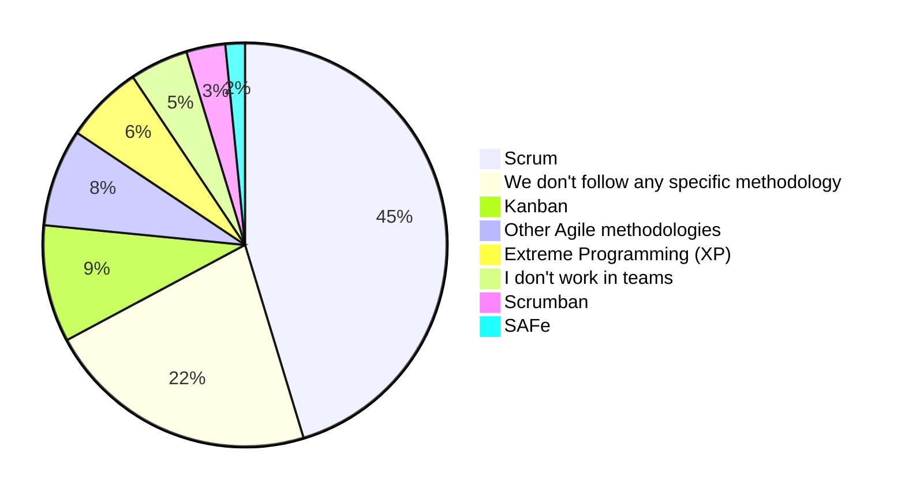
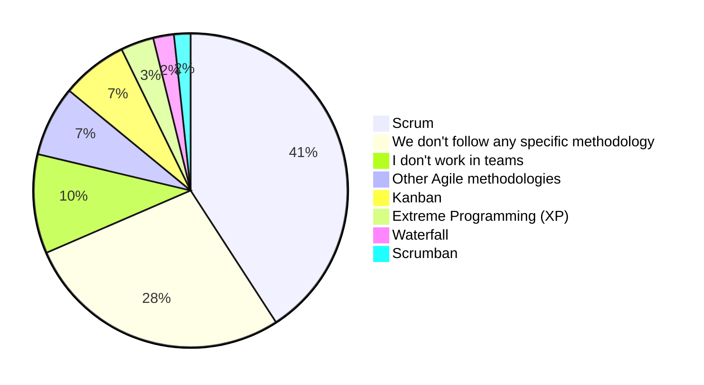

# Agile ways of working

We asked our participants which agile methodology they use, and the answers were the following:

To understand this distribution better we correlated agile methodologies to company sizes according to our participants. Then we asked our experts about their opinions.

## Agile methodologies by company size

### Companies with 2 - 10 employees

Teams in small companies with 2 to 10 employees tend to use agile methodologies according to our survey data, with 42% of them using scrum, 19% using other agile methodologies (XP, Kanban for example).

Some of our responders commented that they don't always stick to their methodologies, or their work is project-based and they may have to change their methodology for each project.

### Companies with 11 - 20 employees

For teams in companies with 11 to 20 employees, we see that Scrum is still the most used methodology followed by other methodologies like Kanban, Scrumban, Extreme programming and other agile methodologies.

While we see that some companies of this scale don't use any specific methodology.

### Companies with 21 - 50 employees

Our data shows that Scrum is still the most used methodology, along other agile methodologies like Kanban and Scrumban.

We also see that 22% of our participants who work in companies with this size are not using any specific methodology, while we see that some of them are using waterfall in their projects.

### Companies with 51 - 100 employees

Some companies with this size also use agile methodologies like scrum, Kanban and XP. Some others are not following any specific methodology. And others are using waterfall.

### Companies with 101 - 1000 employees

At this scale, we saw that some participants work in companies that are applying [Scaled Agile framework (SAFe)](https://en.wikipedia.org/wiki/Scaled_agile_framework), while others are using scrum, Kanban, XP and other agile methodologies.

We also see that even in companies with this scale, some engineers don't work in teams, or work in teams without applying any specific methodology.

### Companies with more than 1000 employee

In large companies, we see that Scrum and other agile methodologies are dominant as well, but we see that some teams other companies don't follow any specific methodologies. As someone commented on our survey, they have a system based on trust and autonomy for certain roles.

## Agile methodologies in Algerian companies

The results above are derived from all answers from all of our participants. In this section we will focus more on Algerian companies (answers from developers who work in Algeria for Algerian companies).

