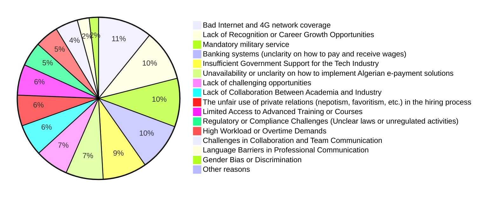
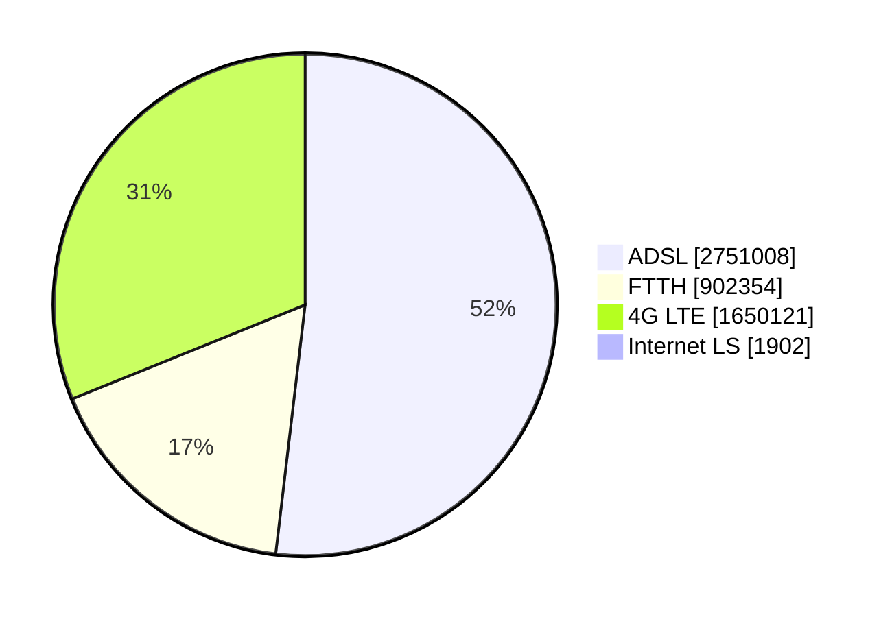

# Challenges

To highlight the challenges Algerian software engineers face, we asked our participants *"What are the main challenges you face in your role as a software engineer in Algeria?"*, and the answers were the following (we redacted some free text inputs).

In the next section we will explore the top challenges reported to shine more light on the effects they have on enginneers and the potential evolution. 

## Top reported challenges

### 1. Bad Internet and 4G network coverage

Bad Internet connection seems to be the #1 challenge for Algerian developers despite of the government's efforts to improve and modernize its infrastructure. According to [ARPCE](https://www.arpce.dz/fr/indic/internet), 52% of home internet memberships are ADSL, followed by 4G LTE, then 17% for FTTH.

Some regions of the country are still struggling with various problems with their Internet connections from blockage to non-availability. Additionally, upgrading to FTTH or [leased lines offers](https://www.algerietelecom.dz/en/entreprises/liaison-specialisees-internet-prod84) might not be an option for many professionals, as it's either [not available in many regions](https://demandeftth.at.dz/index1.php) or it can be very expensive that it has to be considered in companies and startups' budgets.

3G/4G coverage in some regions is still a challenge. (TBD elaborate)

In addition to technical problems; Algerians, especially those who work remotely with foreign companies get really frustrated during the national baccalaureate exams period, when the government limit access to the internet in a questionable way to prevent cheating.

The previous reasons and the historical non-avalability of good internet speed make this section the largest challenge in our survey. If you are interested in Algerian internet and mobile network experience, head to our [appendix section](/docs/appendix#algerian-mobile-network-experience)

### 2. Lack of Recognition or Career Growth Opportunities

TBD

### 3. Mandatory military service

Conscription or the national military service, is a mandatory service for 12 months for all Algerian male citizens aged 19 years and older.

After completing or abandoning their studies, Algerian men who are in good health conditions and who don't have legal exceptions (e.g. family supporting reason, or any social reason worthy of interest) are obligated to do the service for 12 months. Objectors are considered unsubordinated, they will have warrants to arrest them and make them go through military court to decide if they force them to pass the service. Objectors will mainly loose their rights for exceptions and extension [[reference](https://www.mdn.dz/site_principal/sommaire/service/recencement8_an.php)].

A [previous survey done on 260 men from ESI (Ecole Nationale Supérieure d’Informatique)](https://medium.com/@yasserdrif/solving-algerias-engineering-brain-drain-️-a-study-about-salaries-and-military-training-b383293683ca), highlighted that:

> - 84% of graduates who left the country claim that military service was one of the primary reasons.
> - 95% of current engineering students want to leave Algeria after their graduation and 60% claim that escaping the military service is their main motive.
> - 83% of engineering students who want to stay in Algeria and create startups think that military service is an obstacle to them.

Interestingly, 43% of our participants who live outside Algeria reported that mandatory military service is a problem for them. If a man's mandatory military service situation is not regulated, he can't enter the country as they will be flagged at border police. This situation is problematic for many Algerian men who want to go back.  

Algerian men who live abroad legally can apply for an exception, or at least an extension from any Algerian embassy, however they can wait up to a year to get a resolution for their situation.

### 4. Banking systems

Algerian banks (or banks operating in Algeria) are behind in terms of financial services offered for individuals. In a cash-heavy country, it is important for Algerians to cash-out their salaries in Dinars. Consequently, Algerians who work remotely often get paid in euros, or USD. To exchange foreign currencies to Algerian Dinars (DZD), Algerians tend to go to the black markets rather than using regular banks because of the exchange rates. The black markets (also called "square") often offers higher rates for foreign currencies. At the time of writing this (March 20th, 2024) for example, we observe the following rates:

| Foreign currency | Official rate (DZD)* | Square rate (DZD) |
| ---------------- | :------------------: | :---------------: |
| 1 EUR            |        145.95        |        240        |
| 1 USD            |        134,51        |        220        |
| 1 AED            |        36,63         |        61         |
| 1 SAR            |        35,87         |        60         |

> \* Source: https://www.google.com/finance/

In addition to the significantly higher rates that black markets offer, they often offer a faster and an easier mean to transfer and convert money, while Algerian banks may have liquidity and availability issues.

TBD: tell why foreign banks are better than Algerian banks.

However, the risks with digital (foreign banks) are rising 

Nihad Ideas: Algerian freelancers (or anyone who wants to have a digital bank account or payments means abroad) will lower their safety requierements from the providers because less and less providers are accepting Algerian residents. On the other hand, more scammers are realizing the potential of the Algerian market and trying to take advantage of it. 
Another major factor is the regulation which is failry behind in considering digital payment needs and the population's expectations. The tougher the rules are, the less people have options and the better the space is for potential gray areas. 
Realistically, digital payments are now a need for anyone trying to do anything online. Wether it'S paying for a course, accessing a magazin behind a paywall or simply upgrading away from ads. It is unproductive and harmful to leave people no option but scammy, gray area options to get their online payments done. 
Finally, KYC. Know Your Client practices are necessary processes for the international and national institutions to ensure that all funds are not being used illegally. These expected controls are very difficult to do for Algerians living in Algeria for international institutions. 

DZ law

their kycc

TBD

Online payments especially for digital products and accepting credit cards.

## Interesting takes from free-text inputs and interviews

### Diplomas and graduates from small southern universities are often not taken seriously

Nihad proposal: There is a case to be made here for the value and the perception of diplomas from different regions and different universities acoross the country and even outside of it. However, through our research and our interviews, other than this entry, we have not found any evidence that it is true. The Educational system and its complex structure and results is a topic for another day. 

### Not having a degree in IT

Nihad Proposal: 
While not having a university or recognized degree in IT is a disadvantage to say the least, we have found that there are plenty of software engineers in Algeria which are currently working without needing one. Since the Algeria Baccalaureat system can get in the way of a young person attending school for Computer science, many professionals still found other resources and opportunities to learn the necessary skills to get a job and evolve their careers efficiently. 

-- We should include some stat from the survey here 

### Caba and material

### Unregulated activities

Nihad opinion: NO, don'T go there, it's way too complicated and it's a topic for another day 
khadma f noir

hard for billing
Fatoura?

###  Talents lacks in soft skills 

## Other challenges

### Buying goods online

As highlighted in [Banking system challenges](#banking-systems), Algerian dinars have a *low exchange rate* compared to other currencies. Therefor purchasing digital products and licenses gets extremely expensive for Algerians who work in the country and get paid in Algerian dinars (DZD).

For example, [IntelliJ IDEA Ultimate](https://www.jetbrains.com/idea/buy/?section=commercial&billing=monthly) costs 60 euros per month, which is 14400 DZD in the parallel market (commonly used instead of the official one), a price close to a monthly rent payment. Not having country/region-specific pricing make purchasing licenses, courses and subscriptions very challenging, if not impossible for people with lower income.

Some Algerians tend to look for free alternatives (some freemium packages require credit cards, which are [challenging to get](#banking-systems)), or they go for illegal/unethical ways of using cracked software or by sharing licenses despite of the sellers' terms and conditions.

There are some initiatives and petitions for companies to have pricing models that considers the Algerian Party Purchasing Power (PPP).

:::tip

Some people like Wes Bos, [take this in consideration](https://wesbos.com/parity-purchasing-power) and provide discounts for Algerians, in [Beginner JavasScript](https://beginnerjavascript.com/):

:::
