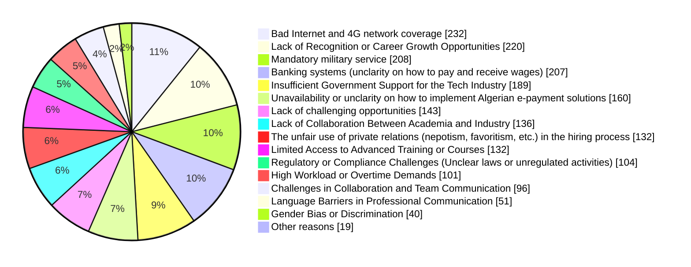
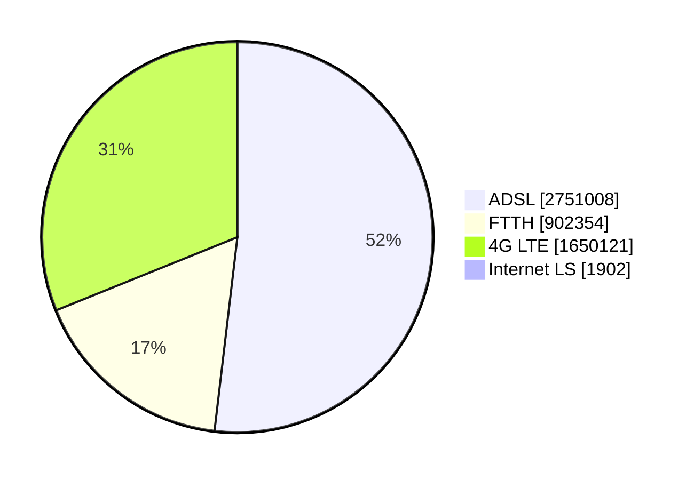
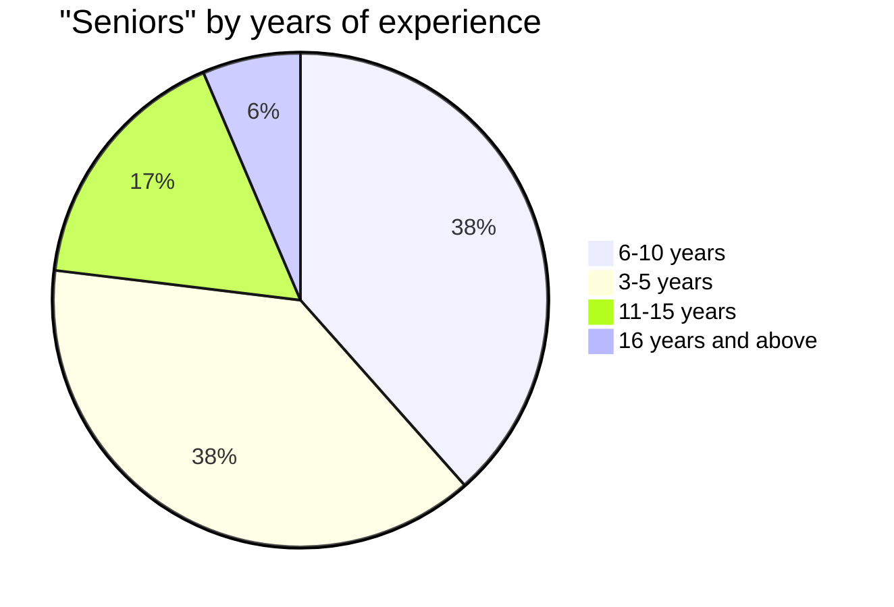
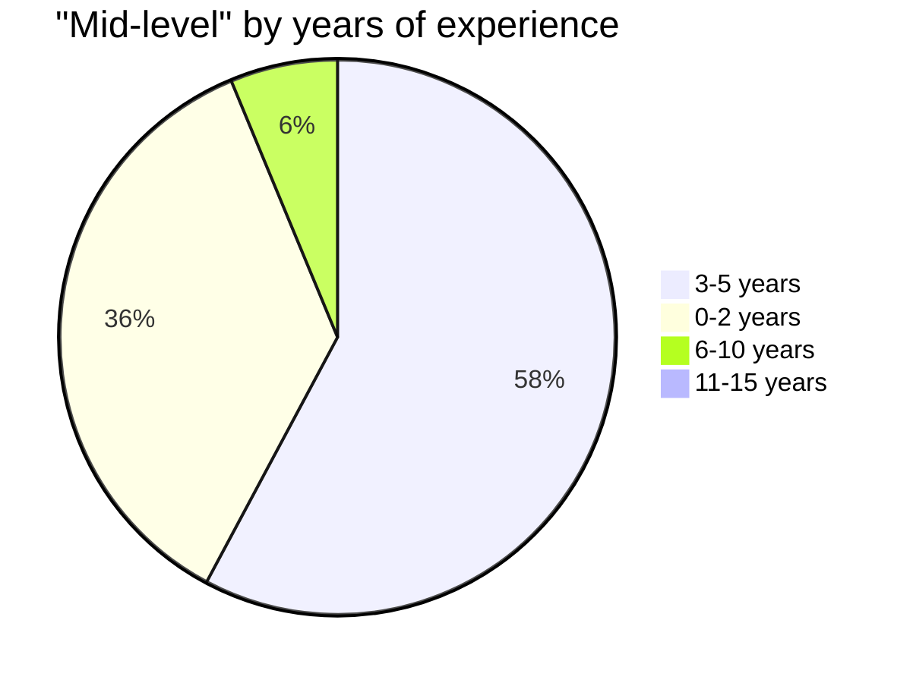

# Reported challenges

To highlight the challenges Algerian software engineers face, we asked our participants *"What are the main challenges you face in your role as a software engineer in Algeria?"*, and the answers were the following (we redacted some free text inputs).

## Top reported challenges

### Bad Internet and 4G network coverage

Bad Internet connection is reported to be the #1 challenge for Algerian developers despite of the government's efforts to improve and modernize its infrastructure.

According to [ARPCE](https://www.arpce.dz/fr/indic/internet), 52% of home internet memberships are ADSL, followed by 4G LTE, then 17% for FTTH.

Some regions of the country are still struggling with various problems with their Internet connections.

Upgrading to FTTH or [leased lines offers](https://www.algerietelecom.dz/en/entreprises/liaison-specialisees-internet-prod84) might not be an option for many professionals, as it's either [not available in many regions](https://demandeftth.at.dz/index1.php) or it can be very expensive that it has to be considered in companies and startups' budgets.

3G/4G coverage in some regions is still a challenge to many Algerians. According to [nPerf](https://www.nperf.com/en/map/DZ/-/-/signal?ll=28.411411581894026&lg=1.664999999999997&zoom=5) and [OpenOpensignal](https://www.opensignal.com/algeria) Algerian mobile operators are competing to increase their 3G/4G coverage and availability over the last years.

Click here to see the results of Mobile Network Experience Report (Algeria 2024)

From [Opensignal's Mobile Network Experience Report (February 2024)](https://www.opensignal.com/reports/2024/03/algeria/mobile-network-experience):

However, some regions are still having mobile connectivity issues in regions (even in big cities). According to an interviewee this might be a result of different technical reasons, and Algeria's rapid urbanization being one of them, especially with the raise of tall buildings in big cities that could obstruct signal transmission.

 

In addition to technical problems; Algerians, especially those who work remotely with foreign companies get frustrated during the national baccalaureate exams period, when the government limit access to the internet in a questionable way to prevent cheating. This internet disruption is still happening in 2024 despite of the government's promises ([[2]](https://youtu.be/MMWHS5fe-XU?t=3368), [[1]](https://youtu.be/u_qo4gPBZgQ), etc)

### Lack of Recognition or Career Growth Opportunities

**43%** of our survey participants reported that `Lack of Recognition or Career Growth Opportunities` is one of the challenges they face in Algeria. To verify this we asked several interviewees (software engineers and companies hiring them).

Many companies in the public sector don't have dedicated positions or tracks for software engineers, they tend to hire for a more generic "IT Person" or "System Administrator" roles. Engineers in these positions are focused on maintenance, setting up networks, and being these companies' IT go-to person when they hire external agencies (national and international) for more "modern" specializations.

In private sector, and according to our interviewees, only a few tech companies and startups offer advanced career paths. These companies often design career growth paths and provide incentives for their employees, along with providing mentorship and trainings. While companies have rigid structures and may have fewer opportunities for promotion.

Multiple survey participants think that software engineers are not getting the recognition and the thankfulness because their bad management, that often lack a mature tech culture. Some managers may not understand the complexity and the challenges of software products.

Budget constraints and digital markets maturity, may affect some startups growth which reflect on their employees' salaries and bonuses. When asking our interviewees `How you incentivize talents? Especially since some of them flee to work remotely for possibly higher salaries?`

> It is definitely hard to compete with salaries that remote working offer, if you have a startup in Algeria your revenues are in Algerian dinars, you can't match salaries developers can get with remote working positions (especially that they're in foreign currencies with high exchange rates).

### Mandatory military service

Conscription or the national military service, is a mandatory service for 12 months for all Algerian male citizens aged 19 years and older.

After completing or abandoning their studies, Algerian men who are in good health conditions and who don't have legal exceptions (e.g. family supporting reason, or any social reason worthy of interest) are obligated to do the service for 12 months. Objectors are considered unsubordinated, they will have warrants to arrest them and make them go through military court to decide if they force them to pass the service. Objectors will mainly loose their rights for exceptions and extension [[reference](https://www.mdn.dz/site_principal/sommaire/service/recencement8_an.php)].

A [previous survey done on 260 men from ESI (Ecole Nationale Supérieure d’Informatique)](https://medium.com/@yasserdrif/solving-algerias-engineering-brain-drain-️-a-study-about-salaries-and-military-training-b383293683ca), highlighted that:

> - 84% of graduates who left the country claim that military service was one of the primary reasons.
> - 95% of current engineering students want to leave Algeria after their graduation and 60% claim that escaping the military service is their main motive.
> - 83% of engineering students who want to stay in Algeria and create startups think that military service is an obstacle to them.

Interestingly, 43% of our participants who live outside Algeria reported that mandatory military service is a problem for them. If a man's mandatory military service situation is not regulated, he can't enter the country as they will be flagged at border police. This situation might be problematic for lot of Algerian men who want to go back.  

Algerian men who live abroad legally can apply for an exception, or at least an extension from any Algerian embassy, however they can wait up to a year to get a resolution for their situation.

### Banking systems

Algerian banks (or banks operating in Algeria) are lagging behind in terms for financial services for individuals. In a cash-heavy country like Algeria it is important for Algerians to cash-out their salaries. 

Algerians who work remotely often get paid in euros, or USD. To exchange foreign currencies to Algerian Dinars (DZD), Algerians tend to go to the black market rather than using regular banks.

Black market (also called "square") often offers higher rates for currencies. At the time of writing this (March 20th, 2024) for example, we see the following rates:

| Foreign currency | Official rate (DZD)* | Square rate (DZD) |
| ---------------- | :------------------: | :---------------: |
| 1 EUR            |        145.95        |        240        |
| 1 USD            |        134,51        |        220        |
| 1 AED            |        36,63         |        61         |
| 1 SAR            |        35,87         |        60         |

> \* Source: https://www.google.com/finance/

In addition to the significantly higher rates that black markets offer, they often offer a faster and an easier mean to transfer and convert money, while Algerian banks mack have liquidity and availability issues.

Therefor, some Algerians prefer to go for foreign (and online) banks such as [Paysera](https://www.paysera.com/), [Payoneer](https://www.payoneer.com/), [Wise (previously TransferWise)](https://wise.com/) and others. These banks offer a range of services, and a smooth KYC process that allows Algerians to create and to confirm their accounts at a minimal cost.

These accounts can be used to receive payments and to pay for online services. Payments in foreign currencies can be *easily* exchanged in the wll established black market, which also offers a platform for exchanging foreign currencies from Wise and Paysera (Often Euro exchange rage from online banks is slightly higher than the cash).

However, relying on these electronic banks present its own set of compliance and regulatory risks and challenges. 

From the online banking side: KYC precesses ([Paysera's for example](https://www.paysera.com/v2/fr-FR/blog/pourquoi-le-compte-est-restreint-bloque)) often lead to account freeze or closing if Algerian account owners cannot verify their data, this might be problematic as some Algerians open account through third party ([illegal](https://youtu.be/b-zfr3U6_2A)) persons who use e-visas or fake addresses in europe to request cards, some others use their friends or families' addresses abroad to request account openings.

From The Algerian side, while there's no clear law against using these online bank accounts, or having foreign bank accounts while residing in Algeria, some of these account holders may risk having legal issues. In the last years, according the some press articles (from [Echorouk for example](https://www.echoroukonline.com/%D8%A7%D9%84%D8%AD%D8%B3%D8%A7%D8%A8%D8%A7%D8%AA-%D8%A7%D9%84%D8%A8%D9%86%D9%83%D9%8A%D8%A9-%D9%84%D9%84%D8%AC%D8%B2%D8%A7%D8%A6%D8%B1%D9%8A%D9%8A%D9%86-%D8%A8%D8%A7%D9%84%D8%AE%D8%A7%D8%B1%D8%AC)) the bank of Algiers is requesting European financial institutions to comply with regulations that prohibit non-permanently resident Algerians from opening bank accounts there, aiming to prevent currency smuggling and regulate the movement of capital.

The Algerian government and some Algerian institutions are working on regulating remote working activities, and make creating bank accounts for foreign currencies easier, with that, Algerian workers would be able to [receive salaries in foreign currencies, and use them to buy goods online](https://moukawil.dz/beta/knowledgebase/exportation-de-services-numeriques/).

:::tip Remote working

Interested in knowing more about challenges remote workers are facing? Head to our [Remote working](/docs/insights/remote-working) page

:::

## Other takes from free-text inputs and interviews

### Not having a degree in IT, or having degrees from southern universities

Some participants reported that not having a degree in IT, or that diplomas and graduates from small southern universities are often not taken seriously.

We could not confirm these inputs with any of our interviewees. We asked different engineers from southern wilayas if they think that degrees from their universities affected their chances on getting jobs, their responses were:

> "No, it's a skills issue"

However, not having a degree in IT, may reduce chances in getting to interview phases for companies with "old school" hiring styles, while private companies don't care (in general).

### Algeria's strict regulations on importing IT devices

According to some interviewees, Algeria's laws, or mis-informed personal working authorizing imported goods may cause challenges to those who need to import hardwares for their work.

According to an interviewees:

> Our team in Algeria has some of the best engineers who works on a software we deploy on our drones, it is unfortunate that they can't test their changes on an actual hardware, that's counter productive to us. We can't do anything about it since we can't send drones to Algeria, and if manage to, it will be nearly impossible to get authorizations to fly them.

Another interviewee reported:

> My thesis covered a work done with a VR headset, I could get a "Startup" label for my project, unfortunately I'm struggling to get a VR headset for other projects I'm working on after graduating.

Also, in talks with some security pentesters, it appears that they also have the same challenges, they reported that it's very challenging to request physical hacking devices (for ethical use), as it's nearly impossible to get some hardware so they can run their physical pentesting on them (often for international bug bounty programs).

### Unregulated activities

Many Algerians prefer to work remotely for foreign companies, and many of these prefer (or are used to) work "under the radar" of the official financial system. They receive wages in foreign currencies, then they exchange them on the black market for a higher rate, and since that all happening outside an Algerian official system, there's no need to pay taxes or for any social funds contributions.

Working off the books (en noir) is very common in Algeria, and that might be due to the lack of a financial education and a mistrust in the financial systems. Some interviewees mentioned:

> I don't really care about having a legal status (EURL or Auto-entrepreneur status), I prefer saving more money and paying doctors and for medicines if I need them, than to pay for social services funds. My savings will also be my retirement funds.
> Having a legal status is just a way to make me pay taxes.

A mistrust in the financial system and the lack of financial education may make people evade paying taxes, some interviewees mentioned "Why would I pay taxes if I don't see their benefits in my environment?".

People who work remotely and off the book get higher salaries that the Algerian public treasury doesn't benefit from. This phenomena also cause an imbalance in the Algerian salaries in software engineering market, engineers are more attracted to work remotely than to work for Algerian companies that they can't match their salaries in foreign currencies (while still paying taxes, health insurance, etc).

In addition to that, some freelancers reported in the survey and in some interviews that billing is one of the challenging parts of their work. This was also confirmed by some business owners who deal with Algerian freelancers.

Billing problems might be complex and require their own study, but from what we could find in our study is that there are no clear grids or transparency in the Algerian market. Some freelancers may charge clients in different formulas using different rates.

The unprofessional culture from both freelancers' side, and from some clients also cause a mistrust and delays in delivery and/or payments.

However, there is some progress on this challenge from different parties; The government's new [Auto-Entrepreneur](https://www.anae.dz/) status now allows freelancers to have a legal status, and that will give them an official status that shall protect their rights as long as they work with contracts.

Some startups also extended their services to cover freelancers. [Fatoura](https://fatoura.app/auto-entrepreneur) the invoicing software, for example, offer a discount for freelancers and entrepreneurs. Other companies also provide workshops and trainings for freelancers focusing on communication and professionalism.

### Talents lacks in soft skills

Reported from the survey, from [other reports](https://digitalarabia.network/media/pages/articles/grab-a-coffee-read/da075f7bd5-1637052954/strategy_paper_algerien_20210406.pdf) and from interviews with Algerians and foreigners who hired Algerians to work remotely: Some Algerian engineers some soft skills.

The lack of planning and punctuality was one of the reported issues by Algerians and foreigners, their employees sometimes show up late to meetings and sometimes they even skip them without a notice (or with a short one). That and the lack of transparency (and sometimes honesty) made some companies prefer on-site working model versus the remote one.

Some interviewees see that as a challenge that prevented them from implementing working frameworks, and this caused frustration for a foreigner that hired an Algerian engineer, they claimed that their Algerian employee was skipping dailies and several Agile ceremonies.

Another issue was reported is that self-evaluation (together with the blurry salaries market) make a lot of Algerian engineers overestimate themselves. Business owners reported that their software engineers apply as mid-level or seniors even if they have few years of experience. This phenomena can also be highlighted from our survey data.

When asked about `What is your current professional level?` answers where the following:

We notice that there are some engineers with 3 to 5 years of professional years of experience are claimed to be seniors, while for mid-level, we see that some engineers in their early career years are claiming to be mid-level:

 

This might be due to the non regulated salaries market that always makes developers that they can earn more, and it may also be a result of a *relatively* closed Algerian market (few Algerians work with internationals, either in foreign companies in Algeria, or remotely).

 

One other sign of the lack of soft skills, or professionalism is that more than **30%** of our participants use instant messaging applications (Messenger, Whatsapp, Telegram, etc) for their work. That might be a sign of mixing personal and professional channels. This may reflect on focus, productive time at work, and having proper time off work.  

### Buying goods online

As highlighted in [Banking system challenges](#banking-systems), Algerian dinars have a *low exchange rate* compared to other currencies. Therefor purchasing digital products and licenses gets extremely expensive for Algerians who work in the country and get paid in Algerian dinars (DZD).

For example, [IntelliJ IDEA Ultimate](https://www.jetbrains.com/idea/buy/?section=commercial&billing=monthly) costs 60 euros per month, which is 14400 DZD in the parallel market (commonly used instead of the official one), a price close a monthly rent payment. Not having country/region-specific pricing make purchasing licenses, courses and subscriptions very challenging, if not impossible for people with lower income.

Some Algerians tend to look for free alternatives (some fermium packages require credit cards, which are [challenging to get](#banking-systems)), or they go for illegal/unethical ways of using cracked software or by sharing licenses despite of the sellers' terms and conditions.

There are some initiatives and petitions for companies to have pricing models that considers the Algerian Party Purchasing Power (PPP).

:::tip

Some people like Wes Bos, [take this in consideration](https://wesbos.com/parity-purchasing-power) and provide discounts for Algerians, in [Beginner JavasScript](https://beginnerjavascript.com/):

:::