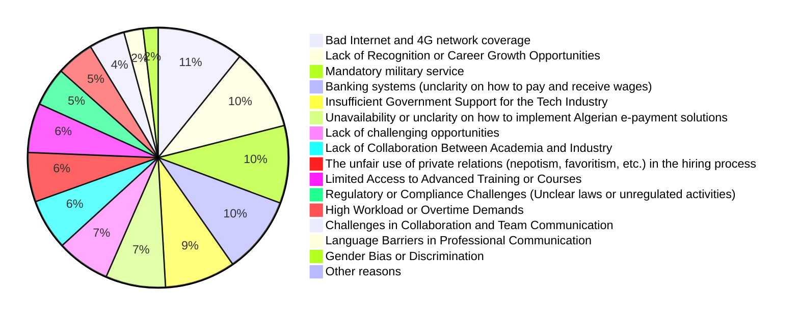
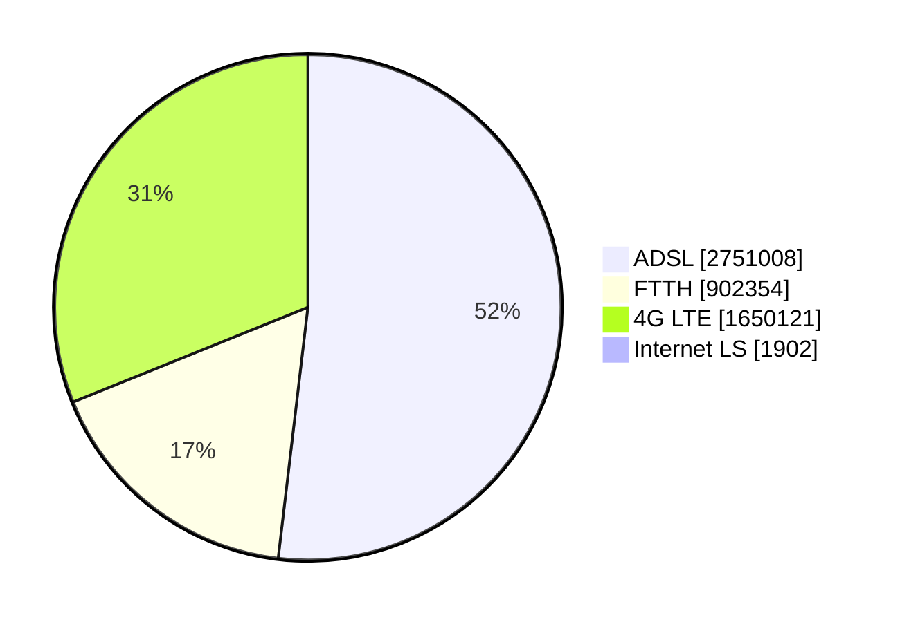

# Challenges

To highlight the challenges Algerian software engineers face, we asked our participants *"What are the main challenges you face in your role as a software engineer in Algeria?"*, and the answers were the following (we redacted some free text inputs).

## Top reported challenges

### Bad Internet and 4G network coverage

Bad Internet connection seems to be the #1 challenge for Algerian developers despite of the government's efforts to improve and modernize its infrastructure.

According to [ARPCE](https://www.arpce.dz/fr/indic/internet), 52% of home internet memberships are ADSL, followed by 4G LTE, then 17% for FTTH.

Some regions of the country are still struggling with various problems with their Internet connections.

Upgrading to FTTH or [leased lines offers](https://www.algerietelecom.dz/en/entreprises/liaison-specialisees-internet-prod84) might not be an option for many professionals, as it's either [not available in many regions](https://demandeftth.at.dz/index1.php) or it can be very expensive that it has to be considered in companies and startups' budgets.

3G/4G coverage in some regions is still a challenge. (TBD elaborate)

In addition to technical problems; Algerians, especially those who work remotely with foreign companies get really frustrated during the national baccalaureate exams period, when the government limit access to the internet in a questionable way to prevent cheating.

If you are interested in Algerian internet and mobile network experience, head to our [appendix section](/docs/appendix#algerian-mobile-network-experience)

### Lack of Recognition or Career Growth Opportunities

TBD

### Mandatory military service

Conscription or the national military service, is a mandatory service for 12 months for all Algerian male citizens aged 19 years and older.

After completing or abandoning their studies, Algerian men who are in good health conditions and who don't have legal exceptions (e.g. family supporting reason, or any social reason worthy of interest) are obligated to do the service for 12 months. Objectors are considered unsubordinated, they will have warrants to arrest them and make them go through military court to decide if they force them to pass the service. Objectors will mainly loose their rights for exceptions and extension [[reference](https://www.mdn.dz/site_principal/sommaire/service/recencement8_an.php)].

A [previous survey done on 260 men from ESI (Ecole Nationale Supérieure d’Informatique)](https://medium.com/@yasserdrif/solving-algerias-engineering-brain-drain-️-a-study-about-salaries-and-military-training-b383293683ca), highlighted that:

> - 84% of graduates who left the country claim that military service was one of the primary reasons.
> - 95% of current engineering students want to leave Algeria after their graduation and 60% claim that escaping the military service is their main motive.
> - 83% of engineering students who want to stay in Algeria and create startups think that military service is an obstacle to them.

Interestingly, 43% of our participants who live outside Algeria reported that mandatory military service is a problem for them. If a man's mandatory military service situation is not regulated, he can't enter the country as they will be flagged at border police. This situation might be problematic for lot of Algerian men who want to go back.  

Algerian men who live abroad legally can apply for an exception, or at least an extension from any Algerian embassy, however they can wait up to a year to get a resolution for their situation.

### Banking systems

Algerian banks (or banks operating in Algeria) are lacking behind in terms for financial services for individuals. In a cash-heavy country like Algeria it is important for Algerians to cash-out their salaries. 

Algerians who work remotely often get paid in euros, or USD. To exchange foreign currencies to Algerian Dinars (DZD), Algerians tend to go to the black market rather than using regular banks.

Black market (also called "square") often offers higher rates for currencies. At the time of writing this (March 20th, 2024) for example, we see the following rates:

| Foreign currency | Official rate (DZD)* | Square rate (DZD) |
| ---------------- | :------------------: | :---------------: |
| 1 EUR            |        145.95        |        240        |
| 1 USD            |        134,51        |        220        |
| 1 AED            |        36,63         |        61         |
| 1 SAR            |        35,87         |        60         |

> \* Source: https://www.google.com/finance/

In addition to the significantly higher rates that black markets offer, they often offer a faster and an easier mean to transfer and convert money, while Algerian banks mack have liquidity and availability issues.

TBD: tell why foreign banks are better than Algerian banks.

However, the risks with digital (foreign banks) are rising 

DZ law

their kycc

TBD

Online payments especially for digital products and accepting credit cards.

## Interesting takes from free-text inputs and interviews

### Diplomas and graduates from small southern universities are often not taken seriously

### Not having a degree in IT

### Unregulated activities

khadma f noir

hard for billing
Fatoura?

## Other challenges

- Paying for software licenses and subscriptions

- Low dinar rate

- not having country-specific rates e.g Adobe creative suite

