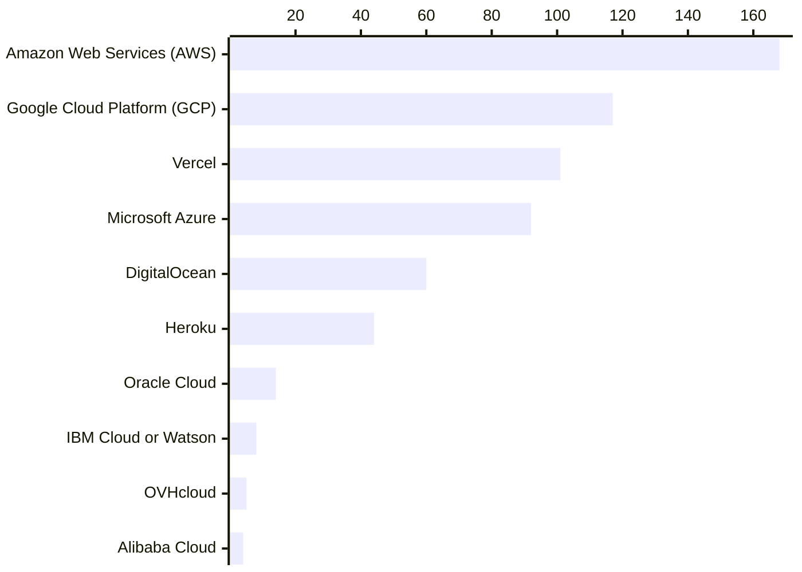
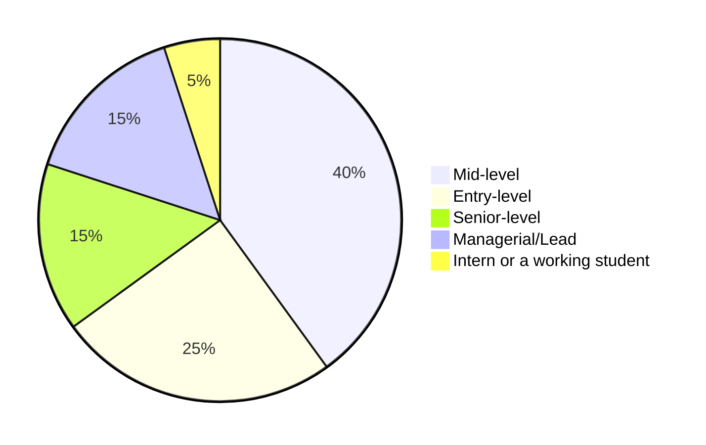
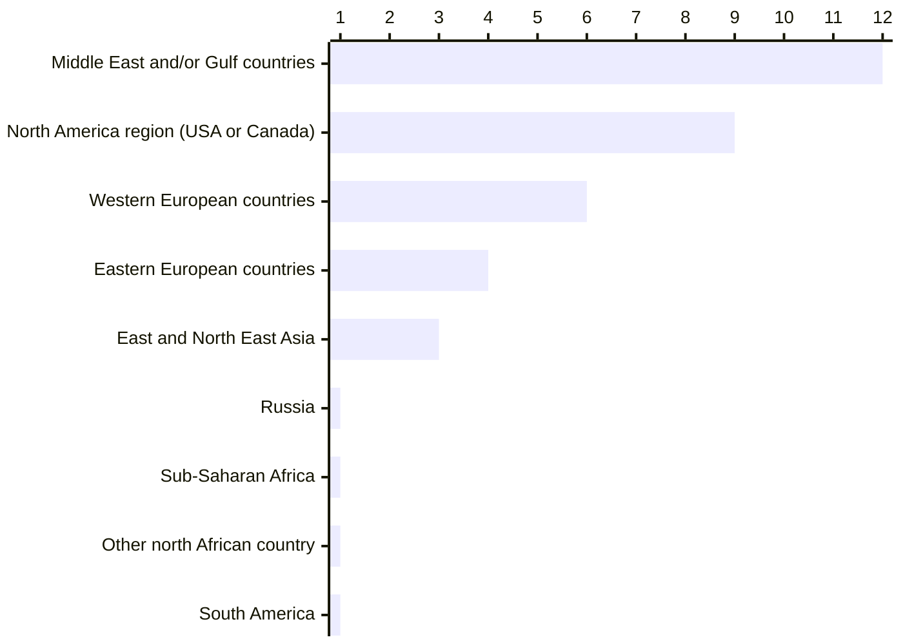
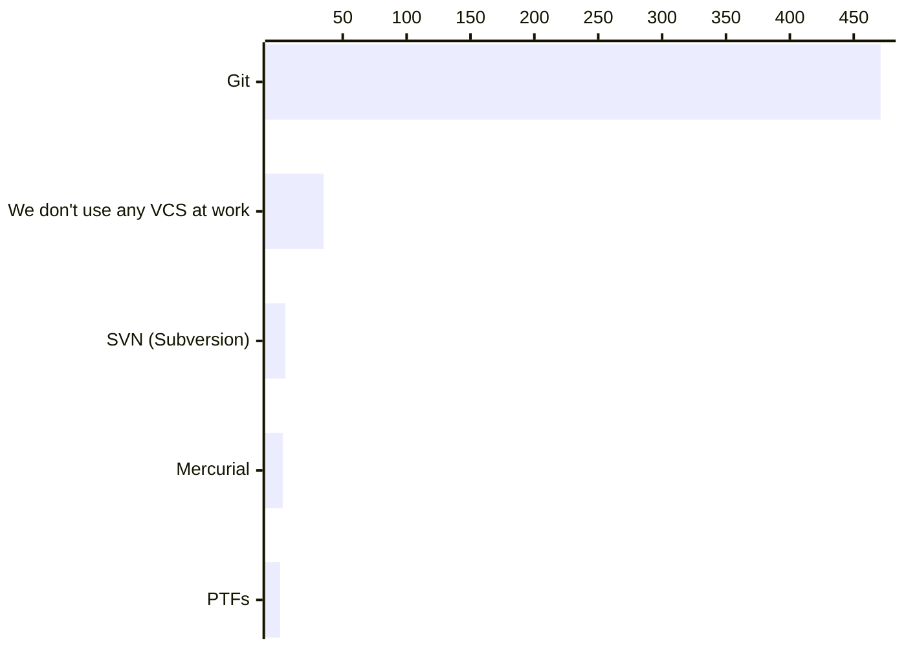
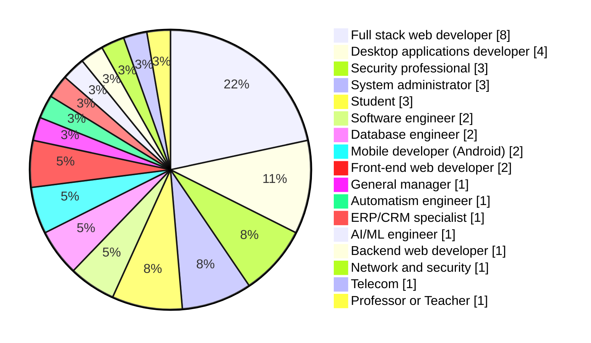
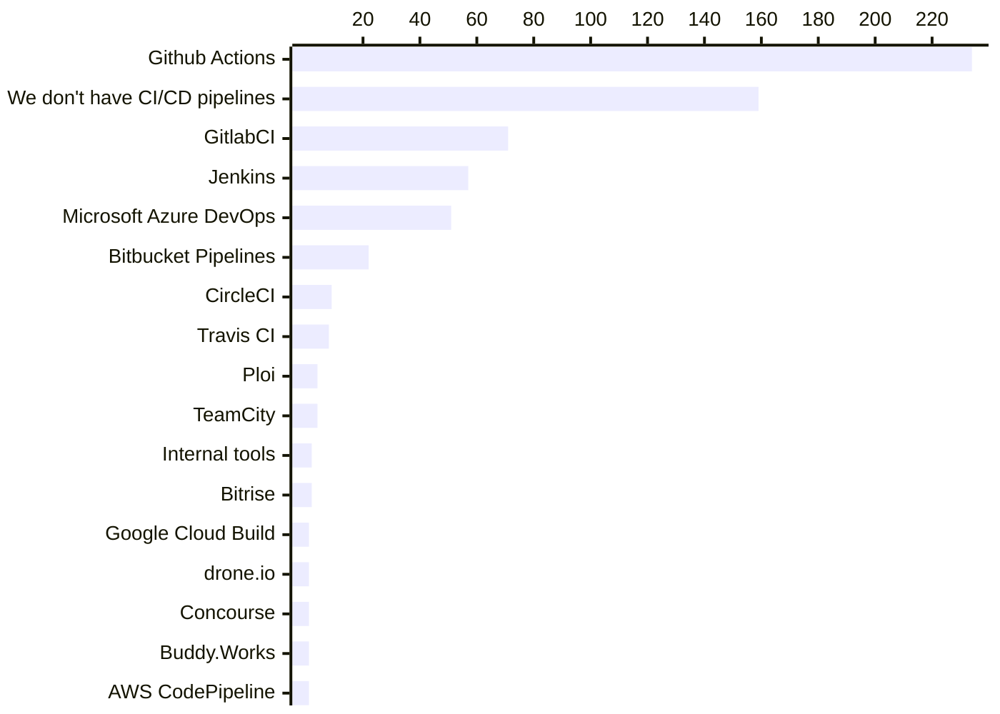
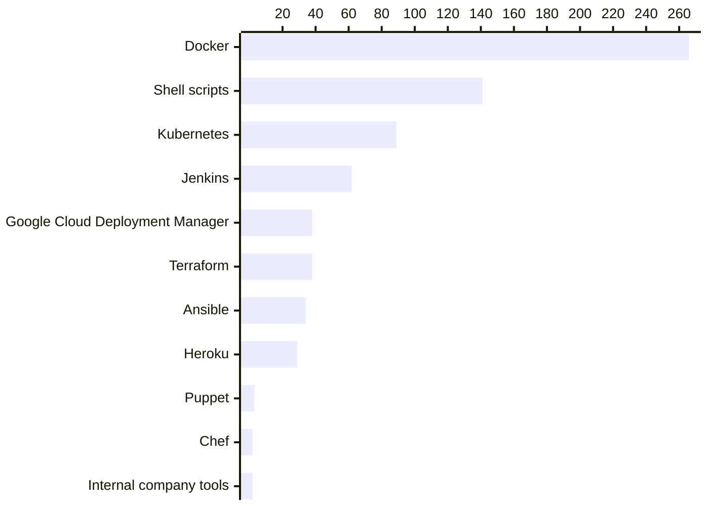

# Cloud and DevOps

According to our survey data, public Cloud providers such as Amazon Web Services (AWS), Google Cloud Platform (GCP) and Microsoft Azure are the most used by our participants. We notice a tendency to use Serveless/PaaS solutions such as Heroku, Vercel and Netlify.

37% of the participants who use AWS work for Algerian of different sizes. For GCP, only 20% work for Algerian companies.

Vercel users for example, are mostly developers working on web front-ends. 48% of them are Full stack developers, and 20% are front-end developers.

## Cloud in Algeria

Algeria ranked #14 from 15 in [Cloud Competitiveness Index 2023 (MENA)](https://www.menacloud.org/cloud_competitiveness_index_2023.php). The index evaluates various aspects related to cloud adoption, including regulation, talent, connectivity, government, and business.

The audit happened before Law on the Protection of Private Persons in the Processing of Personal Data (No. 18-07) was [enabled on August 10th, 2023](https://anpdp.dz/fr/quand-et-a-qui-sapplique-la-loi-n18-07/), and before many other improvements took effect. Since the last year [Algeria's International Bandwidth improved](https://www.mpt.gov.dz/en/the-equipped-capacity-of-our-countrys-international-telecom-network-reaches-9-8tb-s/) and the government continued promoting new e-services. These factors should be reflected in better scores for Algeria's in future editions of CCI.

The report stated the following about Algeria's `TALENTS` index:

> *"Algeria's score in our Talent domain is related to
the country's rankings in Meritocracy &
Incentivization-related indicators, particularly
Reliance on Professional Management & Labor Tax
Rate, where the lowest regional numbers were
recorded. Similarly, Talent Impact & Employability
indicators such as Innovation Output, High-value
Exports, Software Development, and Ease of
Finding Skilled Employees registered rather poor
scores region-wide. Another indicator that could
improve Algeria's current ranking in our Talent
domain is Delegation of Authority, where it ranked
15th."* - [CIC MENA 2024](https://www.menacloud.org/cloud_competitiveness_index_2023.php)

Only 1% of our survey participants work as SRE/DevOps engineers, and 2% work as system administrators. Our participants work for companies from different sizes (from small companies to large companies of 1000+ employees). This may point to a lack of specialized engineers in site reliability.

[DevOps and Site Reliability Engineering](#devops-and-site-reliability-engineering) will elaborate this point further more.

### Algerian companies on the cloud

Fast-growing startups like [Yassir](https://maystro-delivery.com/) and [Maystro Delivery](https://maystro-delivery.com/) are adopting cloud-native approaches based on international cloud providers such as Google Cloud Platform.

*This may cause compliance challenges where data has to be stored and processed in Algeria, or it would require requesting exceptions from ANPDP*

:::warning
TBD: How are they managing data on the cloud
:::

:::info

Google Cloud published [Yassir Case Study](https://cloud.google.com/customers/yassir) recently, where they talk about how Yassir is building their superapp on GCP.

:::

### Algerian cloud providers

The new Algerian law n° 22-39 on January 10th, 2022 [regulates cloud computing and data storage](https://www.arpce.dz/fr/service/cloud). Since then, [ARPCE](https://www.arpce.dz) authorized some of the leading companies behind some of Algeria's data centers to offer web hosting and cloud services.

Among the companies listed in [ARPCE](https://www.arpce.dz/fr/service/cloud)'s website, we have: [ISAAL](https://issal.dz/), [AYRADE](https://www.ayrade.com/), [eBS](https://www.ebs.dz/) and [ADEX Cloud](https://adexcloud.dz/).

### Private clouds

Large Algerian corporate and some government agencies (ministries) have their own private clouds.

For example, some of Sonatrach's services [are running on Huawei Cloud Stack (HCS)](https://e.huawei.com/kz/ict-insights/global/ict_insights/201902271023/Success-Story/201904170833), other companies choose XYZ... TBD.

OpenShift

## DevOps and site reliability engineering

Our participants' professional levels are the following:

According to our survey data:

- Some Algerian companies hire interns or working students.
- Medium scale companies (100 to 1000 employees) may hire entry level and junior SRE/DevOps engineers and system administrators.
- Small companies and startups may give "Lead" titles to engineers with 5 to 10 years of experience.
- Senior system administrators are paid between 100 000 DZD and 150 000 DZD, mid-level and juniors are paid less than 60 000 DZD.
- Some participants work remotely as SRE/DevOps for foreign companies.
- Mid-level and junior SRE/DevOps engineers are paid between 80 000 DZD and 100 000 DZD.

We asked `If you are willing to leave the country, what would be your destination?`, and the answers from SREs and DevOps engineers were the following:

The numbers are alarming, the lack of challenging opportunities and incentives (explained in [Challenges](/docs/insights/challenges) section) are encouraging Algerian talents to leave the country.

This may leave a gap that juniors and self-taught engineers have to fill, and to fill that we need experienced engineers leading initiatives, and companies accepting challenges knowing that their teams can handle it.

We recently started seeing more job offers for SRE/DevOps engineers specifically. 

The more common thing is that companies look for "good developers with DevOps culture", they hire developers who can build software and run it. This was also reflected by our survey data, we see that many software developers also deal with cloud infrastructures, infrastructure provisioning, CI/CD pipelines, etc.

:::warning
TBD: ELABORATE, ASK IF YOU WANT TO HIRE DEVOPS.
:::

When it comes to the most used tools, we see the following results:

### VCS: Git is the most used one (no surprise), `nothing` is in the second place

We asked our participants [`Which version control systems do you primarily use for managing your software projects?`](/docs/appendix/raw-results#which-version-control-systems-do-you-primarily-use-for-managing-your-software-projects).

As anyone would expect, [Git](https://git-scm.com/) is the most used solution by 91% of our participants. 

However, we see that 6% are not using any version-control-system in their projects. In large companies, we see that some system administrators, security professionals, Telco and database engineers don't use VCS at their work.

This point that engineers in these companies do their work "manually", which signals that those companies don't use IaC, CaC or GaC to provision and manage infrastructures.

Some ERP/CRM are bought and/or developed from external providers, then companies may only user their internal engineers to "manage" or just use them, therefor they may not develop that much.

Other developers mainly use WYSIWYG tools like WinDev, or only build websites with CMS technologies such as WordPress.

### CI/CD: What tools are used? Or, is it even applied?

We asked our participants [`Which CI/CD technology do you use?`](/docs/appendix/raw-results#which-cicd-technology-do-you-use), 31% replied that they don't use any CI/CD tools.

:::warning
TODO TBD Who don't?
:::

Teams who have CI/CD pipelines use different solutions that can be broken down as the following:

- Solutions provided by their repositories hosting services such as GitHub Actions, GitlabCI and Bitbucket Pipelines. 
- Dedicated technologies to create CI/CD pipelines such as CircleCI, Jenkins, TeamCity and Travis CI.
- Cloud providers' tools, such as Microsoft Azure DevOps, Google Cloud Build and AWS CodePipeline.
- Specialized CI/CD technologies, such as Bitrise for mobile applications and Ploi.io for web applications.

The full breakdown from our survey responses is the following:

### Deployment and infrastructure provisioning tools
	
We asked [`What tools do you use for deployment and infrastructure provisioning?`](/docs/appendix/raw-results#what-tools-do-you-use-for-deployment-and-infrastructure-provisioning) The answers were the following: 

 

We see that more than 51% of our participants use Docker, while 27% are using Shell/Bash scripts.

We see that Kubernetes is being used by different companies, from startups to government agencies.

IaC tools like Terraform, Ansible, Puppet and Chef are used by **TBD WHO**