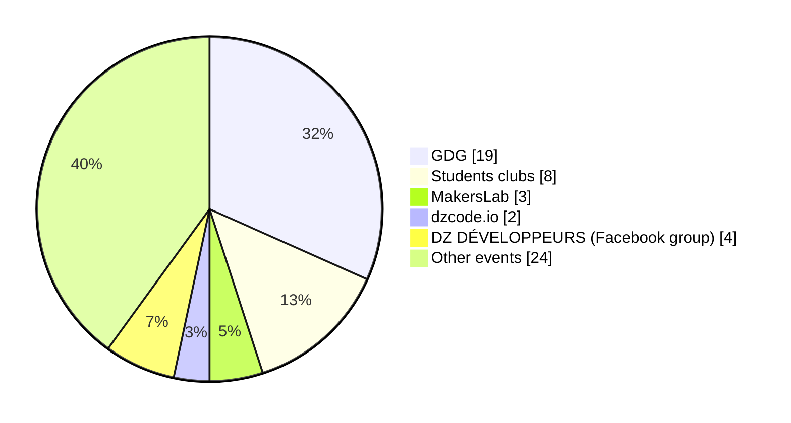
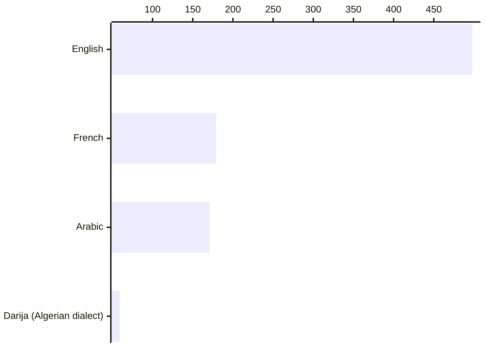

# Tech communities

In the recent years we saw an increase in the number of Algerian Tech communities. While other initiatives became inactive for different reasons.

We asked our survey participants if they are aware of any communities and the responses were the following:

Table representation (See more!)

| Communities                                    | Count |
| :--------------------------------------------- | :---: |
| Des rencontre Discord entre amis               |   1   |
| GDG                                            |   9   |
| Vooxed                                         |   1   |
| Dzair IA                                       |   1   |
| team open minds                                |   1   |
| DevFest (Google events)                        |   1   |
| StartHack                                      |   1   |
| Injaz                                          |   1   |
| Google Hackathon                               |   1   |
| Algerian Tech Makers                           |   1   |
| لقاءات المحددة من طرف الشركة مع الشركات الاخرى |   1   |
| Algeria Fintech & E-commerce Summit            |   1   |
| GDG Ghardaia                                   |   1   |
| membre at ITC club                             |   1   |
| Google Developer Group                         |   1   |
| GDG Events                                     |   1   |
| GDG Algiers                                    |   3   |
| MakersLab                                      |   3   |
| dzcode.io                                      |   2   |
| gomycode                                       |   1   |
| Micro club (USTHB)                             |   1   |
| Itchallenge                                    |   1   |
| Club IT community                              |   1   |
| School clubs                                   |   1   |
| Alphabit                                       |   1   |
| Ingeniums                                      |   1   |
| GDG SBA                                        |   1   |
| GDSC ESI SBA                                   |   1   |
| Scientific clubs like alphabit club            |   1   |
| Digital-Corner                                 |   1   |
| Annaba Tech days                               |   1   |
| GDG Tizi Ouzou                                 |   1   |
| Mainly facebook groups                         |   1   |
| DZ DÉVELOPPEURS (Facebook group)               |   4   |
| Women Tech makers Algiers                      |   1   |
| School Of AI Algiers                           |   1   |
| Hanooty                                        |   1   |
| meet up dev                                    |   1   |
| Zeontech                                       |   1   |
| IT for all                                     |   1   |
| Mozilla Campus Club                            |   1   |
| Icosium Culture (Kouba)                        |   1   |
| Micro Club                                     |   1   |

## Communities

We can categorize the entries to the following  categories:

### Student clubs

Student clubs and organizations provide a positive value for students and future IT professionals. They provide a great complement to the formal and classical curriculums and try to loosen the gaps between academia and the different industries.

Our survey participants mentioned some university clubs such as:

- [Team Open Minds](https://www.facebook.com/open.minds.oran)
- [Micro Club - USTHB](https://www.facebook.com/Micro.Club.USTHB)
- [Alphabit Club](https://www.facebook.com/profile.php?id=100089682379294)
- [Ingeniums](https://www.facebook.com/ingeniums)
- [ITC Blida](https://www.facebook.com/ITCBlida)
- [GDSC ESI SBA](https://gdsc.community.dev/esi-sba/)
- [School of AI Algiers](https://www.facebook.com/SchoolofAIAlgiers)
- [Women Techmakers Algiers](https://www.facebook.com/WomenTechmakersAlgiers)
- [Mozilla Campus Club - Constantine UV2](https://www.facebook.com/MCCUV2)

We also know many other (and very active) IT students clubs such as:

- [Shellmates Club](https://www.facebook.com/shellmates) for students and cybersecurity enthusiasts
- [CSE (ESI)](https://www.facebook.com/club.scientifique.esi/), one of the largest clubs in Algeria
- [ETIC](https://www.facebook.com/ETIC.Club), closing gaps between students and professional world
- [OpenMinds (USTHB)](https://www.facebook.com/openmindsclub)
- [Muhandis](https://www.facebook.com/muhandisclub)
- [Horizon Club (ENSTTIC)](https://www.facebook.com/HorizonClub.page)
- [UDev (USTO)](https://www.facebook.com/UDevCommunity)
- [GDSC Usto-Mb](https://www.facebook.com/GDSCUSTOMB)

### Tech events and hackathons

Meetups, conferences and hackathons are places where different actors meet and learn. Hackathons are usually organized by students clubs, for example [Hack !T](https://hackit2018.cse.club/) and [StartHack](https://www.facebook.com/StartHackDz) are hackathons organized by students and often hosted in universities (or engineering schools).

There are also a few national conferences and summits, for example:

- [Algeria 2.0 ](https://www.facebook.com/Algeria2.0)
- [Annaba Tech](https://www.facebook.com/annabatechcommunity)
- [Algeria FinTech & E-commerce Summit](https://www.facebook.com/algeriafintech)
- [Webexpo ElDjazair](https://webexpo-dz.com/)
- [DIGITECH](https://digitech-expo.com/)

In addition to the national events, some clubs and organizations host editions of global events and hackathons such as:

- [Global Game Jam](https://v3.globalgamejam.org/2019/jam-sites/global-game-jam-algeria-2019)
- [SpaceApps Challenge](https://www.spaceappschallenge.org/)
- [GDG DevFest](https://developers.google.com/community/devfest)

### Associations and organizations

- [INJAZ El Djazair](https://www.facebook.com/InjazElDjazair)
- 

- [Free Software & GNU/Linux Algeria (الجمعية الثقافية العلمية البرمجيات الحرة و غنو/لينكس)](https://www.facebook.com/fsgla)
- [CNCF Oran](https://community.cncf.io/oran/)
- [ORIA](https://www.facebook.com/ORIA.ORAN) *(Oran Robotique et IA)*

- [GDG]

- [AWS Users Group Algeria](https://www.meetup.com/aws-algeria/)
- [OWASP Algiers Chapter](https://owasp.org/www-chapter-algiers/)

### Groups and pages on social media

There are also many online communities on different social media platforms, Discord servers or Slack channels.

[DZ DÉVELOPPEURS](https://www.facebook.com/groups/328640490565078) for example is one of the largest Algerian developer communities on Facebook with 156k members. There also more generic groups for [Algerian freelancers](https://www.facebook.com/groups/algeriafreelancerscommunity) for example, or more specialized groups like [DevOps Algeria](https://www.facebook.com/groups/186104005354872).

On Facebook also, we find some pages like [Dia Tech](https://www.facebook.com/diaetech) and [الجماعة - El Djmâa](https://www.facebook.com/eldjmaa) that both talk about various IT and software development topics in plain Algerian dialect.

On Twitter/X, we have [Algerian Software Community](https://twitter.com/i/communities/1504035529507155971) that organize recorded rooms on weekends where experts discuss various IT-related topics.

Some communities are exclusively active on LinkedIn such as [CNCF Oran](https://www.linkedin.com/company/cncf-oran-community/).

### Initiatives backed by companies

Some companies like [Sylabs](https://www.facebook.com/SylabsDZ), [Yassir](https://yassir.com/) and [Makers Lab](https://makerslab.dz/) often host and/or sponsor Tech events which gives a big boost to the Algerian tech community.

As highlighted in [our challenges](/docs/insights/challenges) section, our survey participants pointed that there is an insufficient government support for the Tech industry, this may create a bigger need for different tech communities to find sponsors from the private sector.

### Communities built around content creators and experts

Some Algerians content creators offer a high quality content, often in Algerian dialect (Darija), English, or in Arabic which are the most used to acquire IT skills and to stay up-to-date according to our survey:

 
 

Mr [Cherif Bouchlaghem](https://www.youtube.com/@MohamedCherifBOUCHELAGHEMdz23) for example is one of the most knowledgeable engineers, he shares a lot about software design, testing and general coding best practices on his [social media](https://twitter.com/Cherif_b), or on his [Discord server](https://discord.gg/6FqvER4c).

Channels like [MoubachirSiliconValley](https://www.youtube.com/@MoubachirSiliconValley) by a software and hardware performance engineer working in the Silicon Valley provide a panel for experts from different IT fields, where they are invited to talk about their fields of expertise in Algerian Dialect (Darija), English and in French.

Some content creators focus on specific niche/stack, for example [Charfaoui Younes](https://twitter.com/CharfaouiYounes)'s content is mostly focused around Kotlin and Android development. Younes' content is mostly in English.

While other creators like [Houari Zegai](https://twitter.com/HouariZegai) and [Bour Abdelhadi](https://www.facebook.com/mabdelhadib) choose to write in Arabic.

Content creators like [Karim (@codewkarim)](https://www.instagram.com/codewkarim/) choose to create content in Algerian dialect.

We can find many other tech content creators on different social media platforms, such as:

- [@hakim.bencella](https://www.instagram.com/hakim.bencella/) (JavaScript, web development and AWS)
- [@chouaib.ui](https://www.instagram.com/chouaib.ui/) (UX/UI designer)
- [@BetterCodeDev](https://www.instagram.com/bettercodedev/) (Coding and security best practices)

### Other initiatives

Initiatives like [DzCode I/O](https://www.dzcode.io/) aim to bring the community together around various open source projects. This initiative came after [algeriatech](https://github.com/algeriatech) which was created by Riad Benguella back in 2016.

Some other initiatives like [Dzair AI](https://www.dzair.ai/) which promotes innovation with AI and data science by educating the the community, and by closing gaps between companies looking for data and machine learning engineers and talents looking for challenges and opportunities.

There are some Discord servers with different channels, such as:

- [Cherif Bouchlaghem](https://discord.gg/6FqvER4c)
- [dev dz](https://discord.gg/wazVzPn2C6)
- [UltrasDZCoder Programming](https://discord.gg/m29vTMhx6S)

## Challenges

TBD: 
https://www.mesrs.dz/wp-content/uploads/2022/04/Repertoire-des-clubs-scientifiques-de-lannee-2021-2022.pdf

