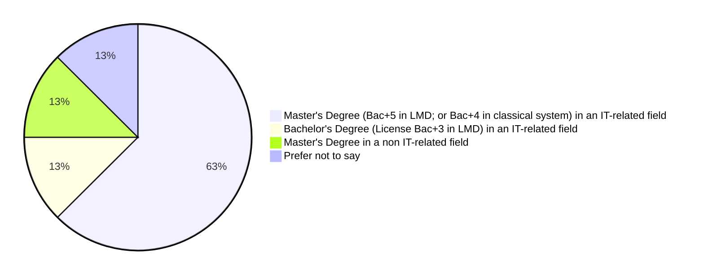
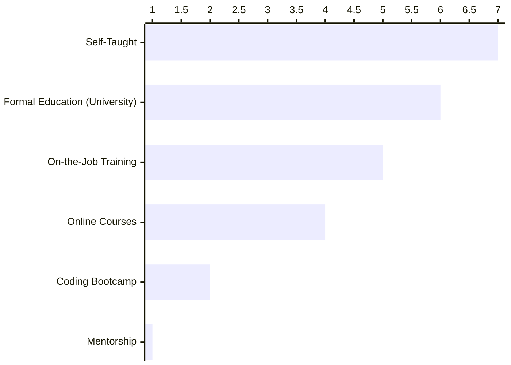
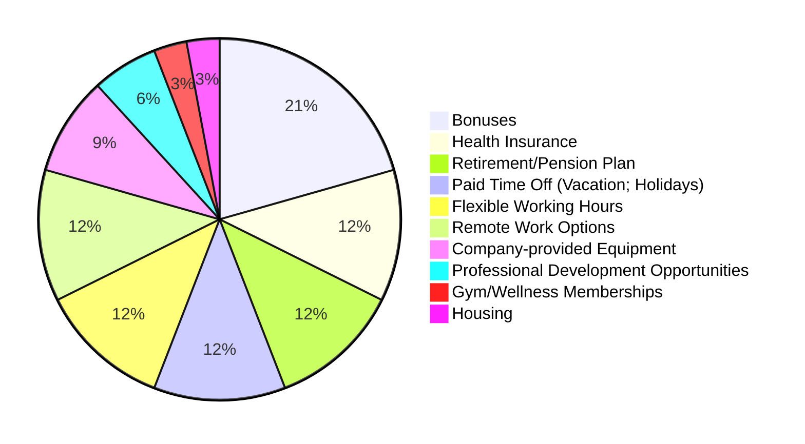
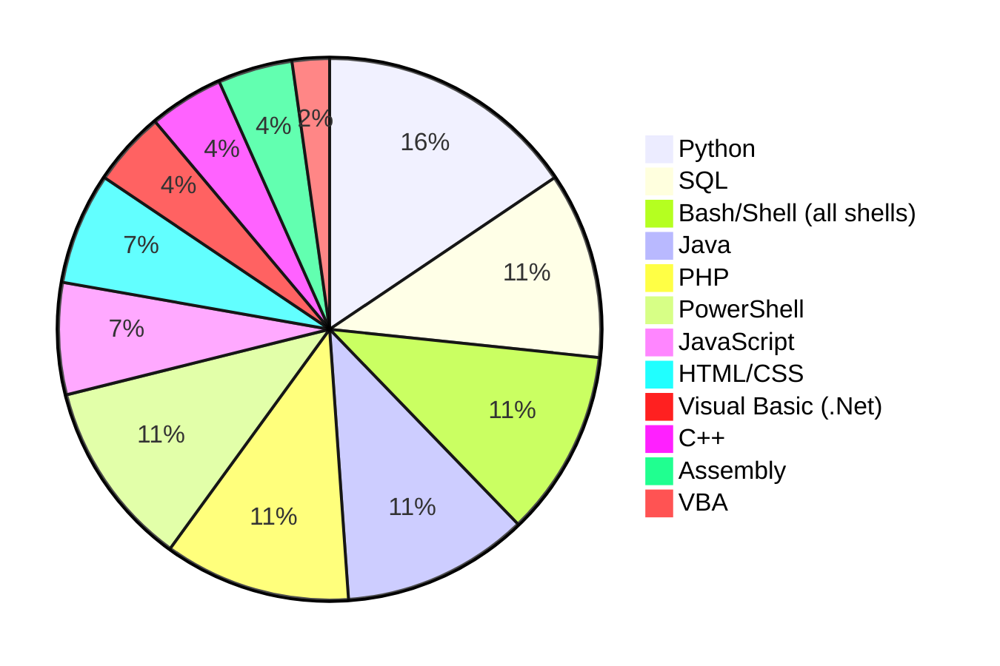
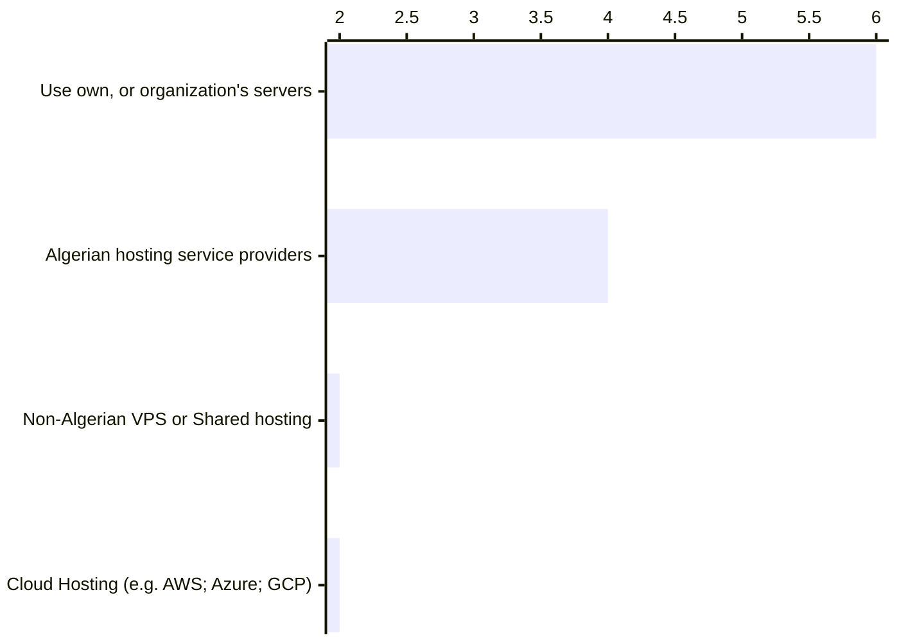

# Cybersecurity and governance

The Algerian government established a national mission to raise awareness and improve different areas of cybersecurity in the country. In this section we will explore some of the findings in this area.

The Ministry of Post and Telecommunications published [The National Information Security Repository (NISR) ](https://www.mpt.gov.dz/en/information-security-reference/) on 2020. 

NISR 2020 consists of twenty domains, ranging from personal data protection, mobile security to physical and IoT security. 

The reference lists a set of recommendations, best practices, guidelines and controls to improve individuals and companies' information systems' security. The controls and guidelines adheres to different international standards (GDPR, NIST 800-53, ISO / IEC 27002:2013, etc).

:::tip This topic needs a dedicated research, take it from here!

To not shift away from the generic "State of Algerian software engineering" domain this report covers, I would just scratch the surface on this topic. Why? [Read more here](/docs/closing#cybersecurity).
:::

To support our understanding and to have a better overview if this field in Algeria, we conducted several interviews with professionals.

## Cybersecurity in Algerian laws and regulations

The Algerian regulator incriminate and defines cyber crimes. With a series of laws such as:

- Law [N° 04-15 (10 November 2004)](https://droit.mjustice.dz/sites/default/files/portail/legisl_nouveau/code_penal_2010/fr/index.html?i=655) defines sanctions for crimes related to data integrity, confidentiality and security.
- Law [N° 09-04 (05 August 2009)](https://www.arpce.dz/fr/pub/l9d1a8), amended with [N° 16-02 (19 June 2016)](https://droit.mjustice.dz/sites/default/files/Loi-N%C2%B0-16-02.pdf) define cyber crimes, electronic communications surveillance and the establishment of a national committee for preventing and fighting offenses related to information and communication technology.
- Law [N° 18-05 (10 May 2018)](https://www.arpce.dz/fr/pub/z2g9u7) emphasizing the requirement of securing data at rest and in transfer when dealing with personal and payments data.
- Law [N° 18-07 (10 June 2018)](https://www.arpce.dz/fr/pub/c7e6n6) which is also related to personal data protection.
- Law [N° 20-05 (20 January 2020)](https://www.joradp.dz/FTP/jo-francais/2020/F2020004.pdf) created Conseil National de la Sécurité des Systèmes d’Information (CNSSI) (National Information Systems Security Council) which operates withing the Ministry of National Defense, it is responsible for the development of the national strategy for the security of information systems. 

These laws (and other texts) created different agencies that regulate and audit different aspects of cyber security and data protection. Among these agencies, we cite:

- [ANPDP](https://anpdp.dz/)
- [ARPCE](https://www.arpce.dz/)
- [INAPI](https://anpdp.dz/)
- CNSSI (Ministry of National Defense)
- [ONPLCITIC](https://www.arpce.dz/fr/file/p3m2q0) (Organe National de Prévention et de Lutte Contre les Infractions Liées aux TIC)
- ASSI (Agence de sécurité des systèmes d’information) (Ministry of National Defense)
- Central Department for Combating Cybercrime (DGSN)
- [AGCE](https://agce.dz/)
- [CNOSSI](https://www.joradp.dz/FTP/jo-francais/2020/F2020004.pdf)
- [DZ-CERT](https://www.cerist.dz/index.php/fr/rechercheetdevelop/116-projets-de-recherche-innovants/238-dz-cert-algerian-computer-emergency-response-team) (DZ-CERT Algerian Computer Emergency Response Team)

Along the establishment of [NISR document](https://www.mpt.gov.dz/en/information-security-reference/) in 2016, then its update on 2020.

## Cybersecurity from our survey data

Our survey did not have a lot of participants who work as cybersecurity engineers (8 of 517). Thus, we have to complete our analysis and discovery by interviewing specialists individually.

### Education

In our question about the highest level of education completed, our participants answered the following:

And when asked how they acquired their skills in IT (`How did you acquire your IT skills in your specific field? And how did you learn to code?`), the answers where the following:

We notice that at least 6 out of 8 participants acquired their skills in information technology and/or cybersecurity from their formal education.

Out of the 6 engineers who received formal education at university, 5 of them supplemented their learning with online courses and books. Additionally, 3 of these individuals underwent on-the-job training.

Our participants acquire skills in cybersecurity in English (100% of the participants), in French (50%), in Arabic and in Algerian dialect (Darija).

We had one senior security engineer who only received a formal education (Master's degree in an IT-related field), that individual is paid the lowest salary (less than **100 000 DZD** per month) compared to other seniors.

According to [our experts](/docs/appendix/raw-interviews#a-cybersecurity-engineer-who-worked-for-an-cybersecurity-company-in-algeria), formal education provides basics of computer science (such as algorithms, operating systems, networking...). 

Schools and universities create an environment where students can learn from each other by organizing workshops, CTF competitions, etc.

There are a few companies who have continuous education programs, these companies host workshops and seminars for their engineers, and sometimes they sponsor them to pass different certificates. 

### Work models and challenges

67% of our participants work for Algerian companies on-site in Algeria, and 22% work remotely from Algeria for foreign companies.

We had one participant (out of 8) who works part-time both for an Algerian company in Algeria, and remotely for foreign companies.

According to our participants, the main challenges cybersecurity engineers face in Algeria are:

1. Lack of Recognition or Career Growth Opportunities
2. Insufficient Government Support for the Tech Industry
3. Limited Access to Advanced Training or Courses
4. Regulatory or Compliance Challenges (Unclear laws or unregulated activities)
5. Banking systems (unclarity on how to pay and receive wages)
6. High Workload or Overtime Demands
7. Mandatory military service
8. Challenges in Collaboration and Team Communication
9. Lack of Collaboration Between Academia and Industry
10. Lack of challenging opportunities
11. The unfair use of private relations (nepotism; favoritism; etc.) in the hiring process

### Salaries and perks

According to our participants:

- Junior security engineers are paid salaries around **80 000 DZD**.
- Security engineers with 6+ years of experience are paid between **100 000** and **150 000 DZD** (in Algiers).
- Senior security engineers (11 to 15 years of professional experience) are paid salaries between **100 000** and **150 000 DZD** (in Algiers and Oran).

### Technologies

We asked our participants what language they primarily use, and the answers where the following:

The two participants who use Assembly work for foreign companies (one participant works as a part-time employee and one freelancer).

When asked about web hosting solutions, our participants answered the following:

Most of our security engineers (6 out of 8) use in-house hosting solutions (their own, or their organization's servers).

Half of the security engineers who responded use Algerian hosting providers (some of them commented that it's for compliance reasons).

Two of the participants use AWS and Azure as cloud providers, one use GCP, and one use OVHcloud.

### Relocation

63% of our participants who work as security engineers are open to relocate to other Wilayas if they have better opportunities.

The participants who work in cybersecurity and live in Algiers did relocate from other Wilayas to work there.

## Contributing to a national cybersecurity mission

While the government is promoting "national cyber security mission" by establishing [The National Information Security Repository (NISR) ](https://www.mpt.gov.dz/en/information-security-reference/), by organizing different conferences and seminars, and even by working on starting a [Higher National school of cyber security](https://www.aps.dz/societe/166994-vers-l-elaboration-d-une-strategie-nationale-pour-faire-face-aux-menaces-cybernetiques)... 

Algeria is classified as a country with high risk of cybercrimes, with many cases of devices being infected with malware. The [Global Organized Crime Index](https://ocindex.net/country/algeria) reported the following the following:

> The lack of specific legislation focused on cybersecurity and a general lack of awareness among the population, and authorities contribute to this situation.

Some cybersecurity companies in Algeria offer training and consulting services in addition to performing audits and pen-testing services, but it seems (according to our observation, and to experts we interviewed) that the proactive demand on these services mostly come from foreign companies that are based in Algeria, who adhere to international standards, often driven by CTO/CISO offices from abroad.

Other companies may reach out to security consultants to run incident response.

When we interviewed some developers and security researchers, we asked how can we contribute and report security issues we find in websites and applications. The answers were mostly negative, engineers are often not interested in reporting security vulnerabilities, according to our experts the lack of tech maturity and security culture may result either in ignoring their reports, or legal consequences.

We could not find any Algerian bug bounty program, reporting security bugs can get researchers into legal issues (and sometimes even gets to the National Defense Army). When a bug is found accidentally, the researcher might have hard time chasing the developers or maintainers of websites and applications, and often they have to rely on private connections to report these bugs so they get patched. 

However, there are some unofficial rewards provided by some companies. When a vulnerability is critical and the application/website owners are contacted, they can pay the reporters (according to our interview with [software agency](/docs/appendix/raw-interviews#can-pay-bounties), and a security engineer).

The lack of clear legal frameworks and an established culture might be demotivating for security experts and enthusiasts, some engineers may find working in cybersecurity risky, and others prefer to leave the country or work remotely for foreign companies with a more established culture, and for a higher salary.
