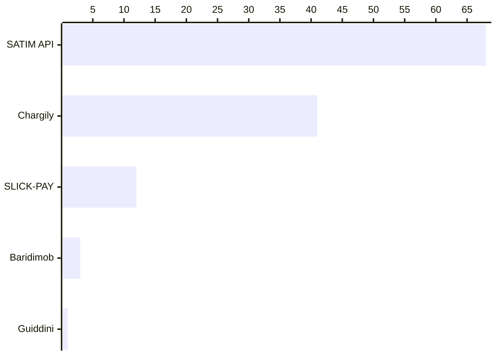
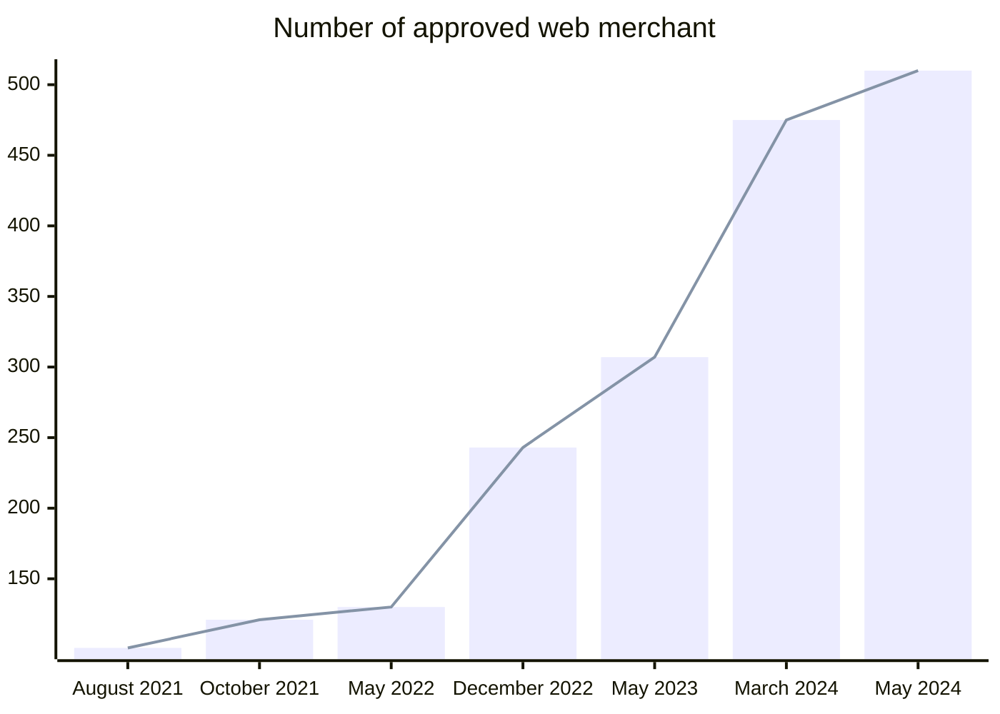

# E-Payment solutions

We asked our survey participants which e-payment solution they use. [Stripe](https://stripe.com/en-de) was the most solution with over 51%.

For the Algerian solutions we have the following:

 

The government's official solution (SATIM/CIBWeb) is followed by serval startups offering serval payment modules/APIs, [Chargily](https://chargily.com/) is the second most used solution according to our participants, then followed by [SlickPay](https://www.slick-pay.com/), and [Guidini's e-payment services](https://guiddini.com.dz/e-paiement-en-algerie/). 

We will explore these options in the following sections, we will explore the usage of these different payment methods.

## SATIM

[SATIM (Automated Interbank Transactions and Electronic Banking Company)](https://www.satim.dz/) (consumed through [CIBWeb](https://www.cibweb.dz/fr/)) is the most used Algerian Payment solution, it accepts both local credit cards (CIB and EDDAHABIA).

However, this solution seem in its early staged with only 510 authorized clients as of now (May 28th, 2024) according to [CIB's website](https://www.cibweb.dz/fr/actualites-et-chiffres-cles).

Looking into [previous screenshots of "cibweb.dz/fr/actualites-et-chiffres-cles" page on archive.org](https://web.archive.org/web/20240000000000*/https://cibweb.dz/fr/actualites-et-chiffres-cles), we notice the following pattern:

 

The slow increase of these numbers sets the following hypothesis:

1. The e-commerce culture is not established yet, businesses are still not online or they don't provide e-payment options.
2. The SATIM's processing time and the lack of a clear guidance slows down the adoption, businesses may wait for a long time to implement e-payment solutions and/or to get approved by the authority.
3. Businesses use third-party payment providers or other solutions.

 

The first point is out of scope in our study as [it requires](/docs/closing#e-commerce) a dedicated study. Therefor, we will only focus on the other hypothesis.

 

According to several interviews we conducted:

- Some developers are not aware of the process of how to integrate e-payment solutions.
- Some businesses tend to postpone e-payment integration with the official SATIM/CIB APIs because of their process and pricing.

The integration with SATIM/CIB lacks a technical documentation, or at least the "technical" promotion of an existing one.

E-payment and CIB search keywords in Algeria are often pointing to third-party services and not the official websites and sources.

Personal in banks are sometimes not aware of the processes, developers and businesses find it challenging to ask their banks for information.

In a interview with a software development agency who's behind a subscription-based solution, we were told that they could not integrate with SATIM/CIB payment solutions since their process takes a lot of time, and it introduces a significant cost.

In another interview with a developer, we were informed that CIB process may take several months, and their test environment is a paid one, which makes it very expensive the longer it's used.

## Using third-party payment solutions

SATIM's high entry barriers, the confusion or the lack of information on how to integrate with them, in addition to not promote their solutions between software development communities and agencies created silos.

These challenges and silos created an opportunity for some startups and software development agencies. As SATIM requires businesses to have a payment module, some software development agencies promotes their own modules.

As of May 2024, we counted 81 authorized [e-payment modules](https://www.cibweb.dz/fr/modules-autorise/). These modules are provided by software development agencies who offer their solutions as a feature in their products, while other companies launched dedicated startups for this need.

Such startups promise a better developer experience with their APIs, their libraries and their lower initial costs.

These startups promote their solutions in developer communities, and promise to have a better developer experience. However, some developers and businesses still don't trust them due to the lack of a clear legal framework for their practices.

In an interview with a representative of one of these startups we learned that no special audit or certificates were required for them to operate apart from SATIM's to get them approved.

Some of these application APIs endpoints are hosted abroad, and are served from non **.dz** domains, which might not be compliant with Algerian laws, or at least they operate in "gray areas" of the Algerian legislation.

## Using Baridimob and Baridiweb services

Some businesses use [Baridimob and BaridiWeb](https://www.poste.dz/services/professional/baridimobweb) as a solution to send and receive payments, as an electronic payments solution.

The daily limit was upgraded from 50K DZD, to **200K DZD** since July 2023. 

Transfers are subjected to a varying fee depending on the specified amount, fees are mentioned in [Algérie Poste website's FAQ page](https://www.poste.dz/faqM).

<!-- In Algeria, CIBWEB, SATIM, and GIE Monétique are all related to the electronic payment system and financial transactions within the country. Here’s how they are connected:

1. **CIBWEB**:
   - **CIBWEB** is an online portal or platform used by cardholders in Algeria to manage their interbank payment cards (Carte Interbancaire - CIB). This platform allows users to check their card balances, transactions, and perform various other banking services online.

2. **SATIM**:
   - **SATIM** (Société d’Automatisation des Transactions Interbancaires et de Monétique) is the company responsible for the automation of interbank transactions and the management of electronic banking systems in Algeria. SATIM handles the infrastructure for card transactions and ensures the interoperability of different banks' cards within the country.

3. **GIE Monétique**:
   - **GIE Monétique** (Groupement d’Intérêt Economique Monétique) is an economic interest group that oversees the standardization, coordination, and development of electronic banking and payment systems in Algeria. It acts as a consortium of various Algerian banks to promote and regulate electronic payments, ensuring a unified and efficient electronic banking system across the country.

### Relationships:

- **SATIM** operates the infrastructure and systems that allow electronic transactions to occur, ensuring that different banks' cards can work together seamlessly. It provides the backbone for interbank transactions, which CIBWEB utilizes to offer its services to end users.
- **GIE Monétique** plays a strategic role in the governance and regulatory framework within which SATIM operates. It ensures that the electronic payment systems, including those managed by SATIM, meet certain standards and are in line with the overall goals of the Algerian banking sector.
- **CIBWEB** leverages the infrastructure provided by SATIM to deliver online services to cardholders, making it easier for them to manage their banking needs electronically.

In essence, SATIM provides the technical infrastructure, GIE Monétique oversees and regulates the industry, and CIBWEB offers the user-facing services that depend on the underlying systems managed by SATIM. -->