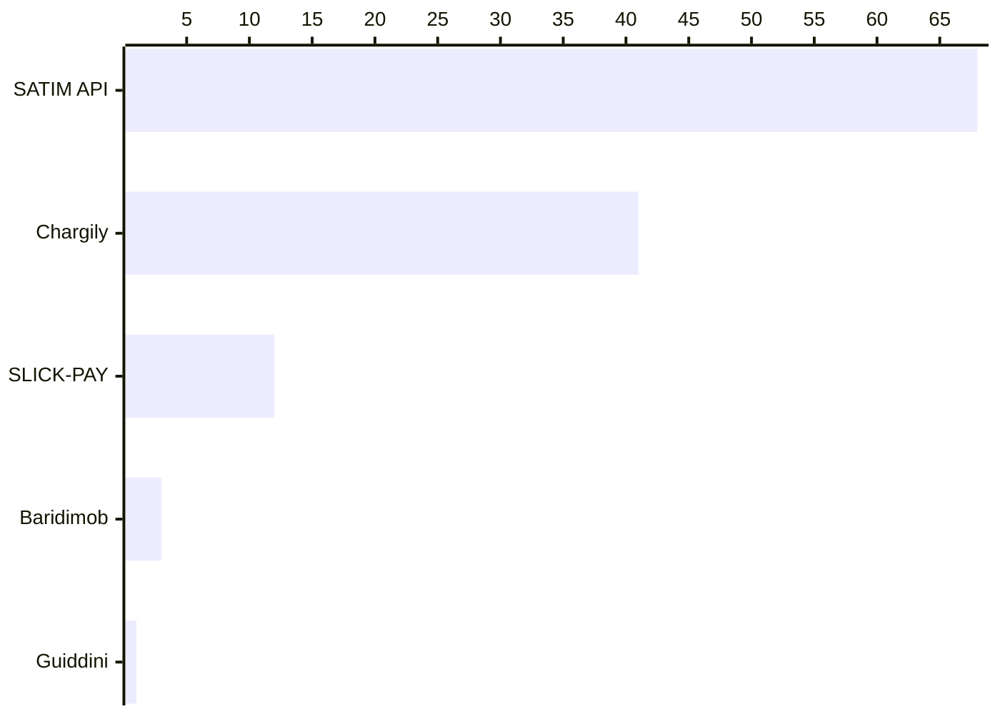

# E-Payment solutions

We asked our survey participants which e-payment solution they use. [Stripe](https://stripe.com/en-de) was the most solution with over 51%.

For the Algerian solutions we have the following:

[SATIM (Automated Interbank Transactions and Electronic Banking Company)](https://www.satim.dz/) (consumed through [CIBWeb](https://www.cibweb.dz/fr/)) is the most used Algerian Payment solution, it accepts both local credit cards (CIB and EDDAHABIA).

However, this solution seem in its early staged with only 475 authorized clients as of now (March 20th, 2024)*.

> \* source: https://www.cibweb.dz/fr/actualites-et-chiffres-cles

The government's official solution (SATIM/CIBWeb) is followed by serval startups offering serval payment modules/APIs, [Chargily](https://chargily.com/) is the second most used solution according to our participants, then followed by [SlickPay](https://www.slick-pay.com/), and [Guidini's e-payment services](https://guiddini.com.dz/e-paiement-en-algerie/).

Such startups promise a better developer experience with their APIs and their lower initial cost. 

<!-- However, looking into CIB's authorized web merchants: https://www.cibweb.dz/fr/annuaires-des-marchands, we see that these startups are registered under different labels.

This may arise some questions about FinTech startup regulations. Do these startup have special licenses to perform financial operations? Does the government require certificates from certain auditors to issue licenses?

On the other hand, onboarding CIBWeb solution might not be trivial and it is not well documented. Navigating through "CIB WEB" search results is very hard as they are often linking to Chargily or Slickpay instead of pointing to official resources, or tutorials/documentation on how to onboard to the official CIBWeb solution. -->

https://www.poste.dz/services/professional/baridimobweb

https://cibweb.dz/fr/modules-autorise