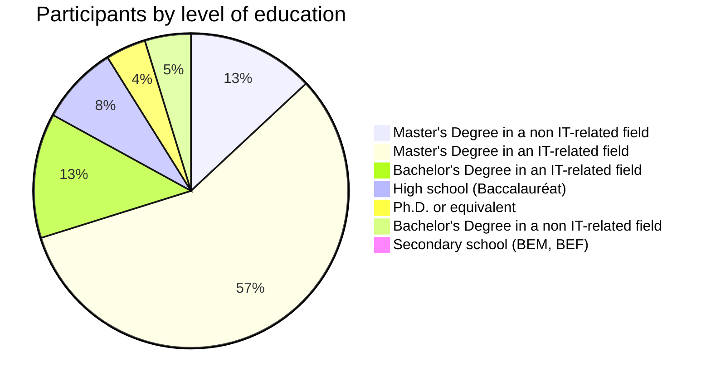
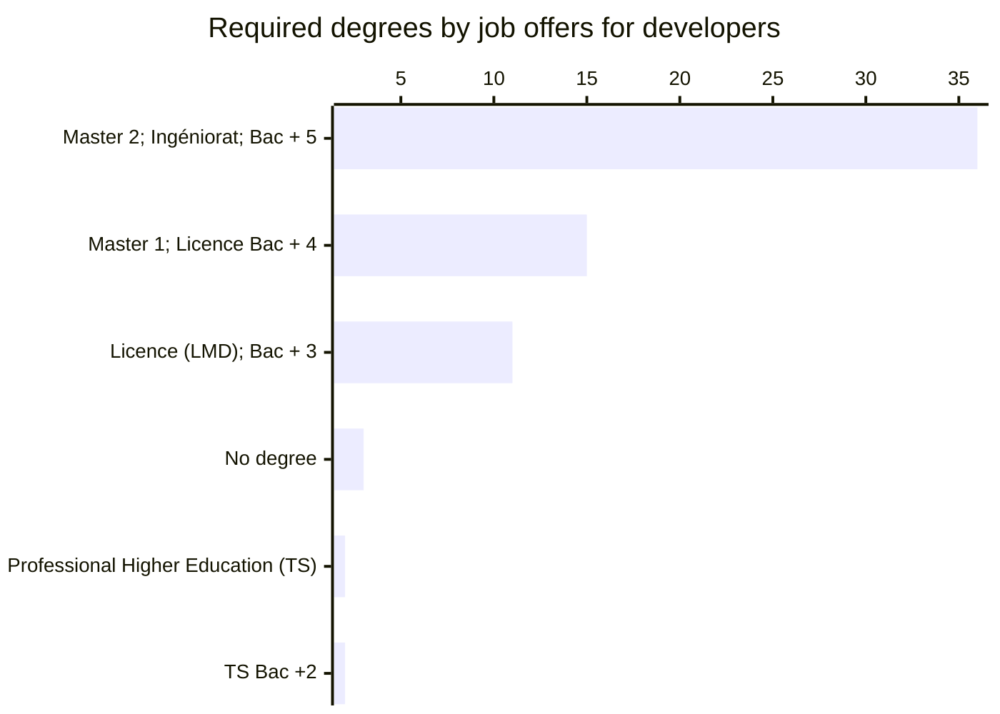

# Education and learning

We asked our participants about their levels of education and we had the following distribution:

:::danger TODOs
-  Allocation from BAC to university
-  what if:
   -  one doesn'T have a degree
   -  doesn'T have a degree in CS/IT
-  degrees from elite schools: ESI, IA...
-  Salaries by education level
-  Outliers study:
   -  Insights from people with BEM
   -  Insights from PhDs
-  Is having a master degree worth it
-  Online education and its value
-  brain drain: study in algeria and work abroad, or go study abroad
:::

The majority (65%) of the participants have a master's degree, and 4% have a Ph.D or an equivalent qualification.

In this page we will explore the relation between academic degrees (formal education) and software engineering craftsmanship.

## Education landscape

:::tip This topic needs a dedicated research, take it from here!

To not shift away from the generic "State of Algerian software engineering" domain this report covers, I would just scratch the surface on this topic. Why? [Read more here](/docs/closing#education).
:::

### High-school

Algerian students study for 3 years in high-schools, after passing Brevet d’Enseignement Moyen (BEM) a national exam to leave lower secondary schools (college or CEM).

TBD mention:

- Languages and social studies (lettres)
- Sciences (natural and physical)
- Technology (mathematics, physical sciences and technology).
- gestion

TBD: mention the fact that one can miss the chance to end in a technical branch if the mess it up in CEM, or HS.

> Can we say that having a bad grade in the national "BEM/BEF" exam can affect chances of working in software engineering?

### Higher education

Access to universities and Higher schools is open to holders of the baccalaureate or a foreign equivalent. The Ministry of Higher Education and Scientific Research sets the requirements (scores to have) annually, assigning students to specialties takes the following parameters in consideration:

- **Student choice:** Students must submit their desired specialties to study in order, then they get assigned the first matching choice.
- **Field of study in the baccalaureate:** Mathematics, Technology and scientific students for example have access to science, technology, engineering, and mathematics (STEM) branches.
- **Average score in specific fields on the baccalaureate:** Set annually based on averages, success rate and choices trends of each edition. For example access to Mathematics and Computer science (MI) branch in the university of Algiers (USTHB) was 13.74 in 2018, 13.83 in 2019, 14.27 in 2020 and 15.53 in 2021 ([source](https://finfo.usthb.dz/wp-content/uploads/2022/09/MoyennesMinimales-MI-USTHB.pdf)).
- **The number of available seats in each field and jurisdiction:** Students are assigned their first matching desired field of study.

This system makes the access to trending study specialties very competitive. Hence, we can use the scores to access these fields in big universities as a metric to see whether Computer science or similar related study fields are trending in Algeria.

For example, in the following graph we compared the minimum admission scores for The [Higher National School of Computer Science (ESI)](https://esi.dz/) compared to success rates for Experimental Science branch:

Table representation

| Year | ESI Admission score | Experimental science success rate | Overall success rate |
| ---- | ------------------- | --------------------------------- | -------------------- |
| 2019 | 16.48               | 47.31%                            | 54,56%               |
| 2020 | 17.07               | 56,97%                            | 55.30%               |
| 2021 | 18.13               | 60%                               | 61,17%               |
| 2022 | 17.95               | 59,32%                            | 58.75%               |
| 2023 | 18.63               | 60,85%                            | 50,63%               |

We see that the minimum admission score is rising, the higher success rate in baccalaureate, the higher admission score is.

Note that universities have different requirements ([see results for 2023](https://www.esi.dz/wp-content/uploads/2023/08/Moyennes-minimales-BAC2023.pdf)).

### Higher/Elite schools

- ESI Alger
- ESI SBA
- IA

ESI and https://www.ensia.edu.dz/
http://www.ensttic.dz/

Cybersecurity school in WIP: https://www.aps.dz/societe/166994-vers-l-elaboration-d-une-strategie-nationale-pour-faire-face-aux-menaces-cybernetiques

### Centre & institutes

### Private universities

- https://services.mesrs.dz/bac2023/guide/fr/priv%C3%A9.html
- https://his.edu.dz/
- https://nit-edu.net/

### Private schools

https://www.agenceecofin.com/formation/2908-100661-en-visite-en-algerie-le-president-macron-relance-le-projet-de-creation-de-l-ecole-42-annonce-depuis-5-ans (code guy on insta)

### Online (private) universities

Some students study online in foreign universities. 

## Does having a degree affect the chances of finding a job?

To answer this question we crawled the biggest employment platform and fetched 48 job postings for software developers, 93% of them required a degree.

### In Algeria
### Abroad/remote
## Does having a degree affect salaries
### In Algeria
### Abroad/remote

<!-- Algerians with degree in IT make %X more/less than  -->

## Brain drain

## Internships

:::tip This topic needs a dedicated research, take it from here!

To not shift away from the generic "State of Algerian software engineering" domain this report covers, I would just scratch the surface on this topic. Why? [Read more here](/docs/closing#nternships).
:::

---
Degrees?

Algerian degree but working abroad?

Do you need a degree in IT to work here or not?

