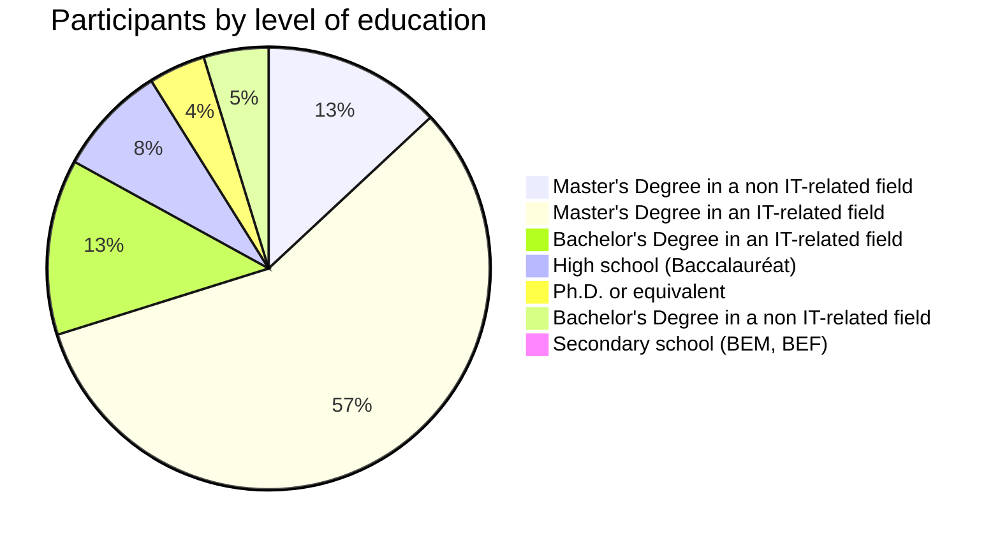
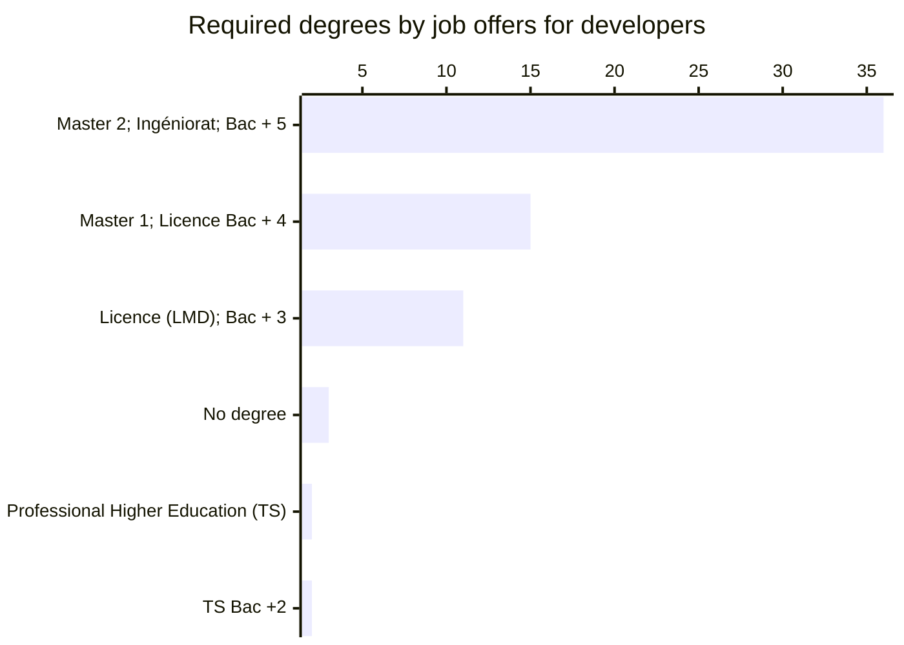

# Education and learning

We asked our participants about their levels of education and we had the following distribution:

The majority (65%) of the participants have a master's degree, and 4% have a Ph.D or an equivalent qualification.

In this page we will explore the relation between academic degrees (formal education) and software engineering craftsmanship.

## Education landscape

:::tip This topic needs a dedicated research, take it from here!

To not shift away from the generic "State of Algerian software engineering" domain this report covers, I would just scratch the surface on this topic. Why? [Read more here](/docs/closing#education).
:::

### High-school

Algerian students study for 3 years in high-schools, after passing Brevet d’Enseignement Moyen (BEM) a national exam to leave lower secondary schools (college or CEM).

TBD mention:

- Languages and social studies (lettres)
- Sciences (natural and physical)
- Technology (mathematics, physical sciences and technology).
- gestion

TBD: mention the fact that one can miss the chance to end in a technical branch if the mess it up in CEM, or HS.

### University

### Higher/Elite schools

### Centre

### Private universities

### Private schools

## Does having a degree affect the chances of finding a job?

To answer this question we crawled the biggest employment platform and fetched 48 job postings for software developers, 93% of them required a degree.

### In Algeria
### Abroad/remote
## Does having a degree affect salaries
### In Algeria
### Abroad/remote

<!-- Algerians with degree in IT make %X more/less than  -->

## Internships

:::tip This topic needs a dedicated research, take it from here!

To not shift away from the generic "State of Algerian software engineering" domain this report covers, I would just scratch the surface on this topic. Why? [Read more here](/docs/closing#nternships).
:::

---
Degrees?

Algerian degree but working abroad?

Do you need a degree in IT to work here or not?

ESI and https://www.ensia.edu.dz/
http://www.ensttic.dz/

institutes

Cybersecurity school in WIP: https://www.aps.dz/societe/166994-vers-l-elaboration-d-une-strategie-nationale-pour-faire-face-aux-menaces-cybernetiques