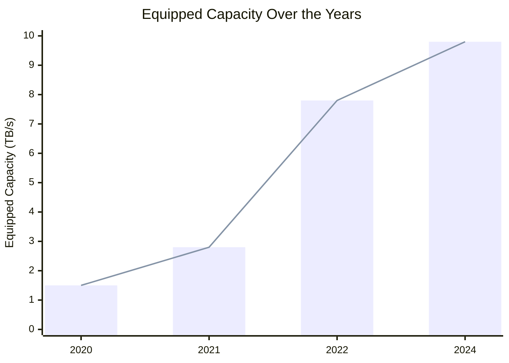
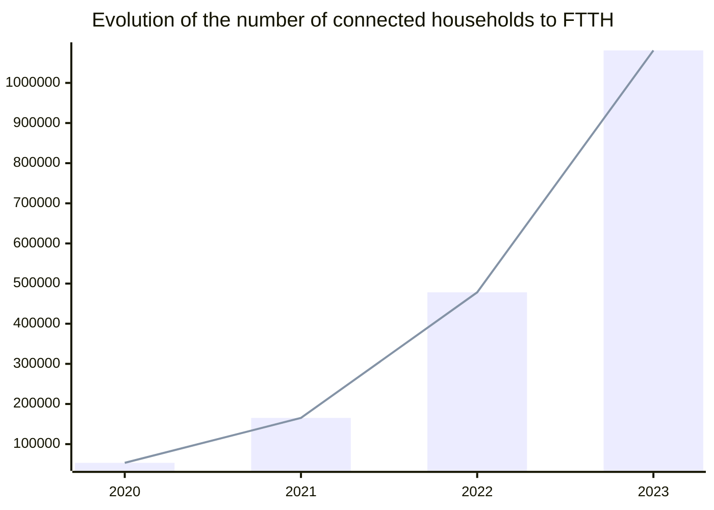

# A bright future

To conclude this report on a positive note, it's essential to highlight several improvement indicators. These indicators not only signify progress but also serve as beacons of hope, illuminating opportunities and providing inspiring examples for advancement.

## Algeria 2030

## Cloud ARPCE

## Startup.dz

## ANAE

https://www.anae.dz/fr/

## E-payments article

## Better Internet & QoS

The [Ministry of Post and Telecommunications](https://www.mpt.gov.dz/en/) led by Mr. [Karim BIBI TRIKI](https://www.mpt.gov.dz/en/ministers-biography/) is taking big steps in improving the Algerian ICT scene and infrastructure.

To improve the quality of service, the [Regulatory Authority of Post and Electronic Communications (ARPCE)](https://www.arpce.dz/fr) launched [Jawdati](https://play.google.com/store/apps/details?id=dz.arpce.jawdati), an application that measures the quality of Internet service in Algeria. Algeria Telecom on its end is very active on its [social media](https://www.facebook.com/AlgerieTelecom) and follow up on queries and complaints from customers.

Recently, the ministry [announced](https://www.mpt.gov.dz/en/the-equipped-capacity-of-our-countrys-international-telecom-network-reaches-9-8tb-s/) that Algerian equipped capacity of the country's network jumped from 7.8 to 9.8 between 2022 and early 2024 to meet the increasing demand for high speed internet.

Table representation

| Year | Bandwidth (TB/s) |
| ---- | ---------------- |
| 2020 | 1.5              |
| 2021 | 2.8              |
| 2022 | 7.8              |
| 2024 | 9.8              |

In parallel, the ministry is extending [the Optical Fiber to Home (FTTH)](https://www.mpt.gov.dz/en/switch-to-optical-fiber/) coverage, where it jumped from 478k households at the end of 2022 to reach more than 1.08 million households by the end of 2023.

Table representation

| Year | # of connected households |
| ---- | ------------------------- |
| 2020 | 53394                     |
| 2021 | 165244                    |
| 2022 | 478172                    |
| 2023 | 1080948                   |

In addition to all technical improvements, the government's new legal frameworks such as the establishment of different professional status for freelancers and entrepreneurs, developers and different IT professionals might be eligible for [Algeria Telecom's business offerings](https://www.algerietelecom.dz/en/entreprises) such as [Mouhtarf package](https://www.algerietelecom.dz/en/entreprises/pack-moohtarif-prod86) which may have more interesting offerings.

## Increasing (transparent) demand on IT talents

More government and official companies are using online platforms and job fairs for job postings and business opportunities. 

The Ministry of Post and Telecommunications lunched [Safqatic](https://www.safqatic.dz/), a tender portal to give more opportunities to startups specializing in the ICT.

https://baosem.com/

EMploitic
Trustme.work

## Data protection laws with ANPDP

https://www.dataguidance.com/notes/algeria-data-protection-overview

## Including diaspora

- https://www.cca-paris.com/index.php/34-prochains-evenements/1336-even-csj
- Yassir Berlin

triki
belkacem habba

yassir
namla
lablabee

## Digitalization

e.g. douane

## IMF report 2024

https://www.imf.org/en/Publications/CR/Issues/2024/04/12/Algeria-2023-Article-IV-Consultation-Press-Release-Staff-Report-and-Statement-by-the-547687