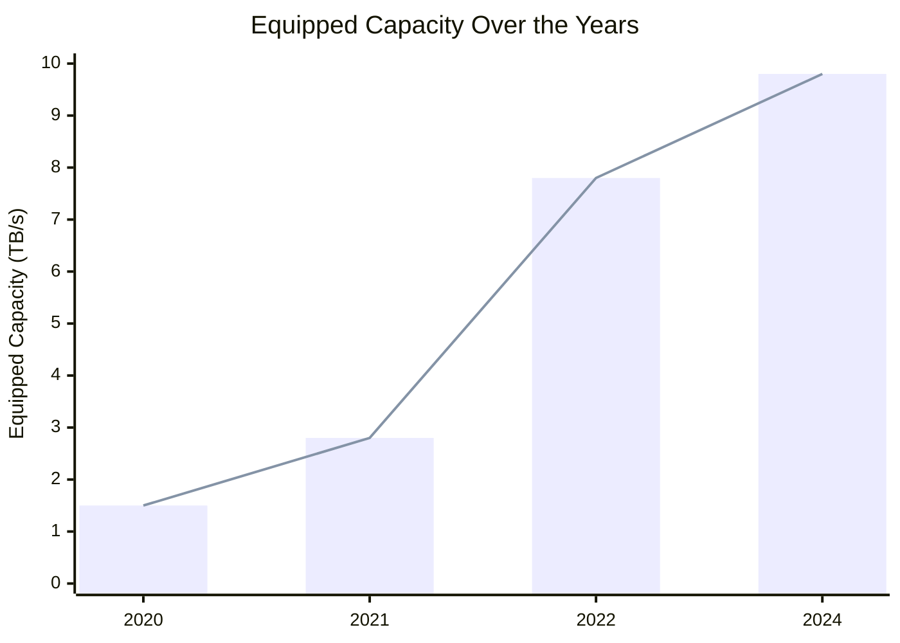
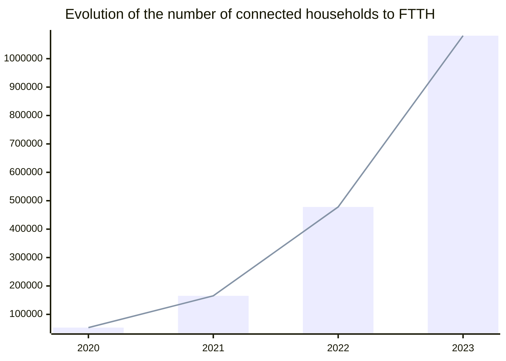

# A bright future

To conclude this report on a positive note, it's essential to highlight several improvement indicators. These indicators not only signify progress but also serve as beacons of hope, illuminating opportunities and providing inspiring examples for advancement.

## Algeria 2030

Late 2011, the previous Ministry of Prospective and Statistics collaborated with Korea Development Institute to establish the [Algerian National vision for 2030](https://www.kdevelopedia.org/Resources/view/Algeria-Establishment-of-national-vision-2030--04201210090122020) document, the ministry was dissolved and replaced with (or just renamed to) [The ministry of Digitalization and Statistics](https://mns.gov.dz/) that manages the [National Office of Statistics](https://www.ons.dz/).

The progress towards Algerian National vision (**as defined in that document**) was not communicated since then. However, several initiatives (such as [Algeria 2030](https://www.algerie2030.com/) conference) and action plans have set 2030 as a target date for development in multiple sectors (tourism, health, industry, energy, etc). This date is also in [the president Abdelmadjid Tebboune's action plan](https://amb-algerie.fr/wp-content/uploads/2022/04/Pland-action-du-gouvernement-pour-la-mise-en-oeuvre-du-programme-du-president-de-la-republique-2021-fr.pdf) as a milestone in development of the health and energy sectors. 

The newly established [ministry of knowledge economy, startups and micro-enterprises](https://mdme.gov.dz/), the [High Commission for Digitalization](https://hcn.gov.dz/) and the [ministry of Digitalization and Statistics](https://mns.gov.dz/) are leading several digitalization projects being implemented across different sectors. These projects are creating new opportunities for different actors in IT, thus improving the Algerian software engineering market. 

## The rise of local cloud providers (approved by ARPCE)

Using Cloud solutions in Algeria raises questions related to data residency and sovereignty, therefor, some companies consider using local hosting and local cloud providers. The Regulatory Authority of Post and Electronic Communications (ARPCE) is one of the regulators that certifies cloud providers.

This authority shall protect clients (cloud tenants and consumers), where they act as a higher regulatory office that controls different cloud hosting companies, watches their compliance and acts as one of the bodies that clients can report issues to.

:::tip Read more about Cloud in Algeria

Are you interested in Cloud and DevOps topics? Head to our [Cloud and DevOps page](/docs/insights/cloud-and-devops).
:::

Having a clear and transparent processes ([as described in ARPCE's website](https://www.arpce.dz/fr/service/cloud)), cloud computing market shall be more democratized, more investors and entrepreneurs can be aware of the official requirements and processes to get their new competitive businesses certified.

Clients on the other hand, can see the list of the certified cloud providers on [ARPCE's website](https://www.arpce.dz/fr/service/cloud) if they want to go to an Algerian hosting service or cloud provider.

## Data protection laws and ANPDP

The Algerian digitalization revolution is creating many challenges regarding data protection. Which makes having an authority like the [National Authority for the Protection of Personal Data](https://anpdp.dz/) more important than ever.

This authority audits and certifies compliant bodies who deal with Algerian personal data. The Algerian personal data is defined in the the law N°18-07 (inspired to some extent by European Union and French data protection law before the entry into force of the GDPR).

:::tip Read more about data laws in Algeria

Are you interested in Data protection laws in Algeria? Head to [Data and Machine learning page](/docs/insights/data-and-ml#data-protection-laws-in-algeria).
:::

Entities who want to deal with personal data can apply to be approved through the [ANPDP's online portal](https://portail.anpdp.dz/).

From our view, and according to multiple interviews we conducted: *"While on paper (and on different media channels) this initiative seems excellent, such initiative seem to be in its early stages. Many companies (and government websites) are not compliant with data protection laws. Some companies don't care, or they might not be aware of an entity like ANPDP.*

*ANDPD is also facing technical issues on its online platforms. We tried to reach out to them by email to confirm that our study is compliant but we did not hear back from them. We also tried to open the link to their online platform and it seems to be offline (for the moment at least)."*

Establishing such an entity, and bringing data protection topics on  different media channels is a step forward in the Algerian digitalization journey.

## The auto-entrepreneur official status

The National Agency of auto-entrepreneurs and self-employment (ANAE) recently made their application process easier. Entrepreneurs and self-employed people in different sectors (not only digital) can apply online to obtain their auto-entrepreneur card.

[ANAE](https://www.anae.dz/) (created by the [ministry of knowledge economy, startups and micro-enterprises](https://mdme.gov.dz/)) aims to implement and to promote new processes to encourage entrepreneurship and to regulate freelancers' and remote workers' situation.

The agency promises to have a fast and easy onboarding process, where entrepreneurs and freelancers can register online get request their cards which allows them to onboard to the official financial system and start contributing to their health insurance, retirement funds, etc.

:::tip Read more about freelance and remote working

Are you interested in learning about freelance and remote working from Algeria? Head to [Remote working page](/docs/insights/remote-working).
:::

This is an opportunity for many freelancers to approach entrepreneurship more easily and for the rest of the population to experiment with the concept at low entry cost. The government also benefits from the ecosystem visibility created by the auto-entrepreneur card. 

## Startup ecosystem and its impact

Being the main focus of the [ministry of knowledge economy, startups and micro-enterprises](https://mdme.gov.dz/), the [startup.dz](https://startup.dz/) is building bridges between the government, entrepreneurs, talents, academia and different investors.

Since launching the platform, the ministry and different agencies worked on promoting entrepreneurship and innovation. Such initiatives create more opportunities for starting new businesses, and for creating more demand on talents.

In the recent years, multiple conferences and meetups took place both nationally and internationally to extend the Algerian startup scene, to learn and to benefit from different actors in different areas.

The government is encouraging startups and innovation by establishing bodies like [Algeria Venture](https://aventure.dz/) the public startup accelerator, [National Agency for Entrepreneurship Support and Development (ANADE)](https://anade.dz/) a rebranding of [National Agency for Support and Employment of Young People (ANSEJ)](https://www.mf.gov.dz/index.php/fr/grands-dossiers/115-dispositif-ansej), and the [ministry of knowledge economy, startups and micro-enterprises](https://mdme.gov.dz/). These bodies fund, educate and promote entrepreneurs to rise their risk appetite, and expose them to new business opportunities with programs like [**The Algeria Startup learning Expedition Program (ASEP)**](https://asep.dz/) that aims expose Algerian startups to world-class innovation ecosystems in China, the United States, and South Korea.

With the "Startups wave", the government is encouraging entrepreneurship and innovation among young entrepreneurs, programs for diaspora, where Algerians living abroad can get facilitation to invest and to have their own startups in Algeria. And programs for students where students can work on thesis with business valid propositions (Startup as "PFE").

These initiatives encourage small gigs to grow into proper businesses, and encourage having more active venture capitals (VCs).

## E-payments and m-payments

Algeria has always been far behind in electronic and mobile payments. But in the last few years several ministries started catching up on a national mission to modernize the financial system.

Created in 2014, [GIE Monétique (Electronic Payment Economic Interest Grouping)](https://giemonetique.dz/) aims to contribute in modernizing the banking systems in Algeria. This entity regulates the interbank electronic payment system and defines the roles of its participants. 

GIE Monétique ensures the interoperability of the payment system with local and international networks.

The group comprises 19 members, including 18 banks and Algerie Poste, with the Bank of Algeria participating as a non-member to oversee the security and standards of payment systems.

Early June this year, SATIM announced their new m-payment solution: [Switch Mobile](https://www.facebook.com/photo.php?fbid=442080865438736&set=a.164290759884416&type=3).

On another hand, Algeria Post's [BaridiWeb and BaridiMob](https://www.poste.dz/services/professional/baridimobweb) seem to be widely used, and getting more popularity among Algerians.

## Better Internet & QoS

The [Ministry of Post and Telecommunications](https://www.mpt.gov.dz/en/) led by Mr. [Karim BIBI TRIKI](https://www.mpt.gov.dz/en/ministers-biography/) is taking big steps in improving the Algerian ICT scene and infrastructure.

To improve the quality of service, the [Regulatory Authority of Post and Electronic Communications (ARPCE)](https://www.arpce.dz/fr) launched [Jawdati](https://play.google.com/store/apps/details?id=dz.arpce.jawdati), an application that measures the quality of Internet service in Algeria. Algeria Telecom on its end is very active on its [social media](https://www.facebook.com/AlgerieTelecom) and follows up on queries and complaints from customers.

Recently, the ministry [announced](https://www.mpt.gov.dz/en/the-equipped-capacity-of-our-countrys-international-telecom-network-reaches-9-8tb-s/) that Algerian equipped capacity of the country's network jumped from 7.8 to 9.8 between 2022 and early 2024 to meet the increasing demand for high speed internet.

Table representation

| Year | Bandwidth (TB/s) |
| ---- | ---------------- |
| 2020 | 1.5              |
| 2021 | 2.8              |
| 2022 | 7.8              |
| 2024 | 9.8              |

In parallel, the ministry is extending [the Optical Fiber to Home (FTTH)](https://www.mpt.gov.dz/en/switch-to-optical-fiber/) coverage, where it jumped from 478k households at the end of 2022 to reach more than 1.08 million households by the end of 2023.

Table representation

| Year | # of connected households |
| ---- | ------------------------- |
| 2020 | 53394                     |
| 2021 | 165244                    |
| 2022 | 478172                    |
| 2023 | 1080948                   |

In addition to all technical improvements, the government's new legal frameworks such as the establishment of different professional status for freelancers and entrepreneurs might be eligible for [Algeria Telecom's business offerings](https://www.algerietelecom.dz/en/entreprises) such as [Moohtarif package](https://www.algerietelecom.dz/en/entreprises/pack-moohtarif-prod86) which may have more interesting offerings.

On May 27th 2024, Algeria Telecom [launched its new offering with high speeds reaching 1GB/s](https://www.algerietelecom.dz/ar/espace-presse/premiere-en-algerie-algerie-telecom-baisse-ses-tarifs-internet-illimite-et-augmente-ses-debits-jusqua-1-gbps-art4650) marking another milestone in the company's long way to improve the Algerian internet quality of service.

## Increasing (transparent) demand on IT talents

Government, private and public companies are increasingly using online platforms and job fairs for job postings and business opportunities. 
The Ministry of Post and Telecommunications launched [Safqatic](https://www.safqatic.dz/), a tender portal to give more opportunities to startups specializing in the ICT. Similarly, Sonatrach and Sonelgaz have their platfom [Baosem](https://baosem.com/) with more digitalization projects.

Lately, the [High Commission for Digitalization](https://hcn.gov.dz/) started publishing some job postings for modern specialties (even for entry-level positions). This might not only be a sign of transparency in communicating job listings, but it also shows a will to digitalize and to modernize the government's tech infrastructure.

The commission's pages on social media seem to post more job offers with competitive salaries (matching our findings for entry-level salaries).

 
 

In addition to such posts on social media, we see that more websites allocate spaces for applicants in their careers pages or similar.

 

Employment fairs and online platforms are the goto for companies now to attract new candidates in IT and software engineering. Among online platforms we list:

- [Emploitic](https://emploitic.com/)
- [Trust Me](https://www.trustme.work/)
- [Emploi Partner](https://www.emploipartner.com/)

## A Scientific council for Artificial intelligence 

On [June 22nd from the last year](https://www.mesrs.dz/index.php/en/2023/06/elementor-52608/), the ministry of higher education and scientific research and the ministry of knowledge economy, start-ups and micro-enterprises **kick started** the Scientific Council of Artificial Intelligence at the Higher National School of Artificial Intelligence. This council serves as an advisory body focused on evaluating AI resources, proposing training programs, and fostering international cooperation with experts inside and outside Algeria.

## Including diaspora

Many Algerians who live abroad are interested in investing in Algeria and its talents. The government on its end encourages these interactions between Algeria and its diaspora.

Diaspora may bring experience and new perspectives to the Algerian market, to either tackle local challenges or build digital products that can compete in the international market. Startups like [Yassir](https://yassir.com/), [Lablabee](https://www.lablabee.com/), [Namla](https://namla.cloud/), [Fentech](https://fentech.ai/) and [Nojoom](https://nojoom.ai/) are built by Algerians, they hire Algerian engineers and often sponsor events as a strategy to attract more talents. These startups expose their Algerian engineers to new challenges and international work standards.

Algerian associations in different foreign countries also have plans and projects that aim to contribute to the Algerian tech industry. For example, the [Higher Council For Youth ](https://csj.gov.dz/) organized early this year a [Hackathon about Digital policies](https://www.cca-paris.com/index.php/34-prochains-evenements/1336-even-csj), and [Deutsch-Algerischer Akademiker und Studierender Verein e.V.(DAAS)](https://daas-ev.org/) who co-published the [DZGITAL: Digital transformation in Algeria](https://digitalarabia.network/media/pages/articles/grab-a-coffee-read/da075f7bd5-1637052954/strategy_paper_algerien_20210406.pdf) on late December 2020 with [Digital Arabia Network (DAN)](https://digitalarabia.network/).

World-class technology leaders and researchers are also investing more in Algeria and in its rising tech industry.
For example, Dr. Belgacem Haba, a researcher and an entrepreneur, started (and endorsed) different projects in Algeria, [Numidia Institute of Technology (NIT)](https://nit-edu.net/) being one of them.

## Digitalization

Algeria is living a digital transformation led by different institutions and companies. The government set this as one of its priorities and established administrations like [The ministry of Digitalization and Statistics](https://mns.gov.dz/), the [Higher Council For Youth ](https://csj.gov.dz/), [The ministry of knowledge economy, startups and micro-enterprises](https://mdme.gov.dz/), etc.

Some government agencies collaborated (or hired) with foreign companies to modernize or to establish their digital infrastructure, for example the [Algerian customs (Douane) collaborated with their South Korean peers](https://www.douane.gov.dz/spip.php?article293&lang=fr) on establishing a new information system to modernize the Algerian customs' infrastructure.

To promote using digital alternatives and to encourage Algerians to use e-payments, some services are open online exclusively. For example, the [Ministry of Youth and Sports](https://www.mjs.gov.dz/) launched [Tadkirati](http://tadkirati.mjs.gov.dz/) to sell tickets for some matches.

However, this approach causes several challenges when not planned and not executed properly. On the 5th of July 2024, the Ministry of Housing, National Planning and the City launched their long-awaited [AADL3 website registrations](https://aadl3inscription2024.dz/) exclusively online, the platform was offline for several hours and presented its users with several errors. Users of this platform reported multiple problems and accused the platform of not planning for peak of usage, and for not testing it properly.

Digitalizing institutions creates opportunities for different actors in the tech industry, including developers. As mentioned in [a previous section](#increasing-transparent-demand-on-it-talents), there's an increase of demand for IT talents to work on digitalization projects. But if these projects are under bad management, and if human resources are not sourced and managed properly, digitalization will expose the country to new risks on the digital sphere.

:::tip
Future article coming on this topic! Stay tuned.
:::

## IMF report 2024

Published on [April 12, 2024](https://www.imf.org/en/Publications/CR/Issues/2024/04/12/Algeria-2023-Article-IV-Consultation-Press-Release-Staff-Report-and-Statement-by-the-547687), the International Monetary Fund (IMF) reported that the Algerian economy is estimated to have grown by 4.2% in 2023, driven by a rebound in hydrocarbon production and strong performance in industry, construction, and service sectors.

Medium-Term Prospects: Diversifying the economy and attracting private investment are crucial for sustained growth. The Monetary and Banking Law reforms aim to strengthen credit markets, develop long-term savings products, and enhance financial inclusion.

Private Sector Potential: Sustained and bold reforms can unlock the potential of the private sector as a driver of growth and job creation.

<!-- 
Certainly! Let's dive deeper into points 3 and 4 from the IMF report on Algeria:

3. **Medium-Term Prospects**:
   - **Diversification of the Economy**: Algeria's economy has long been dependent on **hydrocarbon exports**. To ensure sustained growth, diversification is crucial. The government aims to promote non-oil sectors such as **agriculture**, **manufacturing**, and **services**. By reducing reliance on oil and gas, Algeria can mitigate vulnerability to commodity price fluctuations.
   - **Private Investment**: Encouraging private investment is essential. The **Monetary and Banking Law** reforms aim to create a more conducive environment for investors. By improving access to credit, streamlining regulations, and enhancing investor protection, Algeria seeks to attract both domestic and foreign investment.

4. **Private Sector Potential**:
   - The private sector has untapped potential to drive economic growth and job creation. Bold reforms can unlock this potential. Key areas include:
     - **Labor Market Reforms**: Enhancing labor market flexibility, promoting vocational training, and addressing skills mismatches can boost productivity.
     - **State-Owned Enterprises (SOEs)**: Reforms in SOEs are critical. Improving governance, transparency, and efficiency will enhance their contribution to the economy.
     - **Investment Climate**: Creating an attractive investment climate involves simplifying procedures, reducing bureaucracy, and ensuring legal certainty.

In summary, Algeria's economic future hinges on diversification, private investment, and unleashing the private sector's potential. These reforms are pivotal for sustainable growth and resilience. 😊🌟
 -->

