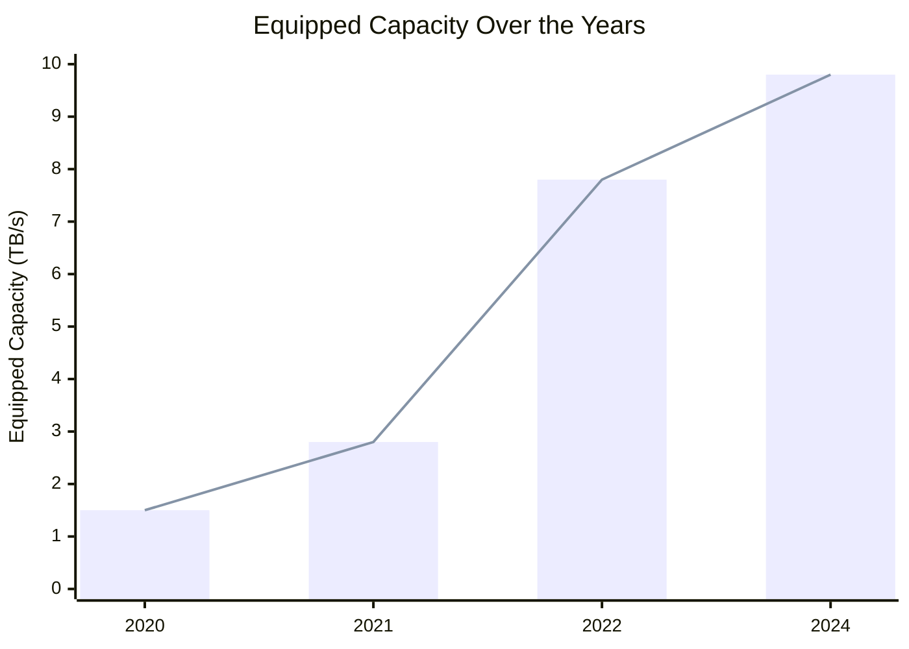
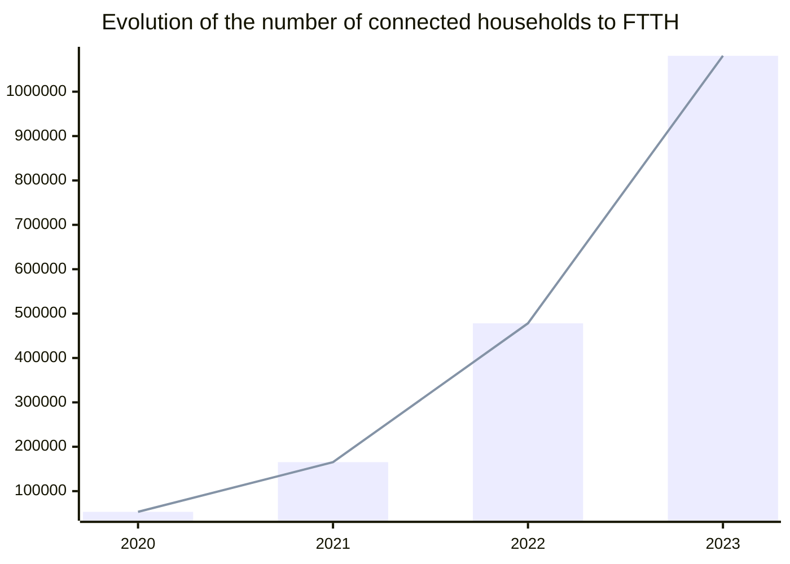

# A bright future

To conclude this report on a positive note, it's essential to highlight several improvement indicators. These indicators not only signify progress but also serve as beacons of hope, illuminating opportunities and providing inspiring examples for advancement.

## Algeria 2030

Late 2011, the previous Ministry of Prospective and Statistics collaborated with Korea Development Institute to establish the [Algerian National vision for 2030](https://www.kdevelopedia.org/Resources/view/Algeria-Establishment-of-national-vision-2030--04201210090122020) document, the ministry was dissolved and replaced with (or just renamed to) [The ministry of Digitalization and Statistics](https://mns.gov.dz/) that manages the [National Office of Statistics](https://www.ons.dz/).

The progress towards Algerian National vision (**as defined in that document**) was not communicated since then. However, several initiatives (such as [Algeria 2030](https://www.algerie2030.com/)) and action plans set 2030 as a milestone in development in multiple sectors (tourism, health, industry, energy, etc).

[The president Abdelmadjid Tebboune's action plan](https://amb-algerie.fr/wp-content/uploads/2022/04/Pland-action-du-gouvernement-pour-la-mise-en-oeuvre-du-programme-du-president-de-la-republique-2021-fr.pdf) set 2030 and 2035 as milestone in development of the health and energy sectors. 

Led by the newly established [ministry of knowledge economy, startups and micro-enterprises](https://mdme.gov.dz/), the [High Commission for Digitalization](https://hcn.gov.dz/) and the [ministry of Digitalization and Statistics](https://mns.gov.dz/), several digitalization projects started being implemented across different sectors in the country. These projects are creating new opportunities for different actors in IT, which shall improve the Algerian software engineering market. 

## The raise of local cloud providers (approved by ARPCE)

Complex and scalable digital products may require cloud computing solutions to host and operate. However, that raises questions related to data residency and sovereignty, therefor, some Algerian companies consider using local hosting and local cloud providers.

In Algeria, the Regulatory Authority of Post and Electronic Communications (ARPCE) is one of the regulators that certifies cloud providers.

Such an authority shall protect clients (cloud tenants and consumers), where they act as a higher regulatory office that controls different cloud hosting companies, watch their compliance and act as one of the bodies that clients can report issues to.

Having a clear and a transparent processes ([as described in ARPCE's website](https://www.arpce.dz/fr/service/cloud)), cloud computing market shall be more democratized, more investors and entrepreneurs can be aware of the official requirements and processes to get their new competitive businesses certified.

Clients on the other hand, can see the list of the certified cloud providers on [ARPCE's website](https://www.arpce.dz/fr/service/cloud) if they want to go to an Algerian hosting service, or a cloud provider.

## Data protection laws and ANPDP

The Algerian digitalization revolution is creating many challenges regarding data protection. Which makes having an authority like the [National Authority for the Protection of Personal Data](https://anpdp.dz/) more important than ever.

The authority audits and certifies compliant bodies who deal with Algerian personal data. The Algerian personal data is defined in the the law N°18-07 (inspired to some extent by European Union and French data protection law before the entry into force of the GDPR).

Entities who want to deal with personal data can apply to be approved through the [ANPDP's online portal](https://portail.anpdp.dz/).

> *While on paper (and on different media channels) this initiative seems excellent, such initiative seem to be in its early stages. Many companies (and government websites) are not compliant with data protection laws. Some companies don't care, or they might not be aware of an entity like ANDPD.*
> 
> *ANDPD on its side may face technical issues on its online platforms, we tried to reach out to them by email to confirm that our study is compliant but we did not hear back from them. We also tried to open the link to their online platform and it seems to be offline (for the moment at least).*

 

Establishing such an entity, and bringing data protection topics on  different media channels is a one step ahead in the Algerian digitalization journey.

## The auto-entrepreneur official status

The National Agency of auto-entrepreneurs self-employment (ANAE) recently made their application process easier. Entrepreneurs and self-employed people in different sectors (not only digital) can apply online to obtain their auto-entrepreneur card.

[ANAE](https://www.anae.dz/) (created by the [ministry of knowledge economy, startups and micro-enterprises](https://mdme.gov.dz/)) aim to implement and to promote new processes to encourage entrepreneurship and to regulate freelancers' and remote workers' situation.

The agency promise to have a fast and easy onboarding process, where entrepreneurs and freelancers can register online get request their cards which allows them to onboard to the official financial system and start contributing to their health insurance, retirement funds, etc.

## Startup.dz

Being the main focus of the [ministry of knowledge economy, startups and micro-enterprises](https://mdme.gov.dz/), the [startup.dz](https://startup.dz/) is building bridges between the government, entrepreneurs, talents, academia and different investors.

Since launching the platform, the ministry and different agencies worked on promoting entrepreneurship and innovation. Such initiatives create more opportunities for starting new businesses, and for creating more demand on talents.

In the recent years, multiple conferences and meetups took place both nationally and internationally to extend the Algerian startup scene, to learn and to benefit from different actors in different areas.

<!-- TBD -->

## E-payments article

## Better Internet & QoS

The [Ministry of Post and Telecommunications](https://www.mpt.gov.dz/en/) led by Mr. [Karim BIBI TRIKI](https://www.mpt.gov.dz/en/ministers-biography/) is taking big steps in improving the Algerian ICT scene and infrastructure.

To improve the quality of service, the [Regulatory Authority of Post and Electronic Communications (ARPCE)](https://www.arpce.dz/fr) launched [Jawdati](https://play.google.com/store/apps/details?id=dz.arpce.jawdati), an application that measures the quality of Internet service in Algeria. Algeria Telecom on its end is very active on its [social media](https://www.facebook.com/AlgerieTelecom) and follow up on queries and complaints from customers.

Recently, the ministry [announced](https://www.mpt.gov.dz/en/the-equipped-capacity-of-our-countrys-international-telecom-network-reaches-9-8tb-s/) that Algerian equipped capacity of the country's network jumped from 7.8 to 9.8 between 2022 and early 2024 to meet the increasing demand for high speed internet.

Table representation

| Year | Bandwidth (TB/s) |
| ---- | ---------------- |
| 2020 | 1.5              |
| 2021 | 2.8              |
| 2022 | 7.8              |
| 2024 | 9.8              |

In parallel, the ministry is extending [the Optical Fiber to Home (FTTH)](https://www.mpt.gov.dz/en/switch-to-optical-fiber/) coverage, where it jumped from 478k households at the end of 2022 to reach more than 1.08 million households by the end of 2023.

Table representation

| Year | # of connected households |
| ---- | ------------------------- |
| 2020 | 53394                     |
| 2021 | 165244                    |
| 2022 | 478172                    |
| 2023 | 1080948                   |

In addition to all technical improvements, the government's new legal frameworks such as the establishment of different professional status for freelancers and entrepreneurs, developers and different IT professionals might be eligible for [Algeria Telecom's business offerings](https://www.algerietelecom.dz/en/entreprises) such as [Mouhtarf package](https://www.algerietelecom.dz/en/entreprises/pack-moohtarif-prod86) which may have more interesting offerings.

In May 27th, Algeria Telecom [launched its new offering with high speeds reaching 1GB/s](https://www.algerietelecom.dz/ar/espace-presse/premiere-en-algerie-algerie-telecom-baisse-ses-tarifs-internet-illimite-et-augmente-ses-debits-jusqua-1-gbps-art4650) marking another milestone in the company's long way to improve the Algerian internet quality of service.

## Increasing (transparent) demand on IT talents

More government and official companies are using online platforms and job fairs for job postings and business opportunities. 

The Ministry of Post and Telecommunications lunched [Safqatic](https://www.safqatic.dz/), a tender portal to give more opportunities to startups specializing in the ICT.

https://baosem.com/

EMploitic
Trustme.work

## Including diaspora

- https://www.cca-paris.com/index.php/34-prochains-evenements/1336-even-csj
- Yassir Berlin

triki
belkacem habba

yassir
namla
lablabee

## Digitalization

e.g. douane

## Algerian responsible AI projects

https://nojoom.ai/

https://www.echoroukonline.com/%D9%86%D8%AD%D9%88-%D8%AA%D9%82%D9%86%D9%8A%D9%86-%D9%85%D8%B3%D8%A4%D9%88%D9%84%D9%8A%D8%A9-%D8%A7%D9%84%D8%B0%D9%83%D8%A7%D8%A1-%D8%A7%D9%84%D8%A7%D8%B5%D8%B7%D9%86%D8%A7%D8%B9%D9%8A-%D9%81

## IMF report 2024

https://www.imf.org/en/Publications/CR/Issues/2024/04/12/Algeria-2023-Article-IV-Consultation-Press-Release-Staff-Report-and-Statement-by-the-547687