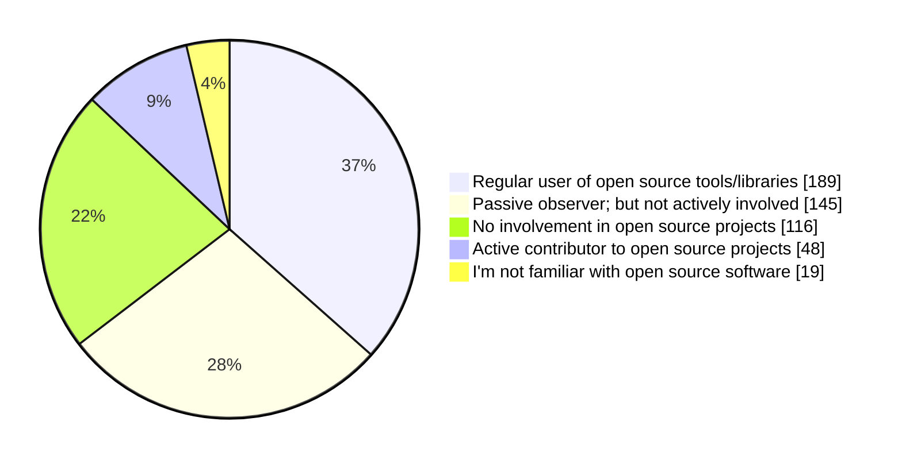

# Open Source

We asked our participants `How would you describe your involvement with open source software development?` and the answers where the following:

According to data, we see that Algerian software engineers mostly use open-source frameworks and libraries, while we see that some engineers who work in corporate and large companies may use proprietary software.

We also see that few of our survey participants consider themselves active contributors to open-source projects. 57% of them are senior engineers, 15% are mid-level engineers, 8% have managerial or leadership roles, and the rest are juniors.

## Visibility

It is hard to find data about Algerian open-source initiatives, or about contributions made by Algerians.

Algeria is not present in different reports due the lack of data, or the lack of visibility of Algerian contributions.

For example, Algeria was not present in [Github's Octoverse report for 2023](https://github.blog/2023-11-08-the-state-of-open-source-and-ai/#fastest-growing-developer-communities-in-africa), as Algerian contributions are not present in "[Made in Africa](https://github.com/collections/made-in-africa)", while Nigeria for example took the lead as the fastest growing country in terms of OSS developers, with a collection of 200+ of projects [made in Nigeria](https://github.com/acekyd/made-in-nigeria).

[Made in Algeria collection on Github](https://github.com/collections/made-in-algeria) is not actively maintained, and it only list a few projects.

Individual contributions made by Algerians might also not be visible in reports and surveys, as some engineers choose not to share their locations on their public profiles, or some of them work from abroad.

## Algerian Open Source projects

- https://github.com/Alfanous-team/alfanous
- https://github.com/idurar/idurar-erp-crm
- https://github.com/linux-lock/bpflock
- https://github.com/linuxscout/mishkal
- https://github.com/linuxscout/pyarabic
- https://github.com/linuxscout/tashaphyne
- https://github.com/Hamz-a/frida-android-helper
- https://github.com/SofianeHamlaoui/Lockdoor-Framework
- https://github.com/assem-ch/django-jet-reboot
- https://github.com/assem-ch/arabicstemmer
- https://github.com/01walid/sloughi
- https://github.com/OpenDZ/timgad
- https://github.com/tixxdz/ahaggar
- https://github.com/aissat/easy_localization

:::info
I'm adding more repositories to [Made In Algeria collection](https://github.com/github/explore/pull/4279), and please do so as well!
:::

## Open Source projects with Algerians as maintainers or contributors

Although the modest contributions from Algerian software engineering community, we still see that some large and established open-source projects receive significant contributions from Algerians. This may participate in spreading open-source culture.

There are a few Algerians who are active open-source projects and/or work full-time on open-source projects, for example:

- [Cherif Bouchelaghem](https://github.com/cherifGsoul) works on [CanJS](https://github.com/canjs).
- [Riad Benguella](https://github.com/youknowriad) works on [Wordpress](https://github.com/wordpress) and their [Gutenberg](https://github.com/WordPress/gutenberg) project
- [Seghir Nadir](https://github.com/senadir) works on  [WooCommerce](https://github.com/woocommerce/woocommerce).
- [Djalal Harouni](https://github.com/tixxdz) works on serval projects by [Cilium](https://github.com/cilium) and contributed to major open-source projects such as [the Linux Kernel](https://github.com/torvalds/linux), [systemd](https://github.com/systemd/systemd), [nmap](https://nmap.org/) and others.
- [Tiramisu compiler](https://github.com/Tiramisu-Compiler/tiramisu) received contributions from [serval Algerians](https://github.com/Tiramisu-Compiler/tiramisu/blob/master/CONTRIBUTORS) such as Dr. [Riyadh Baghdadi](https://github.com/rbaghdadi).

## Algerian Open Source communities

There are a few associations and students that promote open-source software and culture.

As stated in our [communities section](/docs/insights/communities.md), there are some organizations who promote the usage of free and open-source software, and promote OSS culture and contributions. For example:

- [Free Software & GNU/Linux Algeria (الجمعية الثقافية العلمية البرمجيات الحرة و غنو/لينكس)](https://www.facebook.com/fsgla): Promotes FOSS and GNU/Linux, this association [invited Richard Stallman back in 2015](https://www.fsf.org/events/rms-20150205-djelfa), and runs some activities to promote FOSS software, like organizing GNU/Linux install parties.

Some students groups like [Team Open Minds](https://github.com/open-minds/) promotes GNU/Linux and open-source software, and teaches students how to use Git/GitHub and encourages open-source culture among them.

:::warning
TBD
:::

## Algerian Companies maintaining Open Source projects

- https://github.com/BIGmama-technology
- https://github.com/codiume
- https://github.com/idurar
