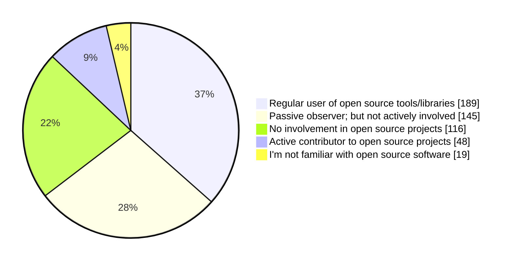

# Open Source

We asked our participants `How would you describe your involvement with open source software development?` and the answers where the following:

According to data, we see that Algerian software engineers mostly use Open Source frameworks and libraries, while we see that some engineers who work in corporate and large companies may use proprietary software.

We also see that few of our survey participants consider themselves active contributors to Open Source projects. 57% of them are senior engineers, 15% are mid-level engineers, 8% have managerial or leadership roles, and the rest are juniors.

## Visibility

It is hard to find data about Algerian Open Source initiatives, or about contributions made by Algerians.

Algeria is not present in different reports due the lack of data, or the lack of visibility of Algerian contributions.

For example, Algeria was not present in [Github's Octoverse report for 2023](https://github.blog/2023-11-08-the-state-of-open-source-and-ai/#fastest-growing-developer-communities-in-africa), as Algerian contributions are not present in "[Made in Africa](https://github.com/collections/made-in-africa)", while Nigeria for example took the lead as the fastest growing country in terms of OSS developers, with a collection of 200+ of projects [made in Nigeria](https://github.com/acekyd/made-in-nigeria).

[Made in Algeria collection on Github](https://github.com/collections/made-in-algeria) is not actively maintained, and it only list a few projects.

Individual contributions made by Algerians might also not be visible in reports and surveys, as some engineers choose not to share their locations on their public profiles, or some of them work from abroad.

## Algerian Open Source projects

- https://github.com/Alfanous-team/alfanous
- https://github.com/idurar/idurar-erp-crm
- https://github.com/linux-lock/bpflock
- https://github.com/linuxscout/mishkal
- https://github.com/linuxscout/pyarabic
- https://github.com/linuxscout/tashaphyne
- https://github.com/Hamz-a/frida-android-helper
- https://github.com/SofianeHamlaoui/Lockdoor-Framework
- https://github.com/assem-ch/django-jet-reboot
- https://github.com/assem-ch/arabicstemmer
- https://github.com/01walid/sloughi
- https://github.com/OpenDZ/timgad
- https://github.com/tixxdz/ahaggar
- https://github.com/aissat/easy_localization
- https://github.com/kossa/laradminator
- https://github.com/kossa/algerian-cities

:::info
I'm adding more repositories to [Made In Algeria collection](https://github.com/github/explore/pull/4279), and please do so as well!
:::

## Algerians' Contributions to Open Source

Even if Algerians have been contributing to large and established Open Source projects, the number of engineers
contributing is still low. More engineers and developers need and have to get involved into Open Source if they
want better work opportunities.

:::info
Did you know that Algerians made major contributions and their code is running on another planet not only earth?

[Djalal Harouni](https://github.com/tixxdz) while in Algeria, his Open Source work was included into [Ingenuity Mars Helicopte Mission](https://www.jpl.nasa.gov/missions/ingenuity)
sent to Mars planet. Ingenuity was deployed to the surface on April 4, 2021. On April 19, it became the first aircraft in history to make a powered, controlled flight on another
planet.
This incredible achievement was powered in part by [Open Source developers around the world (12,000 developers)](https://github.blog/2021-04-19-open-source-goes-to-mars/)
including Djalal's contribution to the [Linux kernel](https://github.com/torvalds/linux) as it was the main Operating system.

Open Source has no frontier. Every one has a chance to make great contributions and work at great companies.
:::

There are other Algerians who are active Open Source projects and/or work full-time on Open Source projects, for example:

- [Cherif Bouchelaghem](https://github.com/cherifGsoul) works on [CanJS](https://github.com/canjs).
- [Riad Benguella](https://github.com/youknowriad) works on [Wordpress](https://github.com/wordpress) and their [Gutenberg](https://github.com/WordPress/gutenberg) project
- [Seghir Nadir](https://github.com/senadir) works on  [WooCommerce](https://github.com/woocommerce/woocommerce).
- [Djalal Harouni](https://github.com/tixxdz) works on several projects by [Cilium](https://github.com/cilium), and other major Open Source projects such as [the Linux Kernel](https://github.com/torvalds/linux), [systemd](https://github.com/systemd/systemd), [nmap](https://nmap.org/), etc.
- [Tiramisu compiler](https://github.com/Tiramisu-Compiler/tiramisu) received contributions from [serval Algerians](https://github.com/Tiramisu-Compiler/tiramisu/blob/master/CONTRIBUTORS) such as Dr. [Riyadh Baghdadi](https://github.com/rbaghdadi).

## Work and contributions to Major Open Source projects

Algerians' contributions to popular Open Source projects that run the internet. Only projects with +100 Github Stars on the 24-04-2024:

- [Linux kernel source tree on github](https://github.com/torvalds/linux) 170k Stars.
- [Linux systemd System and Service Manager](https://github.com/systemd/systemd) 12.5k Stars.
- [NASA F´- A flight software and embedded systems framework](https://github.com/nasa/fprime) 9.9k Stars.
- [The Block Editor project for WordPress and beyond](https://github.com/WordPress/gutenberg) 9.9k Stars.
- [Open Source Headless ERP CRM E-Commerce Software Multi Branch & Currency](https://github.com/idurar/idurar-erp-crm) 5.4k Stars.
- [WordPress Develop](https://github.com/WordPress/wordpress-develop) 2.3k Stars.
- [CanJS Build CRUD apps in fewer lines of code](https://github.com/canjs/canjs) 1.9k Stars.
- [Low-level core library that forms the basis for projects such as GTK+ and GNOME](https://github.com/GNOME/glib) 1.5k Stars.
- [Web Development Evolved - The Firebug you have known and loved](https://github.com/firebug/firebug) 1.3k Stars.
- [Legacy Django jet rebooted to support Django 3 and Django 4, and latest python releases](https://github.com/assem-ch/django-jet-reboot) 368 Stars.
- [Alfanous is an Arabic search engine API provides the simple and advanced search in Quran , more features and many interfaces](https://github.com/Alfanous-team/alfanous) 248 Stars.
- [Integration of Adminator into Laravel 6.x/7.x/8.x with RTL support](https://github.com/kossa/laradminator) 225 Stars.
- [bpflock - eBPF driven security for locking and auditing Linux machines](https://github.com/linux-lock/bpflock) 133 Stars.

## Algerian Open Source communities

There are a few associations and students that promote Open Source software and culture.

As stated in our [communities section](/docs/insights/communities.md), there are some organizations who promote the usage of free and Open Source software, and promote OSS culture and contributions. For example:

- [Free Software & GNU/Linux Algeria (الجمعية الثقافية العلمية البرمجيات الحرة و غنو/لينكس)](https://www.facebook.com/fsgla): Promotes FOSS and GNU/Linux, this association [invited Richard Stallman back in 2015](https://www.fsf.org/events/rms-20150205-djelfa), and runs some activities to promote FOSS software, like organizing GNU/Linux install parties.

Some students groups like [Team Open Minds](https://github.com/open-minds/) promotes GNU/Linux and Open Source software, and teaches students how to use Git/GitHub and encourages Open Source culture among them.

:::warning
TBD
:::

## Algerian Companies maintaining Open Source projects

- https://github.com/BIGmama-technology
- https://github.com/codiume
- https://github.com/idurar
