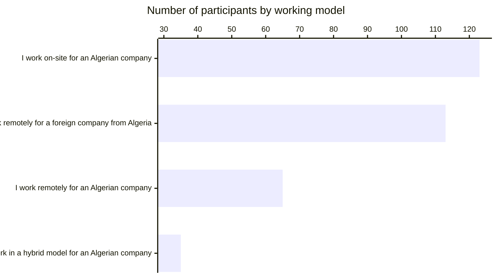
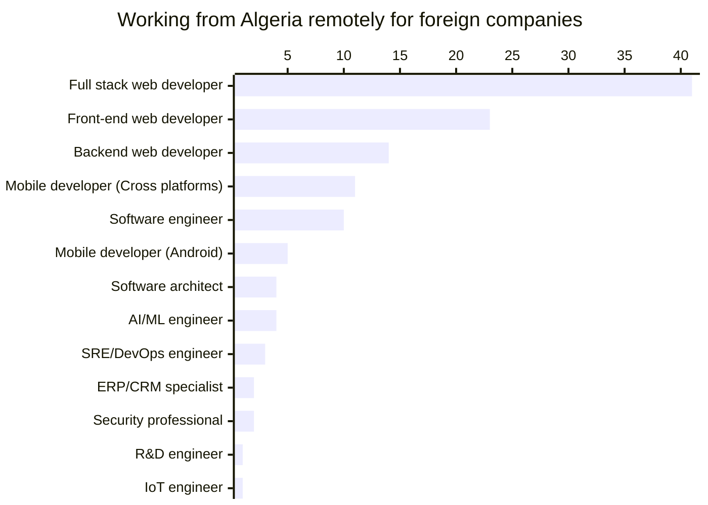
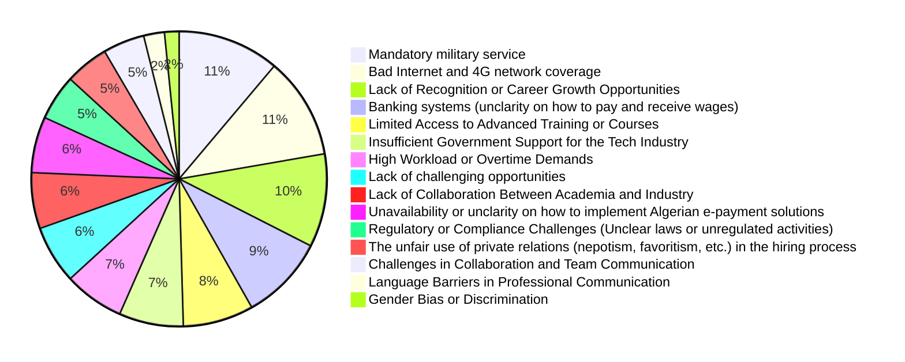
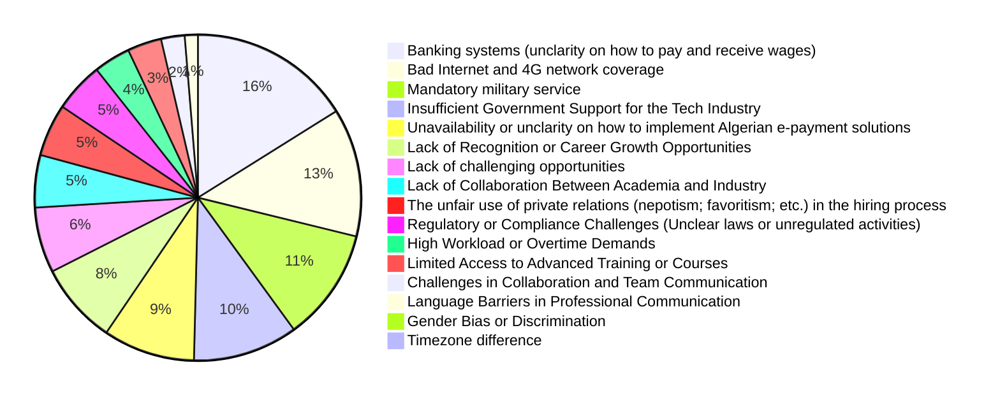

# Remote working

More than half of our participants work remotely either for Algerian companies or foreign companies. We asked our participants who live in Algeria about their working model, the answers were the following:

 
From the numbers above we notice the following:

- There's a tendency to work on-site, or fully remote rather than having a hybrid working model.
- There's a tendency to work for foreign companies remotely from Algeria.

We also noticed that some participants work for both Algerian and foreign companies remotely (having more than one job, or multiple clients). 

 

**62.47%** of participants who live in Algeria have `Remote Work Options` as one of the perks their jobs provide.

## Working for Algerian companies remotely

Some Algerian companies prefer in-office (on-site) working models, according to data from our interviews, human interactions and the social aspect is important in the Algerian culture.

In some interviews, experts claimed that some engineers "lacks professionalism" or at least a "remote working discipline/culture", which makes companies prefer having their staff on-site for a more productive and a professional working environment.

In an interview with an engineer who worked for one of Algeria's leading tech companies, we noted that their company (and other startups) switched to remote work models during COVID lockdown, and got back to a hybrid working model, that period forced teams and companies to adapt a remote working model and helped establishing that culture.

Some companies benefited more from that cultural shift as they downsized their offices, and got more open to hire engineers from different wilayas.

High living costs in the capital where most of the attractive tech jobs are located and public transports' situation in many wilayas are some of the reasons why engineers prefer to work remotely from their homes. Some engineers see that as a way to be productive, while others see that as a luxury where they can cut commute time and be able to clock out from work earlier.

Some companies in the private sector can negotiate hybrid and remote working options, while it's not possible with some companies in the public sector.

In an analysis of an Algerian tech-focused recruitment portal (on June 2024), we counted that **50%** of job offers require in-person presence at company offices, **34%** provide hybrid working model, and **16%** are fully remote.

According to our survey data, **60%** of participants who work for Algerian companies or for foreign companies based in Algeria have remote working options as one of the perks their jobs provide. These perks are provided to **56%** of our participants who work from Oran or Algiers, **70%** to **80%** of participants who work from Sétif, Relizane, Tipaza, and M'Sila.

**56%** of participants who work for these companies from Oran and Algiers work remotely,

## Working for foreign companies remotely from Algeria

**29%** of our survey participants work for foreign companies remotely from Algeria, most of them are web developers.

 

Algerians work remotely in take different roles. Some participants work remotely on freelancer gigs, others work full-time or part-time for foreign companies.

These opportunities are found online or through connections. However, finding such opportunities is getting harder and more competitive, therefor some Algerians offer prices below average on platforms like Upwork and PeoplePerHour.

:::tip

We discussed salaries for remote workers in our [remuneration page](/docs/insights/remuneration#working-remotely-for-foreign-companies).

Wages vary based on different parameters, on clients' and companies' countries, skills, specialization, platforms and negotiation skills.
:::

### Legal framework

Some foreign companies hire Algerians as independent contractors, they get paid monthly or by tasks (or projects). Companies in different countries may not need to contribute in contractors' health insurance, paid time off (in some cases), and other benefits associated with full-time employees in their local area.

Therefor they only paid salaries to contractors' bank accounts and they don't have to care about their contractors' legal situation in their countries of residence.

From the Algerian workers' side, until the last year some remote workers had few options to navigate the Algerian legal system if they want to declare their activities. Some engineers created EURLs (Single Limited Liability Company) or a SARL (Limited liability company) as teams or individuals.

However -according to interviews with actors in the Algerian ecosystem- the legal framework, banking systems and personal working in administrations caused major challenges. That may contribute in discouraging engineers to declare their jobs/income, and work "unofficially". Wages can be received in foreign currencies through international electronic banks and through third-party people,  then they can be traded in the widely substantial *and tolerated* black market for a higher rate than the official's.

Early this year, the government launched the National Agency for Self-Employed ([ANAE](https://www.anae.dz/)) that facilitate the application for a new legal status for entrepreneurs, self-employed, or those who work remotely. The new legal status can be applied for online from ANAE's online platform, once the process is fulfilled applicants gets an auto-entrepreneur card.

By May 2024, ANAE's online platform (https://www.anae.dz/) had more than 10.000 applicant, where more 8000 of them received their self-employed/auto-entrepreneur cards (according to [the minister](https://www.aps.dz/economie/171190-auto-entrepreneuriat-l-anae-et-sa-plateforme-ont-booste-l-acces-des-jeunes-a-l-auto-emploi)).

However, many Algerians still prefer to work without applying for any legal framework. According to our interviewees, that's related to the tolerance of the "black market" and a distrust in bank systems and legal frameworks.

To many workers, it is more convenient to receive wages through third-party payment solutions and/or contacts, trade a part of it in the currencies black market (which is prominent and accessible) rather than going through the Algerian bank systems which is still far behind compared to what electronic banks provide. That and the fact that foreign currencies have a higher rate on the black market (may reach a **60%** more than official rate).

The lack of an appropriate tax education and a distrust in the government might also be a reason why people chose to evade paying taxes and for health insurance. According to our interviewees, it is cheaper to pay private doctors whenever they (or their family members) get sick than to pay contributions for health insurance (same logic for retirement, they prefer to save and invest on their own).

To remediate that, the government and some private agencies started working on different initiatives ([Moukawil](https://moukawil.dz/) for example) to educate entrepreneurs and workers. These parties also co-invest in facilitate and incentivize workers to work within a legal framework and pay their duties. 

On another hand, the government established an action plan to force integrating businesses to the official financial system. This action plan was one of the [the president Abdelmadjid Tebboune's plans](https://amb-algerie.fr/wp-content/uploads/2022/04/Pland-action-du-gouvernement-pour-la-mise-en-oeuvre-du-programme-du-president-de-la-republique-2021-fr.pdf).

The plan aims to identify informal activities and potential taxpayers, to implement measures to encourage the transition to the formal sector, and recovering funds from the informal market. With additional efforts to improve communication about tax rights and guarantees, and strengthening control mechanisms, simplify business registration processes, and provide regulated spaces for previously informal activities.

#### Having offshore companies

Some Algerians prefer to create companies abroad (in United Kingdom, Dubai, Abu Dhabi or in few other countries), that opens more opportunities in dealing with clients and growing businesses abroad. These Algerians claim that is easier and cheaper way to grow businesses and accessing international markets than to have a company registered in Algeria.

Others prefer to create companies in Algeria even if they operate abroad and/or work with international clients. This models grants (according to our interviewees) access to the Algerian talents by providing competitive salaries (compared to other Algerian companies) and to provide a legal working environment that grants social benefits for employees.

These companies act either as software development and consulting agencies that work on short-term projects, or work full-time on their own digital products.

## Challenges & opportunities for the Algerian market

This raising remote working trend in Algeria is offering a lot of opportunities to many Algerian engineers, it's also contributing in upskilling talents by exposing them to technical challenges in more mature tech companies and countries.

Finding remote jobs is one of the most attractive opportunities engineers look up to (according to many of our interviewees), mostly for financial reasons. Which is contributing in one of the biggest challenges local startups and businesses are facing: Talents fleeing to work remotely.

According to our survey data (graph below representing yearly salaries in euros), remote workers salaries start from around **€500/Month** for entry-level and juniors, **€1000/Month** for mid-level developers, and seniors' salaries match median salaries in Europe and some Gulf countries.

These salaries when converted in the parallel/black market for a higher rate create a greater gap between local salaries, and salaries from these jobs.

A base entry level to a junior level salary of **€500/Month** with a rate of `€1 = 240 DZD` is equal to **120K DZD/Month**. Which is in the upper band of the range salaries of this category.

The gap is greater the more experience the engineer has. For example, engineers with 6 to 10 years of experience get paid around **2500€/Month**, which is **600K DZD/Month**. This salary exceed by far the maximum salary Algerian companies pay for engineers, this represents up to 3 folds the salary of engineers of the same seniority in Algerian private companies.

Given that remote workers *often* (according to our interviewees) work outside the official financial system where they receive their wages through third-party solutions, exchanges them in parallel market, and don't pay taxes or contributions to social insurance funds... These workers make far more money than they would do (in some cases) if they work for Algerian companies.

Raising startups and tech companies are facing challenges when looking for competent seniors to hire, and when they find potential candidates they can't match their salary expectations.

These financial incentives, exposure to technical challenges and sometimes more flexible ways of working attract more (senior) talents and sometimes make them leave their full-time jobs at their local Algerian companies to work remotely.

[According to our interviewees](/docs/appendix/raw-interviews), some companies are trying to find other incentives to attract talents and to keep them onboard.

## Challenges remote workers are facing

### Working remotely for Algerian companies

Algerians who live in Algeria and work remotely (hybrid or full-time) for Algerian companies reported the following challenges:

\* *Some participants in this category also work/freelance remotely for foreign companies*

:::tip
Challenges in this group are quite similar to the overall challenges discussed in [**Challenges** page](/docs/insights/challenges).
:::
 
From companies' perspective, they prefer to hire developers to work onsite. According to our interviewees, the overall working culture of many Algerians lacks soft-skills and productive remote working practices (in addition to logistical problems, such as Internet connection).

Therefor, many companies invest in their offices and "on-site" as a primary working model to have a more productive working environment, a better culture (professionally and personally).

However, this model may introduce additional costs to companies and limit their access to a national talent pool.

Other startups and young companies, or clients who hire freelancers for small gigs still prefer to hire remote workers. Especially that the Algerian ecosystem is loosing requirements for startups and enterprises, as having a physical address is not a requirement for young companies ([according to the amendment to the article 21 of law N°04-08 on 2019](https://www.commerce.gov.dz/fr/questions-frequentes/themes/registre-du-commerce)), or with the widespread companies who provide domiciliation services.

### Working remotely for foreign companies

Participants who live in Algeria and work exclusively for foreign companies reported the following challenges:

 

While many Algerians see an opportunity in the using third-party solutions to receive wages, it appears that banking systems is still the major challenge of remote employees who work for foreign companies, followed by the issues with Internet connection and the mandatory military service.

## Working from co-work spaces

According to our survey data, 95% of the participants who work remotely from Algeria work from their homes, 8% use public places like cafeterias and libraries, and only 7% use co-working spaces.

To investigate this further more we [interviewed](/docs/appendix/raw-interviews) several personas.

Engineers who work remotely may not use workspaces for the following reasons:

- **Logistics:** 
  - Some co-working spaces are located in city centers or in places that are challenging to reach with public transport, or by car due to traffic jams. Engineers prefer to work from home and save the commute time.
  - Some engineers reported many issues with Internet and connectivity, in one of the interviews, a developer stated:
    > I always have my 4G modem with me, once we had an internet problem while being in a workspace, when we reported it to the manager he offered to make his personal phone as a Wi-Fi hotspot.
- **Workspaces being places for networking and events:**
  - Some co-working spaces tend to run different workshops and networking events, this might not be suitable for engineers and developers who want to have a calm place where they can focus for long hours.
  - Some co-working places don't provide a dedicated setup for having e-meetings and calls, which is not optimal in a remote working setup.
- **The culture:**
  - A co-working place owner reported that developers and engineers in general "are not very social", which might clash with the open and social culture of a shared working space.
  - Developers reported that co-working spaces are for socializing and for non-work related activities, which is both not interesting and distracting.
- **Unavailability:**
  - Some small wilayas don't have co-working spaces, and in the big wilayas traffic jams and the long commute to these places makes it less appealing of a choice.

According to different participants; membership costs are not an issue, especially if they are working for foreign companies and getting paid in foreign currencies.

