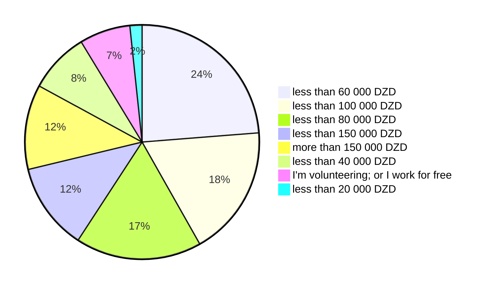
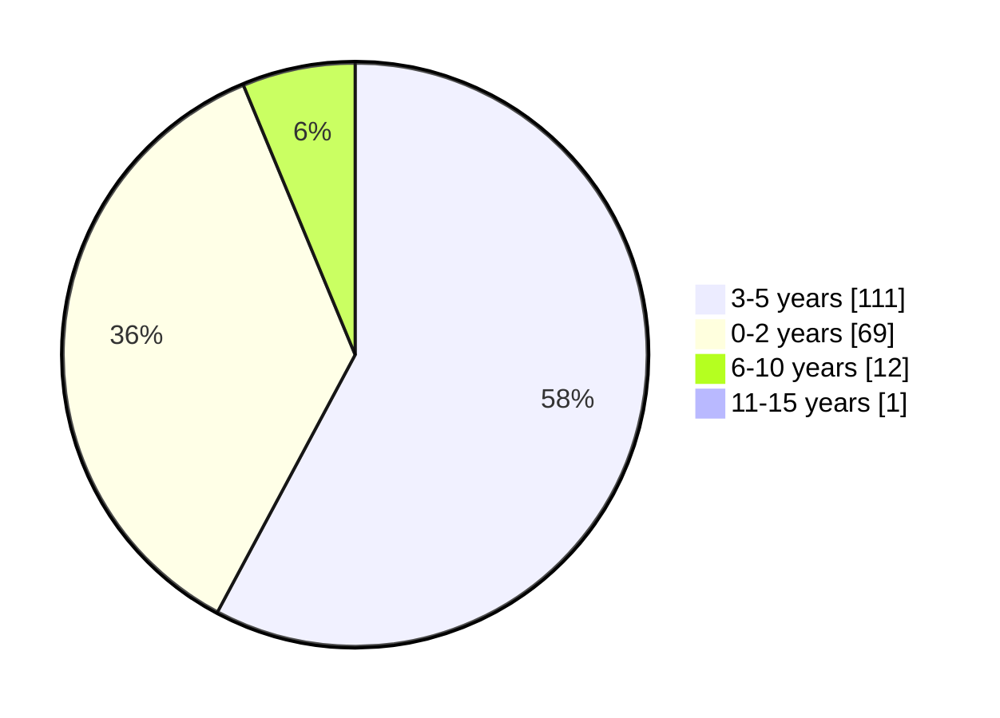
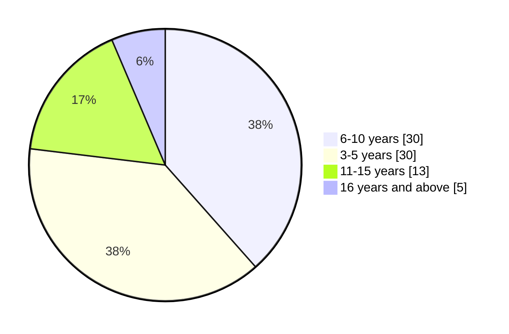
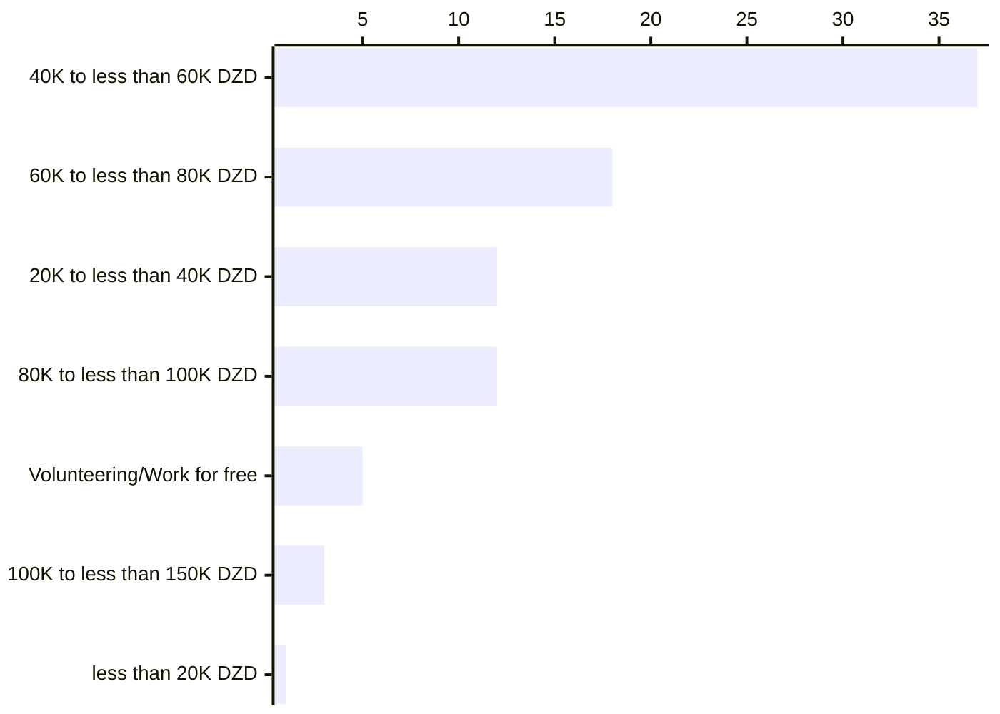
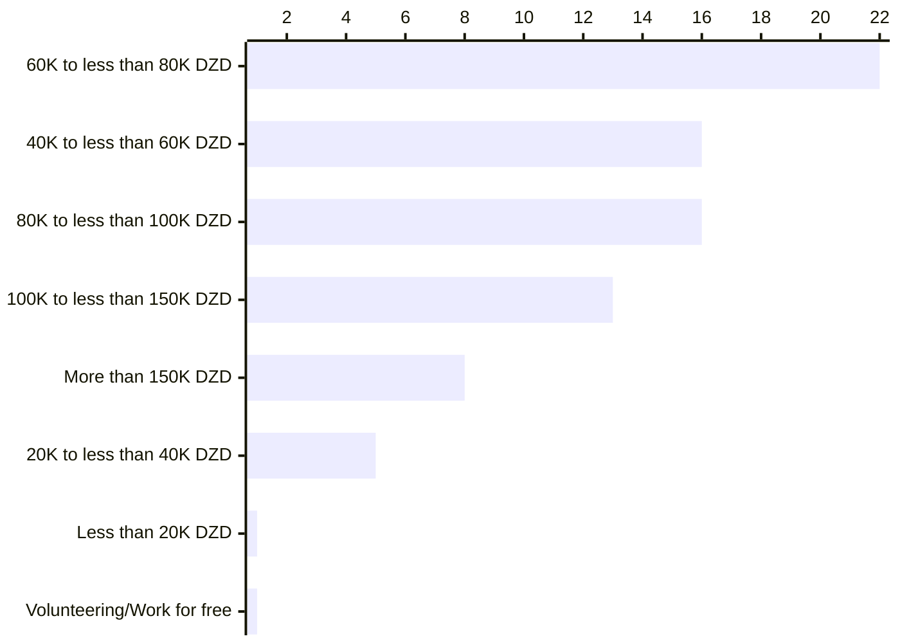
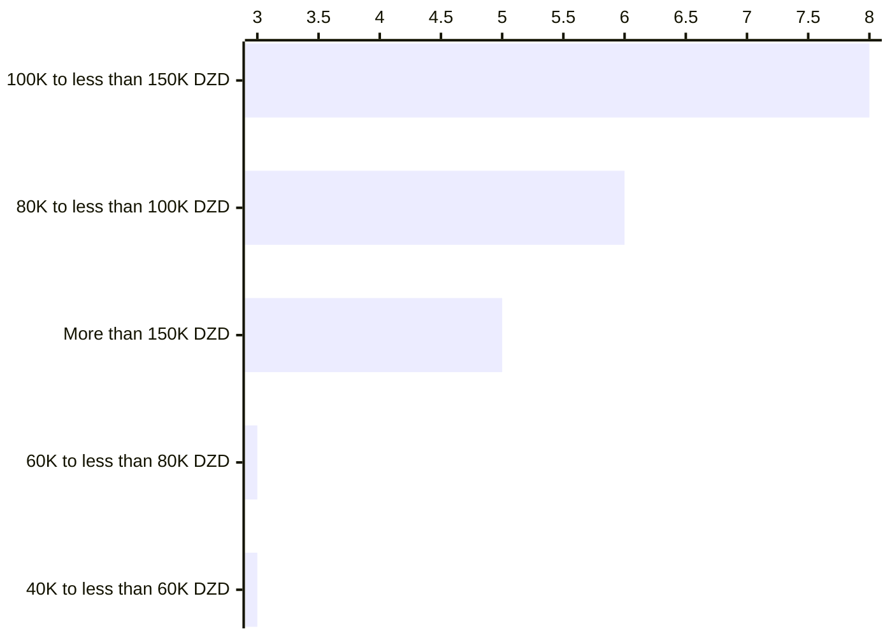

# Remuneration

In this section we present insights from our survey, examining salaries, variation by experience and location. Salaries within the Algerian software engineering and IT sector operate in a dynamic and unregulated landscape. With the potential to range from **20 000 DZD** Algerian dinars to more than **150 000 DZD** (per month), compensation packages reflect a wide spectrum influenced by various factors such as experience, skillset, location, and employer practices.

:::info

Salaries in Algerian Dinar (DZD) are written in different forms in this page.

10 000 DZD = 10K DZD = 1 Million Centimes
:::

Our participants' monthly salary distribution was the following:

Remote working salaries, and remuneration from freelance opportunities also differs, form few euros a month from small gigs, to very high salaries that goes beyond 60K euros a year for full-time employees.

 

In this section we will also compare our findings with previous [work done in 2020](https://medium.com/@yasserdrif/solving-algerias-engineering-brain-drain-️-a-study-about-salaries-and-military-training-b383293683ca) and [another one in 2018](https://abdeslemmenacere.wordpress.com/2018/07/06/salaire-des-developpeurs-en-algerie-2018/).

## Salaries in Algeria

### Working in Algeria

To understand salaries better we ran a series of algorithms to find which parameter (location, job title and/or tech stack, years of experience, etc.) has the most influence over others.

Initially, we had some questions and assumptions to answer, such as:

- *Are the developers who work in Algiers and Oran paid better than developers with the same years of experience in other Wilayas?*
- *Do technology stacks influence salaries? Are backend developers paid more than mobile developers?*
- *Can we tell that years of experience are the most important factor? The more senior a person is the higher is their salary compared to their peers in other Wilayas?*

:::tip

*Interested in different correlations? Do you want us to answer a question like on of the questions above?*

*Let's talk...*
:::

In this study, we will split the findings in 5 groups: 

- Trainee or entry-level engineers (less than two years of professional experience)
- Juniors to early mid-levels (3 to 5 years of professional experience)
- Mid-level to early senior levels (6 to 10 years of professional experience)
- Senior engineers
- Executives and/or managers

**N.B:** Titles in the following section are only to label participants' groups

We believe that titles and the years of experience are relative, we do believe  (and see) that we can find engineers that are considered seniors with just years 5 years of experience, but we also believe that there is a global job titles inflation.

For example, here is a breakdown of participants who labeled themselves as `Mid-level` by their years of experience: 

And those who labeled themselves `Seniors` are:

#### Trainees and entry-level engineers (2 years of professional experience, or less)

Entry-level engineers who work for Algerian companies, or companies based in Algeria are paid salaries ranging between **20 000 DZD** and **150 000 DZD**.

 

Some trainees do internships for free, others are getting paid salaries going from under <nobr>**20 000 DZD**</nobr> up salaries close to <nobr>**40 000 DZD**</nobr>.

#### Juniors to early mid-levels (3 to 5 years of professional experience)

Engineers with 3 to 5 years of experience, and who work for Algerian companies are paid salaries going from <nobr>**20 000 DZD**</nobr> up to more than <nobr>**150 000 DZD**</nobr> per month.

 

Engineers who are paid high salaries going up to <nobr>**150 000 DZD**</nobr> or more, are one of the following:

- Managers and team leaders in small startups or companies (with 6 to 10, or 11 to 20 employees).
- Engineers who work for large companies and wear different hats (e.g. working as full-stack developers and deal with infrastructure).

Engineers of this category are paid these high salaries in Algiers and Oran, when working remotely for Algerian companies (we don't have data where these companies are based), or in some rare cases in other Wilayas (e.g. ERP/CRM specialist in a large company in Sidi Bel Abbès).

#### Mid-level to early senior levels (6 to 10 years of professional experience)

Mid-level to early seniors who work for Algerian companies are paid salaries ranging between <nobr>**80 000 DZD**</nobr> and more than  <nobr>**150 000 DZD**</nobr>.

 

Engineers in this category, and who are paid high salaries going up to <nobr>**150 000 DZD**</nobr> or more, are mainly based in Algiers and have managerial/leadership roles, or consultants and employees who work remotely from other Wilayas (Aïn Témouchent, Aïn Defla, Boumerdès, Oran, etc).

Engineers who are paid salaries going up to <nobr>**100 000 DZD**</nobr> mainly work for small with 2 to 10 employees, to medium companies with 21 to 50 employees. Our participants in this category live and work in companies based in Tlemcen, Sétif, Mila and Annaba, or work remotely for some Algerian companies from their wilayas.

#### Senior engineers

#### Group 5

### Working remotely for foreign companies

#### Group 1
#### Group 2
#### Group 3

### Effects of education on salaries

[goto](/docs/insights/education-and-learning)

## Perks

### Data from the survey

### Perks by location and company size

[goto](/docs/insights/talents-migration)

## The value of salaries

### Costs of living in Algeria

Base salary
costs
taxes
DZD in USD (traveling and buying from outside).

### Happiness index

SHOW diagram (how satisfied are you)

The amount of times when salary was mentioned in challenges

### Evolution of salaries from research

work in 2020
work in 2018

