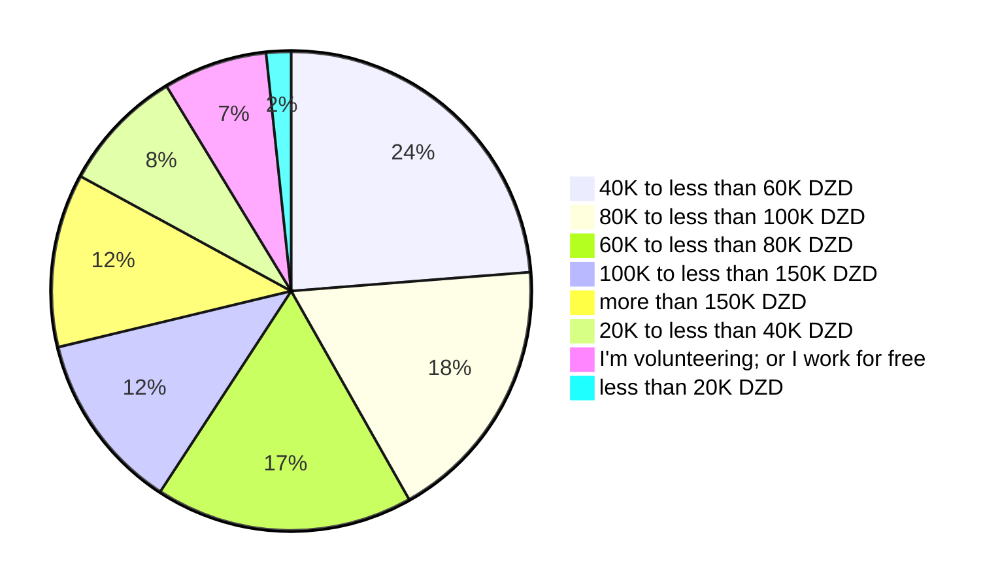
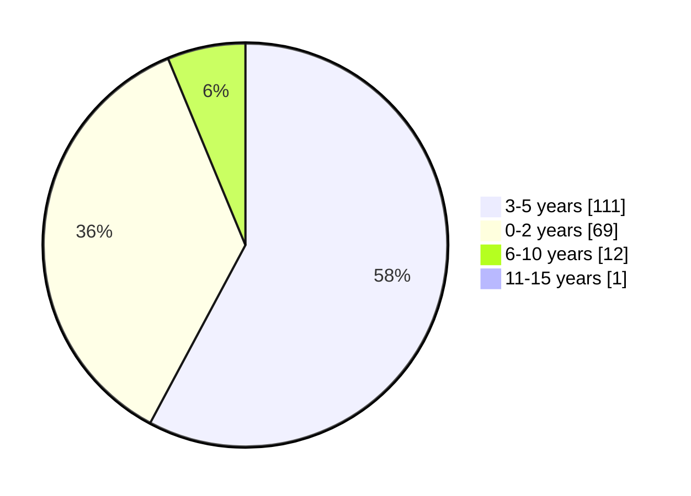
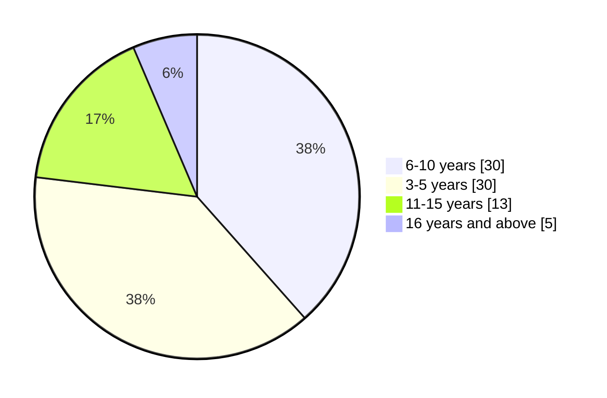
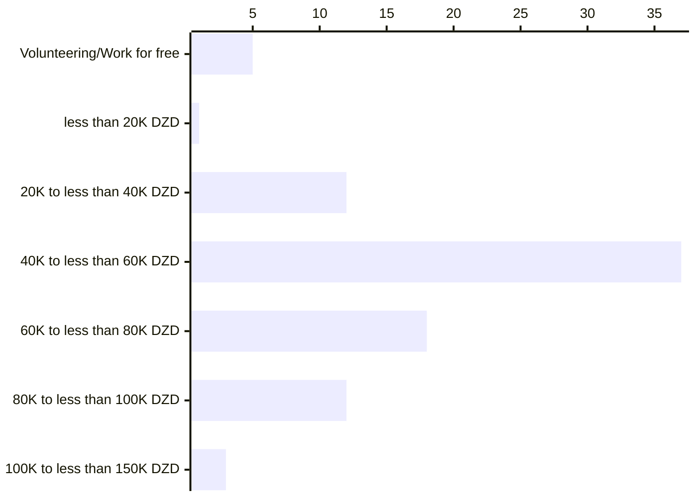
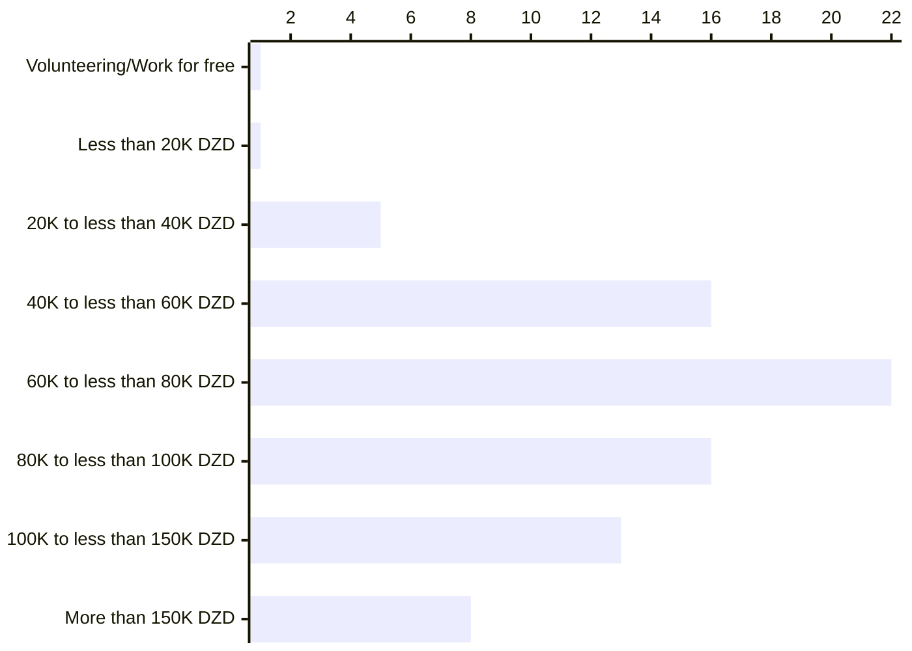
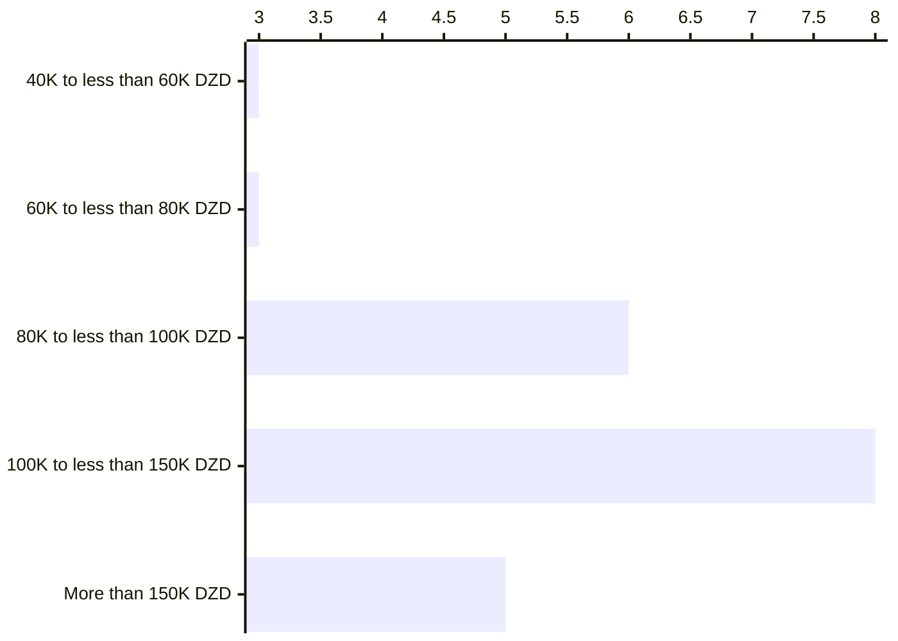
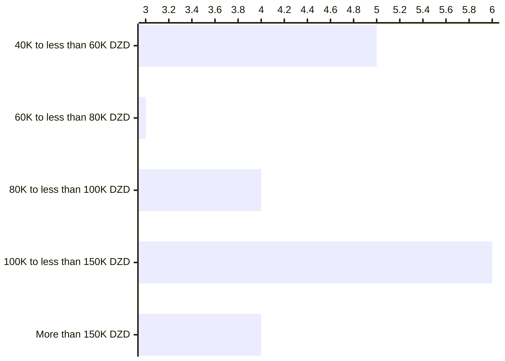
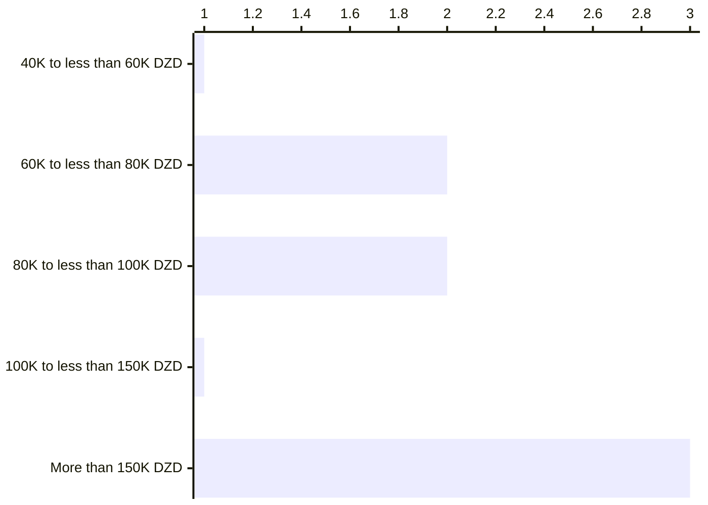
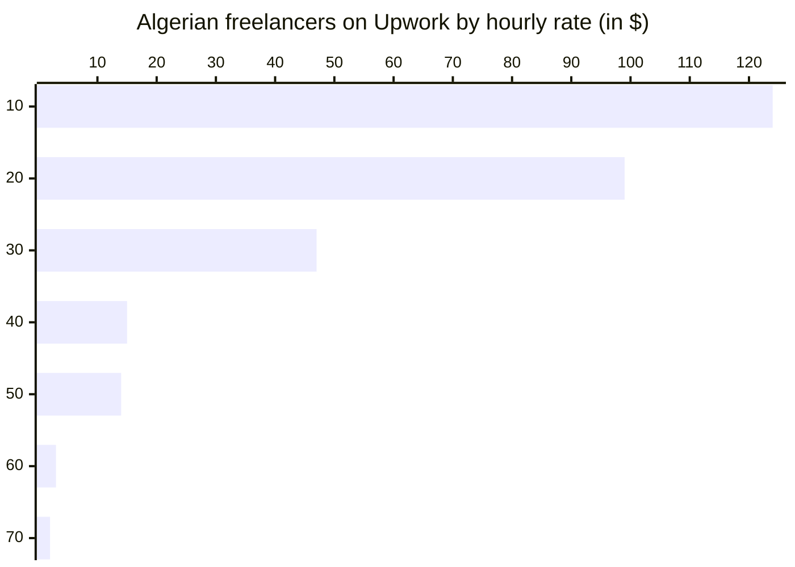
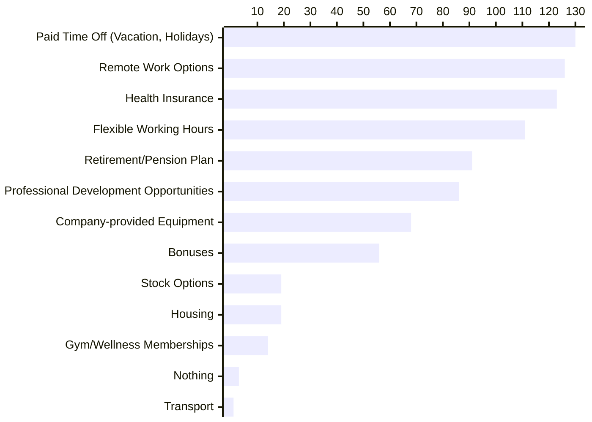

# Remuneration

In this section we present insights from our survey, examining salaries, variation by experience and location. Salaries within the Algerian software engineering and IT sector operate in a dynamic and unregulated landscape. With the potential to range from **20 000 DZD** Algerian dinars to more than **150 000 DZD** (per month), compensation packages reflect a wide spectrum influenced by various factors such as experience, skillset, location, and employer practices.

:::info

Salaries in Algerian Dinar (DZD) are written in different forms in this page.

10 000 DZD = 10K DZD = 1 Million Centimes
:::

Our participants' monthly salary distribution was the following:

Remote working salaries, and remuneration from freelance opportunities also differs, form few euros a month from small gigs, to very high salaries that goes beyond 60K euros a year for full-time employees.

 

In this section we will also compare our findings with previous [work done in 2020](https://medium.com/@yasserdrif/solving-algerias-engineering-brain-drain-️-a-study-about-salaries-and-military-training-b383293683ca) and [another one in 2018](https://abdeslemmenacere.wordpress.com/2018/07/06/salaire-des-developpeurs-en-algerie-2018/).

## Salaries in Algeria

### Working in Algeria

To understand salaries better we ran a series of algorithms to find which parameter (location, job title and/or tech stack, years of experience, etc.) has the most influence over others.

Initially, we had some questions and assumptions to answer, such as:

- *Are the developers who work in Algiers and Oran paid better than developers with the same years of experience in other Wilayas?*
- *Do technology stacks influence salaries? Are backend developers paid more than mobile developers?*
- *Can we tell that years of experience are the most important factor? The more senior a person is the higher is their salary compared to their peers in other Wilayas?*

:::tip

*Interested in different correlations? Do you want us to answer a question like on of the questions above?*

[*Let's talk...*](/contact)
:::

In this study, we will split the findings in 5 groups: 

- Trainee or entry-level engineers (less than two years of professional experience)
- Juniors to early mid-levels (3 to 5 years of professional experience)
- Mid-level to early senior levels (6 to 10 years of professional experience)
- Senior engineers
- Executives and/or managers

**N.B:** Titles in the following section are only to label participants' groups

We believe that titles and the years of experience are relative, we do believe  (and see) that we can find engineers that are considered seniors with just years 5 years of experience, but we also believe that there is a global job titles inflation.

For example, here is a breakdown of participants who labeled themselves as `Mid-level` by their years of experience: 

And those who labeled themselves `Seniors` are:

#### Trainees and entry-level engineers (2 years of professional experience, or less)

Entry-level engineers who work for Algerian companies, or companies based in Algeria are paid salaries ranging between **20 000 DZD** and **150 000 DZD**.

 

Some trainees do internships for free, others are getting paid salaries going from under <nobr>**20 000 DZD**</nobr> up salaries close to <nobr>**40 000 DZD**</nobr>.

#### Juniors to early mid-levels (3 to 5 years of professional experience)

Engineers with 3 to 5 years of experience, and who work for Algerian companies are paid salaries going from <nobr>**20 000 DZD**</nobr> up to more than <nobr>**150 000 DZD**</nobr> per month.

 

Engineers who are paid high salaries going up to <nobr>**150 000 DZD**</nobr> or more, are one of the following:

- Managers and team leaders in small startups or companies (with 6 to 10, or 11 to 20 employees).
- Engineers who work for large companies and wear different hats (e.g. working as full-stack developers and deal with infrastructure).

Engineers of this category are paid these high salaries in Algiers and Oran, when working remotely for Algerian companies (we don't have data where these companies are based), or in some rare cases in other Wilayas (e.g. ERP/CRM specialist in a large company in Sidi Bel Abbès).

#### Mid-level to early senior levels (6 to 10 years of professional experience)

Mid-level to early seniors who work for Algerian companies are paid salaries ranging between <nobr>**80 000 DZD**</nobr> and more than  <nobr>**150 000 DZD**</nobr>.

 

Engineers in this category, and who are paid high salaries going up to <nobr>**150 000 DZD**</nobr> or more, are mainly based in Algiers and have managerial/leadership roles, or consultants and employees who work remotely from other Wilayas (Aïn Témouchent, Aïn Defla, Boumerdès, Oran, etc).

Engineers who are paid salaries going up to <nobr>**100 000 DZD**</nobr> mainly work for small with 2 to 10 employees, to medium companies with 21 to 50 employees. Our participants in this category live and work in companies based in Tlemcen, Sétif, Mila and Annaba, or work remotely for some Algerian companies from their wilayas.

#### Senior engineers

Engineers with 11 to 15 years of experience, and who work for Algerian companies are paid salaries going from <nobr>**60 000 DZD**</nobr> up to more than <nobr>**150 000 DZD**</nobr> per month.

 

Engineers in this category who are paid salaries that goes up to <nobr>**60 000 DZD**</nobr> are employees in large companies with more than 1000 employees. These salaries can be correlated with the ones in public sector. 

We also see that salaries in the same group goes up to <nobr>**80 000 DZD**</nobr> in southern Wilayas (e.g. Naâma, Adrar).

Salaries going up to <nobr>**100 000 DZD**</nobr> for this group are mostly for executives and managers who are based in Algiers.

We see wider spread for salaries around <nobr>**150 000 DZD**</nobr> across the country (From Oran to Ouargla).

These high salaries are present in the big wilayas (Oran and Algiers) for management and leadership roles, and for Governance and security.

#### Executives and/or managers

Salaries for managers also vary between <nobr>**60 000 DZD**</nobr> to more than <nobr>**150 000 DZD**</nobr>.

 

2 of 3 participants who are paid less thn <nobr>**80 000 DZD**</nobr> don't have a university degree (Baccalaureate is their highest degree). But the third participant has Ph.D. or equivalent.

The high salaries (more or less than <nobr>**150 000 DZD**</nobr>) are paid in medium to large companies based in Oran, Algiers.

### Working remotely for foreign companies

Salaries for remote positions are not regulated in any form. They highly depend on the skills, years of the experience, clients' countries, type of projects/contract, and many other factors.

According to our survey participants, Algerian engineers can get up to **85 000 Euros** per year (~7000€/month).

We calculated medians of salaries and compared them to years of experience, the results were the following:

 

We see that salaries are on a raising pattern until 16+ years of experience where we have two remarks:

1. We can not make a judgement since we only have two participants in this case (participants working remotely from Algeria with 16+ years of experience).
2. At this level of seniority a full-time remote position from Algeria might be challenging, or not th preferred solution. Read more about this case in [our remote working page](#) (TLDR; They might be freelance consultants).

 

Remote workers exercise their work in different forms, 46% of the participants who work for foreign companies are full-time employees, 42% are freelancers, and 12% are part-time employees.

To explore freelancers' income, we fetched public Algerian freelancers' data from [Upwork](https://www.upwork.com/), and we had the following:

This data is also correlated with findings from other websites like [peopleperhour](https://www.peopleperhour.com/) (Majority of freelancers with hourly rates around 10 to 20€/hour, and the median close to 40€/hour).

### Effects of education on salaries

[goto](/docs/insights/education-and-learning)

## Perks

Some jobs offer other perks on top of salaries, according to our survey data we have the following:

 

Additionally, some jobs offer other perks, for example[*](/docs/appendix/raw-interviews#an-executive-in-a-tech-startup):

- Business SIM cards.
- VTC Memberships.
- Paid trips and holidays.

### Perks by location and company size

[goto](/docs/insights/talents-migration)

### Perks by employment mode

#### Working for Algerian companies
#### Working for foreign companies in Algeria
#### Working for foreign companies remotely

## The value of salaries

This section looks into the value of software engineering salaries in Algeria.

### Costs of living in Algeria

Algerian minimum wages are around <nobr>**20 000 DZD**</nobr>, however [the Union of Algerian Workers estimates](https://aja.me/gufnww) that the minimum income for a family of five members should be more than <nobr>**80 000 DZD**</nobr> (~556 €), while they estimated that the average monthly salary in the public sector is around <nobr>**40 000 DZD**</nobr> (~278 €).

According to 3363 entries made by 250 different participants in [Numbeo](https://www.numbeo.com/cost-of-living/country_result.jsp?country=Algeria) (a crowd-sourced global database of quality of life data):

- A family of four estimated monthly costs are **1,535.7€** without rent.
- A single person estimated monthly costs are **430.1€** without rent.

However, [Numbeo's counting methodology](https://www.numbeo.com/common/motivation_and_methodology.jsp) might not reflect the average Algerian lifestyle and monthly spending. We asked the Association for the Protection and Guidance of Consumers and their Environment ([APOCE](https://apoce.org/)) about the numbers ... TBD

### Social services and taxes

TBD: Explore:
https://www.annd.org/uploads/summernote/three31614341217.pdf
https://taxsummaries.pwc.com/algeria/individual/taxes-on-personal-income

Counting tax .... https://taxsummaries.pwc.com/algeria/individual/sample-personal-income-tax-calculation

### Value of of the Algerian Dinar (DZD)

TBD:
- Rates
- Allocation touristique: https://voyages-algerie.com/2024/01/08/tourisme/algerie-allocation-touristique-300-euros-voyage/

### Happiness index

`Low Salary` Was only mentioned once by engineers who live in Algeria in our question about what challenges are faced in working with in IT.

:::tip

Interested in knowing more about challenges? Head to our [Challenges](/docs/insights/challenges) page.

:::

We asked our participants `On a scale from 1 to 10, how satisfied are you with your current job in the software engineering field?`, and answers were the following:

 

With a median score of `7`, we may conclude that our participants, from Algeria specifically are mostly satisfied with their salaries, however as one of our participants wrote:

> No matter how high salary is compared to other jobs, it remains low in order to live comfortably.

This idea was also shared by other participants who used the free text option in [`Challenges` question](/docs/appendix/raw-results#what-are-the-main-challenges-you-face-in-your-role-as-a-software-engineer-in-algeria), where lifestyle in Algeria might not let developers "enjoy their salaries". TBD

## Evolution of salaries from research

In a previous [study done in 2018](https://abdeslemmenacere.wordpress.com/2018/07/06/salaire-des-developpeurs-en-algerie-2018/), we see the following numbers:

| Level     | Salary ranges (DZD) | Maximum (DZD) |
| --------- | ------------------- | ------------- |
| Junior    | 50K - 60K           | 60K           |
| Mid-level | 50K - 70K           | 75K           |
| Senior    | 65K - 90K           | 120K          |

Then in 2020, Assem Chelli [ran a survey](https://forms.gle/ddab5UbcNiQxTsif8) where the findings were the following:

| Level     | Salary ranges (DZD) | Maximum (DZD) |
| --------- | ------------------- | ------------- |
| Junior    | 50K - 70K           | -             |
| Mid-level | 71K - 97K           | -             |
| Senior    | 90K - 120K          | -             |

This was is presented by this graph (from the previous work):

 

In 2024, we see a slight increase in developers salaries if we compare the results with the findings above.