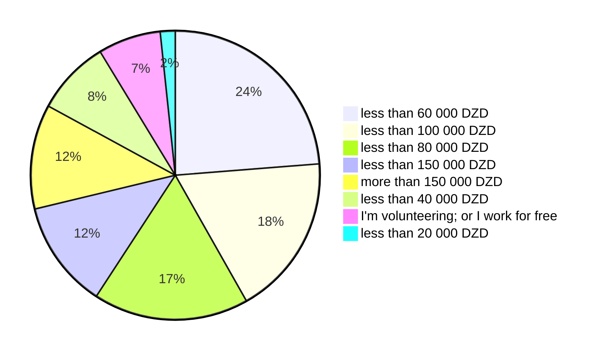

# Salaries

In this section we present insights from our survey, examining salaries, variation by experience and location. Salaries within the Algerian software engineering and IT sector operate in a dynamic and unregulated landscape. With the potential to range from **20 000 DZD** Algerian dinars to more than **150 000 DZD** (per month), compensation packages reflect a wide spectrum influenced by various factors such as experience, skillset, location, and employer practices.

Our participants' monthly salary distribution was the following:

To understand these number better, we broke down the numbers by professional levels and years of experience.

## Salaries by experience level

Interns and working students are paid less than **20 000 DZD**.

## Salaries compared to the last years

https://medium.com/@yasserdrif/solving-algerias-engineering-brain-drain-%EF%B8%8F-a-study-about-salaries-and-military-training-b383293683ca#The%20national%20military%20service%20(Conscription)

https://abdeslemmenacere.wordpress.com/2018/07/06/salaire-des-developpeurs-en-algerie-2018/

