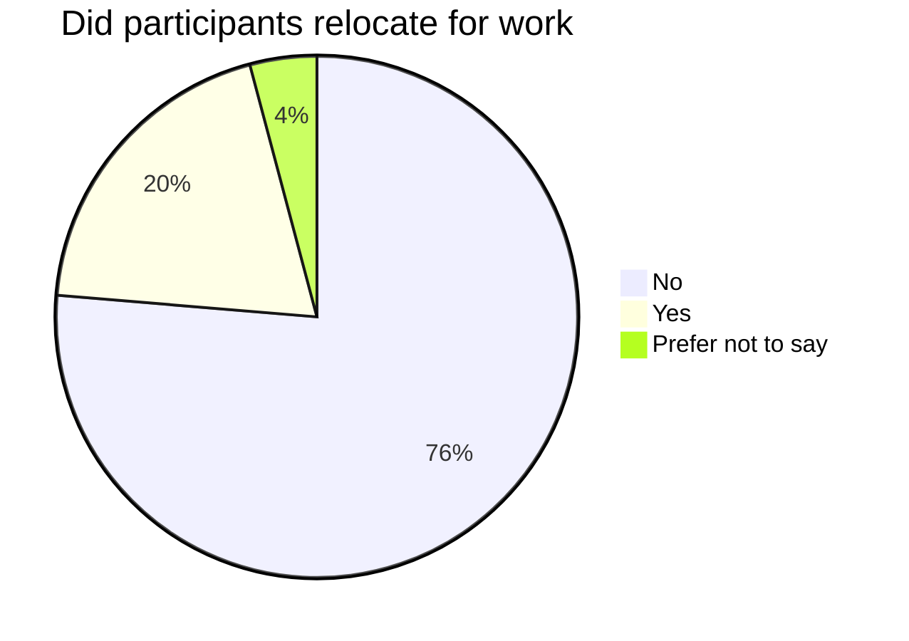

# Talents migration

In the evolving landscape of IT and software engineering, Algerians chase opportunities within and beyond national borders. In this section we will explore this phenomena according to our survey data and interviews we conducted.

## Regional dynamics

According to our survey data, **76%** of the participants who work in Algeria relocated to other wilayas for work in IT.

Among those who relocated:

- **49%** went to Algiers.
- **9%** went to Oran
- The rest went to other wilayas (Blida, Tiaret, Tlemcen, Annaba, Sétif, Djelfa, M'Sila, Chlef, Jijel, Tipaza, Mila, El Oued, etc).

To confirm the assumption that most of the IT jobs are located in Algiers, the capital, we crawled one of the country's biggest job posting portals the findings were the following:

Across 195 job postings, **90%** are based in Algiers, **1%** are in Oran, the remaining **9%** are jobs in different wilayas (Tipaza, Jijel, Constantine, Blida, Sétif, Aïn Témouchent, Sétif, Tizi Ouzou, Béjaïa, Boumerdès, etc).

Some companies (both in private and public sectors) provide housing for employees who moved for working, other companies help their employees relocate and find housing in their new locations, while others don't (or can't) afford that.

According to our interviewees, some startups provide shared accommodations for their employees justified by cutting costs and solidifying the culture.

According to our data and interviews, some engineers who secure remote working positions move to smaller wilayas. Some of our interviewees claim that they prefer being closer to their friends and family while working, in addition to being able to save more on rent and transportation.

:::danger TBD
primes IFRI
:::

## International

### Education in Algeria vs abroad

### Going back to Algeria