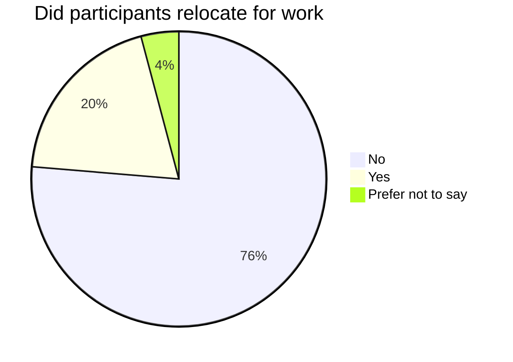

# Talents migration

## Regional dynamics

According to our survey data, **76%** of the participants who work in Algeria relocated to other wilayas for work in IT.

Among those who relocated:

- **49%** went to Algiers.
- **9%** went to Oran
- The rest went to other wilayas (Blida, Tiaret, Tlemcen, Annaba, Sétif, Djelfa, M'Sila, Chlef, Jijel, Tipaza, Mila, El Oued, etc).

To confirm the assumption that most of the IT jobs are located in Algiers, the capital, we crawled one of the country's biggest job posting portals the findings were the following:

Across 195 job postings, **90%** are based in Algiers, **1%** are in Oran, the remaining **9%** are jobs in different wilayas (Tipaza, Jijel, Constantine, Blida, Sétif, Aïn Témouchent, Sétif, Tizi Ouzou, Béjaïa, Boumerdès, etc).

Housing provided
Cheaper in non-big wilayas

## International

### Education in Algeria vs abroad

### Going back to Algeria