# Trends

To better understand trends in Algerian software engineering landscape, we asked our participants some questions about the technologies they use. We also interviewed some experts to enrich this report. Some of the interviews were with some developers and managers in different startups and government companies.

:::tip Curious to see findings from a survey done in 2020?

In a survey ran by [Assem Chelli](https://twitter.com/assem_ch/) on 2020, we learned the following:

- Technologies are not an affecting factor in salaries.
- JavaScript is the most used language because it's used in front-end, backend and mobile.
- Java and JavaScript are used in mobile development.
- Software testing and QA are missing roles in Algeria.

Click here to see the full chart

:::

## Programming languages

Our main finding in regards to programming language is that **JavaScript** is the most used programming language, followed by Python and PHP as shown below.

 

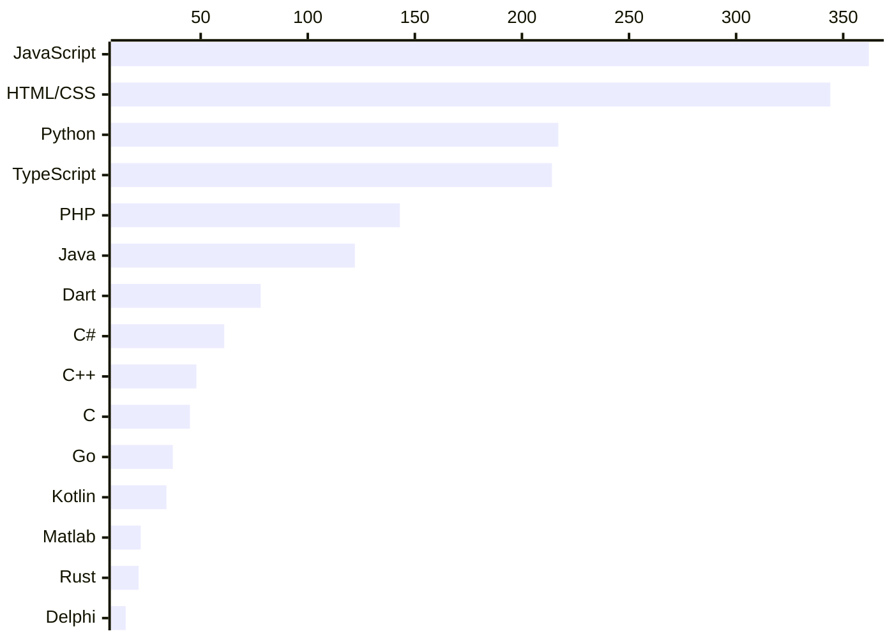
```mermaid
xychart-beta horizontal
  x-axis ["JavaScript","HTML/CSS","Python","TypeScript","PHP", "Java","Dart","C#","C++","C","Go","Kotlin","Matlab","Rust", "Delphi"]
  bar [362,344,217,214,143,122,78,61,48,45,37,34,22,21,15]
```

*You can explore [all submitted programming languages in our appendix section](/docs/appendix/raw-results#which-languages-do-you-frequently-use-in-your-work).*

 

To further understand the trend, we look to [Google trends](https://trends.google.com/trends/explore?date=2018-01-03%202024-03-22&geo=DZ&q=%2Fm%2F060kv,%2Fm%2F07sbkfb,%2Fm%2F02p97,%2Fm%2F05z1_,Flutter) and notice that the interest in Java is declining with an increase of interest in Python, JavaScript and Dart/Flutter.

### JavaScript is everywhere

In the last years JavaScript gained a lot of popularity, with a fast growing ecosystem, ability to write applications not only for web browsers, but for backend with Node.js (or other runtimes), mobile, for desktop and for other platforms.

We asked our participants [what web framework/library they use](/docs/appendix/raw-results#which-web-frameworks-do-you-use). And the result was that 7 of the TOP 10 answers were from the JavaScript world.  

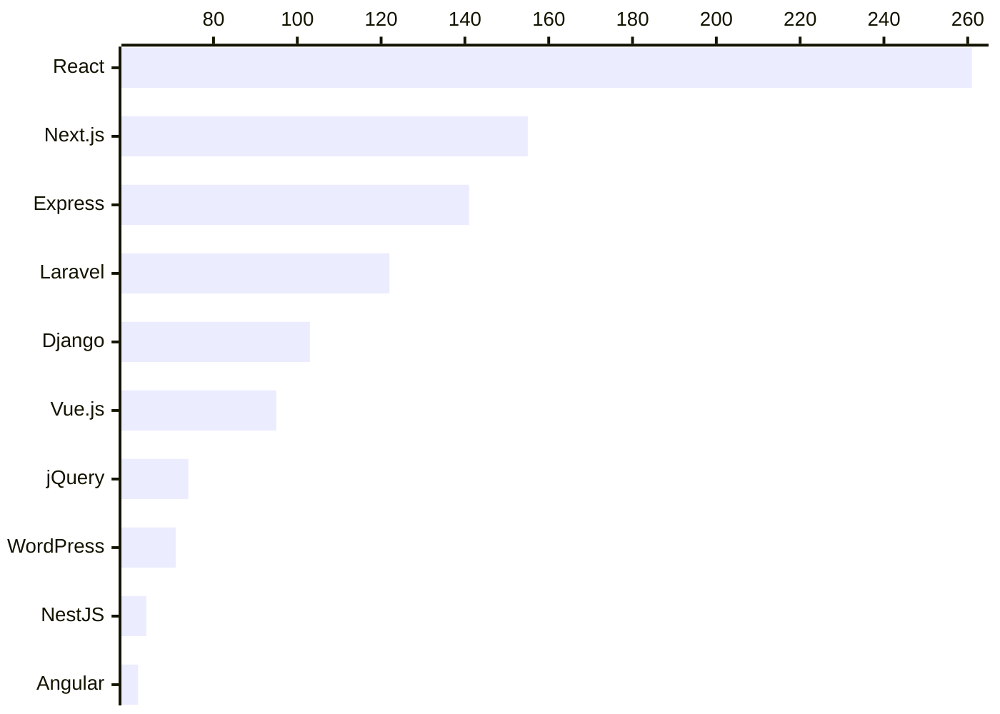
```mermaid
xychart-beta horizontal
  x-axis ["React","Next.js","Express","Laravel","Django","Vue.js","jQuery","WordPress","NestJS","Angular"]
  bar [261,155,141,122,103,95,74,71,64,62]
```
 

For mobile applications, [we also saw that JavaScript is competing with Flutter, Java and Kotlin](/docs/appendix/raw-results#which-mobile-development-frameworkslanguages-do-you-use), JavaScript and Typescript are used with React Native, or used in Progressive Web Applications (PWA) and with other libraries like Ionic and Capacitor or Native script.

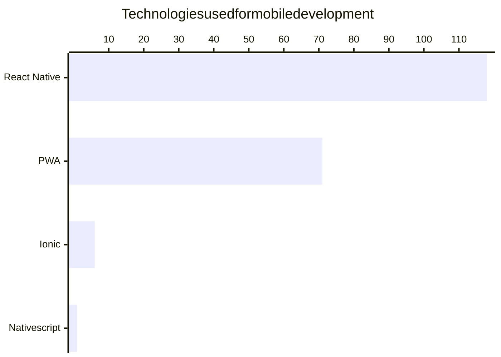
```mermaid
xychart-beta horizontal
  title Technologies used for mobile development
  x-axis ["React Native", "PWA", "Ionic", "Nativescript"]
  bar [118, 71, 6, 1]
```

 

In our question about [what technologies our participants use to build desktop applications](/docs/appendix/raw-results#if-you-build-desktop-applications-what-technologies-do-you-use), Electron ranked first as the most used technology followed by Java libraries and other frameworks and libraries by Microsoft.

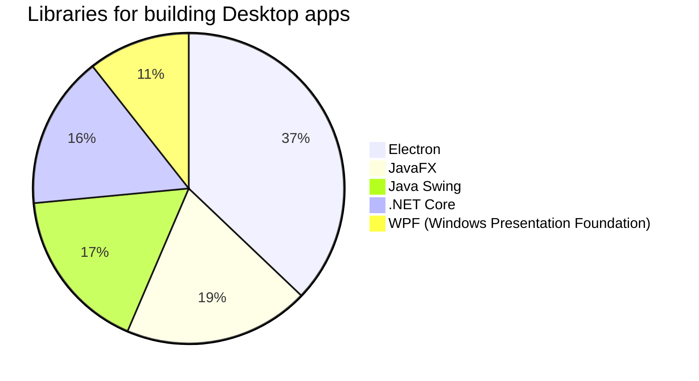
```mermaid
pie
    title Libraries for building Desktop apps
    "Electron" : 98
    "JavaFX" : 51
    "Java Swing" : 45
    ".NET Core" : 42
    "WPF (Windows Presentation Foundation)" : 28
```

This section tells us that the growth of Javascript is currently affecting Algeria as well in mobile development, desktop development and web development. However, even with this growth of the JavaScript community, hiring managers are struggling to find "good seniors", or at least "good JavaScript" developers.

### Increasing interest in Python

Java has always been one of the most taught programming languages in Algerian universities (for OOP classes at least), and with the rising interest in AI/ML and data science, some universities started introducing Python earlier in their curriculums which contributed to having more Python developers.

According to our survey data, a corelation formula between which languages are used and job titles showed that Python is mostly used in backend web development, in data science, machine Learning, and networking and cyber security.

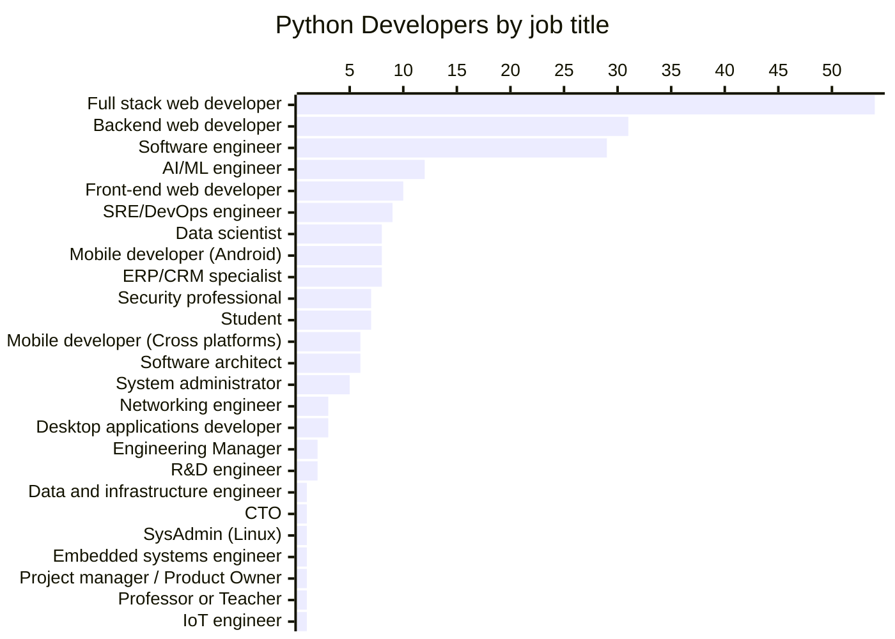
```mermaid
xychart-beta horizontal
  title "Python Developers by job title"
  x-axis ["Full stack web developer","Backend web developer","Software engineer","AI/ML engineer","Front-end web developer","SRE/DevOps engineer","Data scientist","Mobile developer (Android)","ERP/CRM specialist","Security professional","Student","Mobile developer (Cross platforms)","Software architect","System administrator","Networking engineer","Desktop applications developer","Engineering Manager","R&D engineer","Data and infrastructure engineer","CTO","SysAdmin (Linux)","Embedded systems engineer","Project manager / Product Owner","Professor or Teacher","IoT engineer"]
  bar [54,31,29,12,10,9,8,8,8,7,7,6,6,5,3,3,2,2,1,1,1,1,1,1,1]
```

 

We observe that Python is used by 64% of mobile developers to build backend applications or web APIs. They responded to our question about [which web framework/library they use](/docs/appendix/raw-results#which-web-frameworks-do-you-use) with: **Django, Flask and FastAPI.**

Python is also used by ERP/CRM specialists with Odoo according to our survey participants.

Our participants use Tkinter, Kivy, PyQT and PySide2 to build desktop applications.

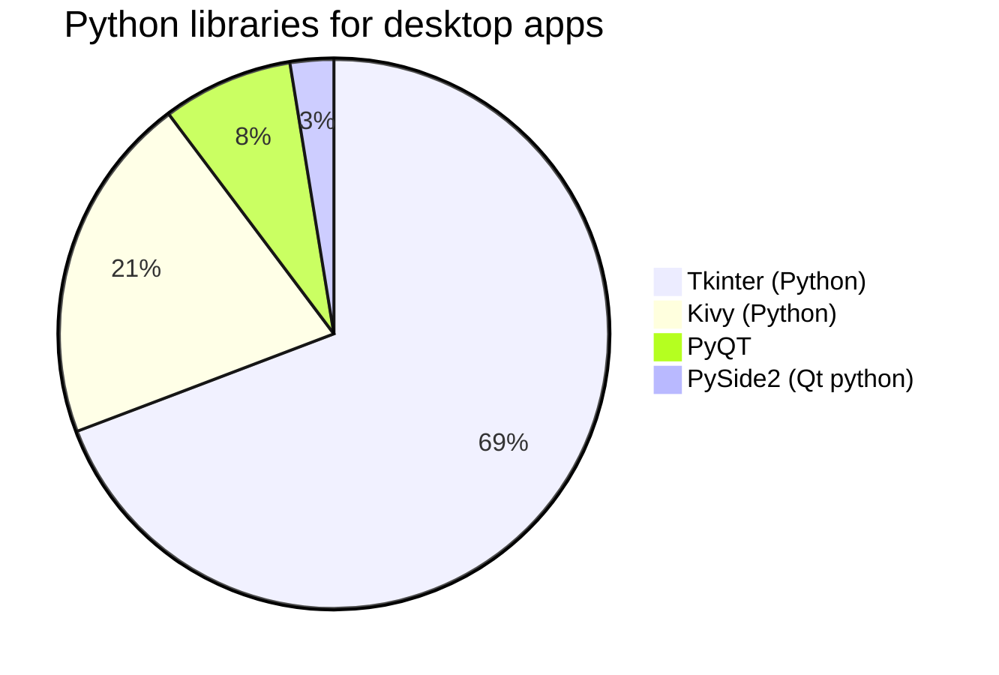
```mermaid
pie
    title Python libraries for desktop apps
    "Tkinter (Python)" : 27
    "Kivy (Python)" : 8
    "PyQT": 3
    "PySide2 (Qt python)": 1
```

### Dart and Flutter are growing slow but steady

Google's [Flutter](https://flutter.dev/) framework for Dart is getting more mature and growing steadily on a global level, and the Algerian market is no exception for that.

Flutter is the most used technology to build mobile applications [according to our survey data](/docs/appendix/raw-results#which-mobile-development-frameworkslanguages-do-you-use).

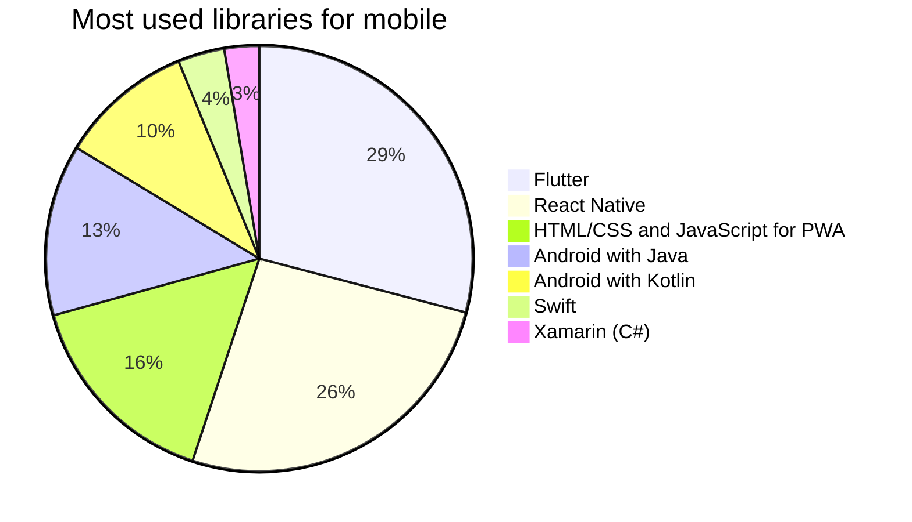
```mermaid
pie 
    title Most used libraries for mobile
    "Flutter" : 132
    "React Native" : 118
    "HTML/CSS and JavaScript for PWA" : 71
    "Android with Java" : 59
    "Android with Kotlin" : 46
    "Swift" : 16
    "Xamarin (C#)" : 12
```

We also saw that [few participants](/docs/appendix/raw-results#if-you-build-desktop-applications-what-technologies-do-you-use) are using Flutter to build desktop applications.

### PHP is still alive

PHP is still one of the most used languages for building web applications.

PHP is used in Algeria with the popular content management systems such as: Wordpress, Drupal and Joomla. The language is also used with web frameworks such as: Laravel, Symfony and CodeIgniter.

It is used for many websites, for the government ([interieur.gov.dz/index.php](https://www.interieur.gov.dz), [mdn.dz](https://www.mdn.dz/site_principal/accueil_an.php), etc), for many university websites (e.g. [univ-oran1.dz](https://univ-oran1.dz/index.php)), and for some businesses. 

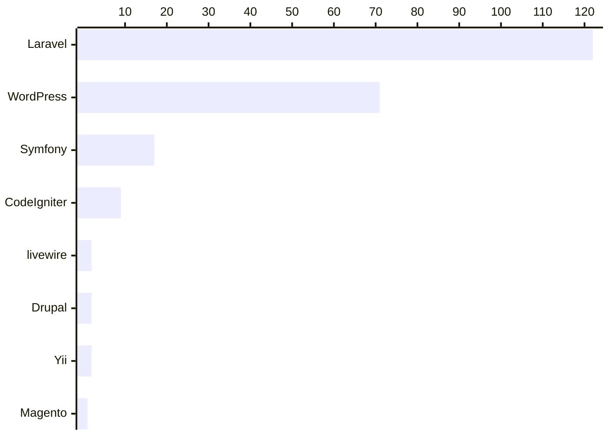
```mermaid
xychart-beta horizontal
  x-axis ["Laravel", "WordPress", "Symfony", "CodeIgniter", "livewire", "Drupal", "Yii", "Magento"]
  bar [122, 71, 17, 9, 2, 2, 2, 1]
```

## Databases

According to our participants, MySQL and PostgreSQL are the most used database management systems.

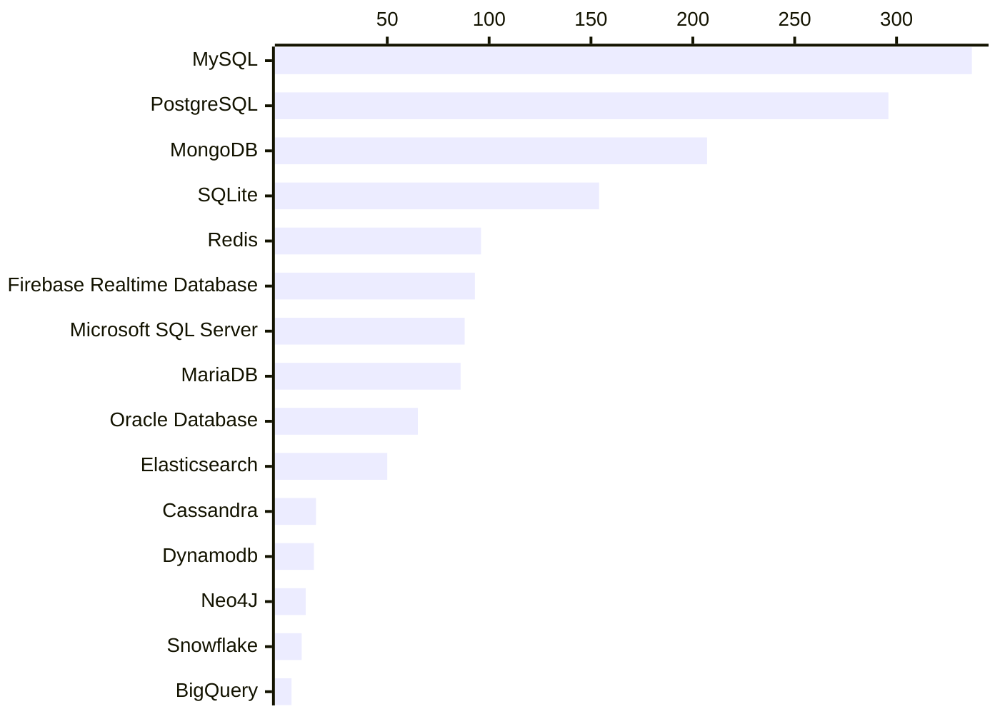
```mermaid
xychart-beta horizontal
  x-axis ["MySQL", "PostgreSQL", "MongoDB", "SQLite", "Redis", "Firebase Realtime Database", "Microsoft SQL Server", "MariaDB", "Oracle Database", "Elasticsearch", "Cassandra", "Dynamodb", "Neo4J", "Snowflake", "BigQuery"]
  bar [337, 296, 207, 154, 96, 93, 88, 86, 65, 50, 15, 14, 10, 8, 3]
```

 

According to our survey participants who live in Algeria, and work for Algerian large companies (1000+ employees) use the following:

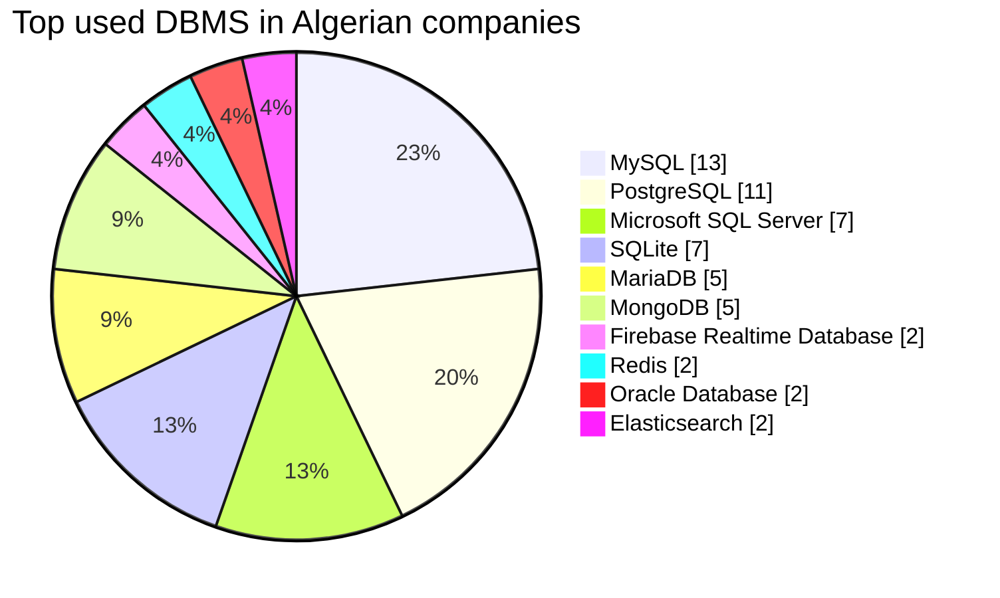
```mermaid
pie showData
    title Top used DBMS in Algerian companies
    "MySQL" : 13
    "PostgreSQL" : 11
    "Microsoft SQL Server" : 7
    "SQLite" : 7
    "MariaDB" : 5
    "MongoDB" : 5
    "Firebase Realtime Database" : 2
    "Redis" : 2
    "Oracle Database" : 2
    "Elasticsearch" : 2
```

According to their job offers and public communication, large companies in Algeria such as Sonatrach and Djezzy, use proprietary database management systems like Oracle and Microsoft SQL Server. While startups like [Yassir](https://yassir.com/) and [Maystro Delivery](https://maystro-delivery.com/) mainly use MongoDB, Redis and PostgreSQL.

## Mobile development

According to [StatCounter](https://gs.statcounter.com/os-market-share/mobile/algeria/#monthly-201409-202402), 90% of Algerians use Android phones, while 9% use iOS.

The number of Android users, having Java as one of the most used programming languages in Algerian universities, and the widespread of Android development resources in different languages contributed in having many native Android developers (with Java and/or Kotlin).

However, we notice from our survey data that cross-platform mobile development technologies are taking over. With good documentation and growing communities offering tutorials, [Dart with Flutter are rising](#dart-and-flutter-are-growing-slow-but-steady) together with React Native (which can be a go-to for a lot of JavaScript developers).

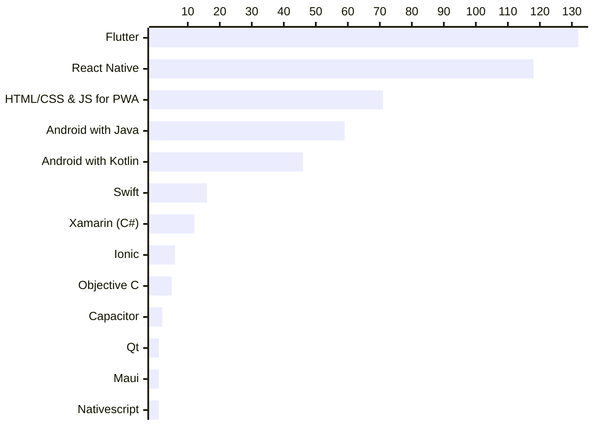
```mermaid
xychart-beta horizontal
  x-axis ["Flutter","React Native","HTML/CSS & JS for PWA","Android with Java","Android with Kotlin","Swift","Xamarin (C#)","Ionic","Objective C","Capacitor","Qt","Maui","Nativescript"]
  bar [132,118,71,59,46,16,12,6,5,2,1,1,1]
```

## Web hosting and cloud technologies.

We asked our participants where they host their services, the majority (39%) of participants claimed that they use cloud hosting providers. 191 of the 246 who use cloud services live in Algeria.

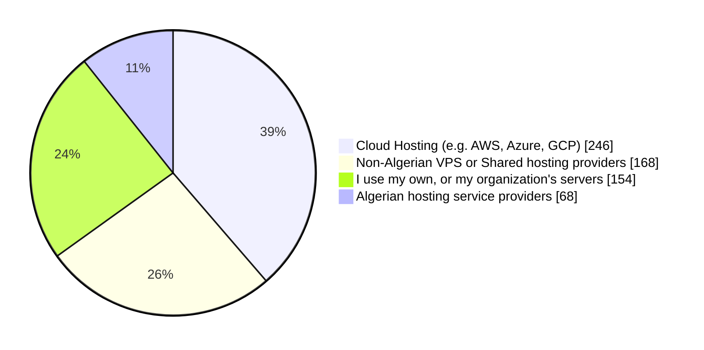
```mermaid
pie showData
    "Cloud Hosting (e.g. AWS, Azure, GCP)" : 246
    "Non-Algerian VPS or Shared hosting providers" : 168
    "I use my own, or my organization's servers" : 154
    "Algerian hosting service providers" : 68
```

### Cloud solutions

The majority of our participants are using international public cloud providers such as Amazon Web Services (AWS), Google Cloud Platform (GCP), Microsoft Azure, along with Serveless/PaaS solutions such as Heroku and Vercel.

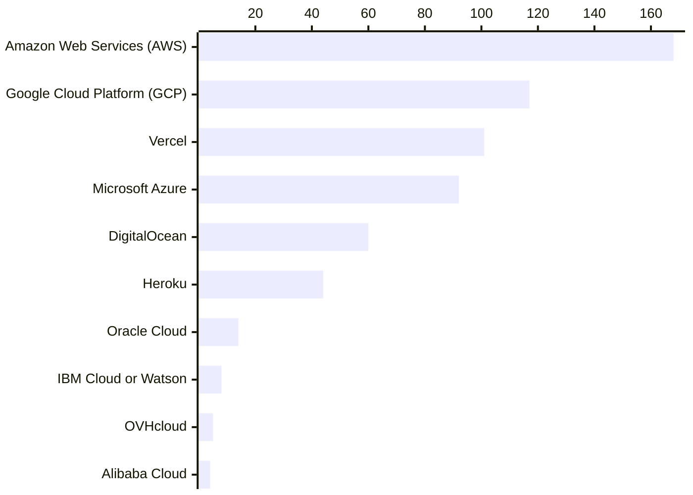
```mermaid
xychart-beta horizontal
  x-axis ["Amazon Web Services (AWS)","Google Cloud Platform (GCP)","Vercel","Microsoft Azure","DigitalOcean","Heroku","Oracle Cloud","IBM Cloud or Watson","OVHcloud","Alibaba Cloud"]
  bar [168,117,101,92,60,44,14,8,5,4]
```

Vercel users for example, are mostly developers working on web front-ends. 48% of them are Full stack developers, and 20% are front-end developers.

:::tip

Do you want to want to read more about Cloud technologies adoption? Check our [Cloud and DevOps page](/docs/insights/cloud-and-devops)
:::

### Algerian web hosting services

Due to some challenges with e-payments, language barriers and unclear regulations on dealing with personal data outside Algeria, some Algerian developers choose Algerian hosting services.

Among these services, we often see the following ones getting recommended on public forums (there must be other services):

- [Algeria Telecom's Web Hosting](https://www.algerietelecom.dz/en/entreprises/hebergement-de-site-web-prod14)
- [DZSecurity](https://www.dzsecurity.com/)
- [Octenium](https://octenium.com/)
- [Localhost.dz](https://www.localhost.dz/)

### Algerian domain names (.dz)

According to the law  [N° 18 of May 10th, 2018 Article 8](https://www.joradp.dz/FTP/JO-FRANCAIS/2018/F2018028.pdf): Algerian e-commerce websites **should** be hosted in Algeria, and they **must** use `.com.dz` domains.

:::tip
`.dz` domain names are provided for free for registered trademark at [INAPI](https://inapi.org/).
:::

According to the [Algerian national registry of domain names](https://www.nic.dz/), 16815 domain names have been created through [different registrars](https://www.nic.dz/registrar#sec2), the top 5 registrars are the following:

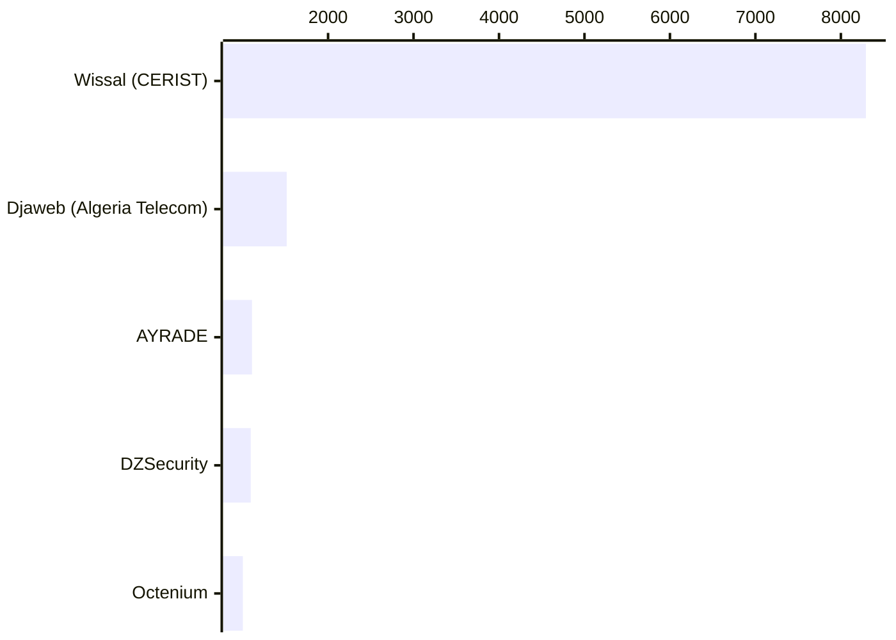
```mermaid
xychart-beta horizontal
  x-axis ["Wissal (CERIST)","Djaweb (Algeria Telecom)","AYRADE","DZSecurity","Octenium"]
  bar [8293,1516,1110,1095,1003]
```

## Data, AI and Machine learning

2% of our participants are AI/ML Engineers, and 2% answered to our ["what's your main role"](/docs/appendix/raw-results#whats-your-main-role) question with *"Data engineer"*, or *"Data scientist"*.

The most used programming languages in this field are Python, JavaScript, Java, C++ and R together with SQL and scripting languages.

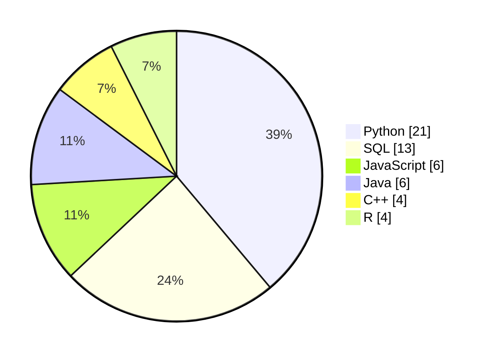
```mermaid
pie showData
    "Python" : 21
    "SQL" : 13
    "JavaScript" : 6
    "Java" : 6
    "C++" : 4
    "R" : 4
```

Upon selecting data and ML engineers who live in Algeria, we found their profiles to be the following:

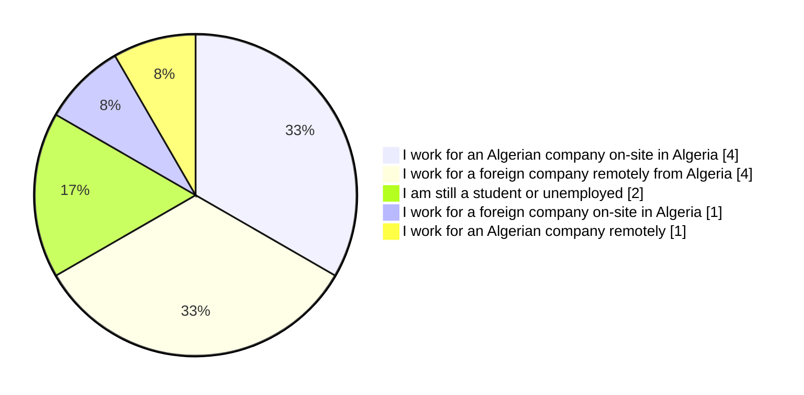
```mermaid
pie showData
    "I work for an Algerian company on-site in Algeria" : 4
    "I work for a foreign company remotely from Algeria" : 4
    "I am still a student or unemployed" : 2
    "I work for a foreign company on-site in Algeria" : 1
    "I work for an Algerian company remotely" : 1
```

Engineers who are employed in Algeria, work for companies with different sizes, from small companies with 2 - 5 employees to large companies with 1000+ employees.

We had one participant from Béchar and one from Constantine who work in AI and data fields for Algerian companies, very few participants work remotely for foreign companies or as freelancers. The majority work in Algiers for Algerian or foreign companies on-site from their offices there.

[Dzair AI](https://www.dzair.ai/) initiative did a great job collecting a list of companies who use AI and data science, the list can be found on their website. The list shows that the vast majority (if not all) of the companies are located in Algiers, the capital.
