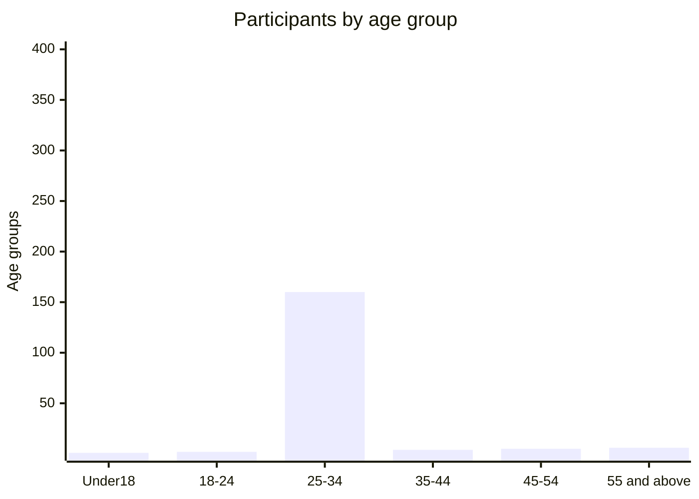
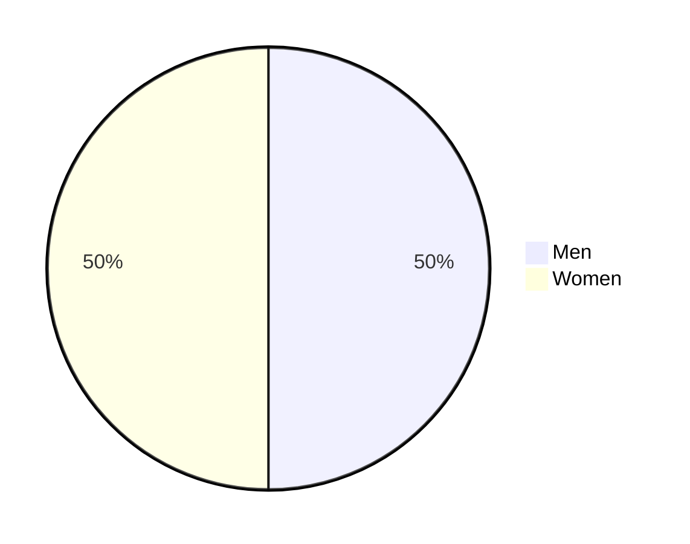
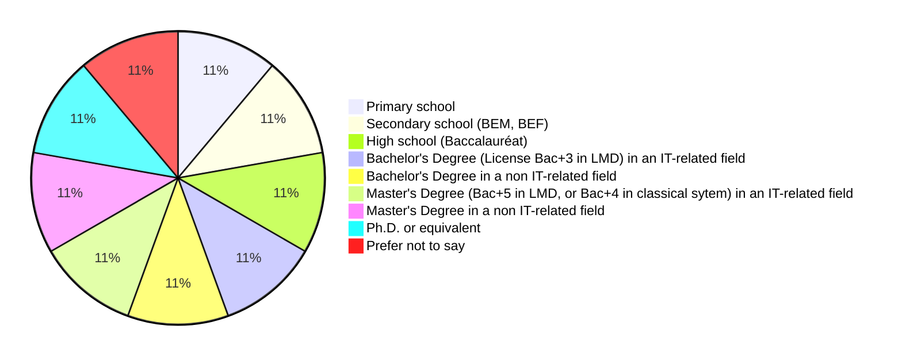
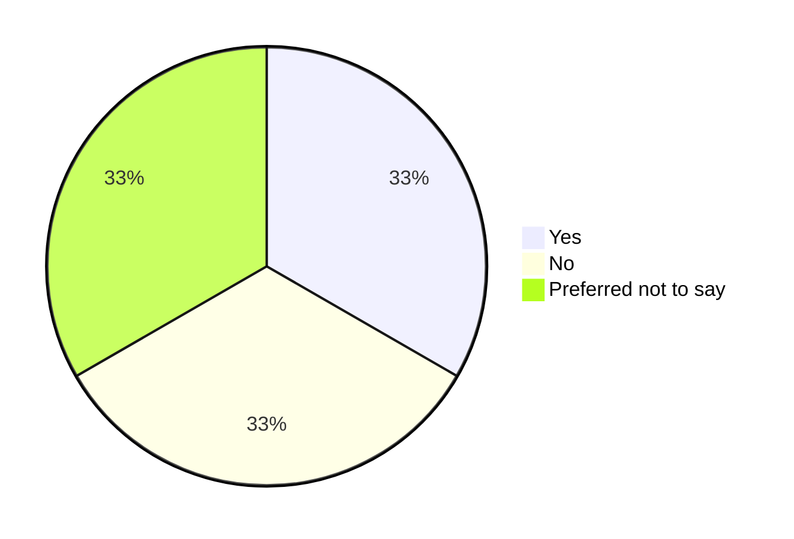
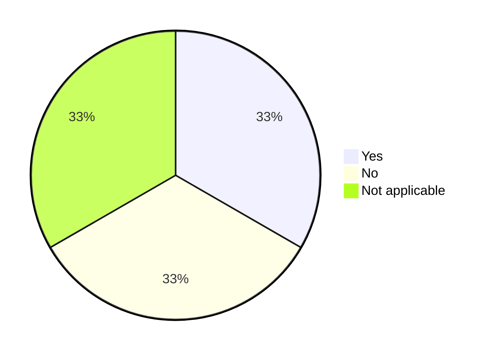

# Raw results (charts only)

* (*) Answers with "Prefer not to say" or non-meaningful free text inputs were removed* 

## Demographics (1/2)

### What is your age?

Table representation

| Under 18 | 18-24 yo | 25-34 yo | 35-44 yo | 45-54 yo | 55 yo and above |
| :------: | :------: | :------: | :------: | :------: | :-------------: |
|    0     |    0     |    0     |    0     |    0     |        0        |

### What is your gender?*

### What is your highest level of education completed?

Table representation

|                                       Label                                        | Count |
| :--------------------------------------------------------------------------------: | :---: |
|                                   Primary school                                   |   1   |
|                            Secondary school (BEM, BEF)                             |   1   |
|                             High school (Baccalauréat)                             |   1   |
|          Bachelor's Degree (License Bac+3 in LMD) in an IT-related field           |   1   |
|                    Bachelor's Degree in a non IT-related field                     |   1   |
| Master's Degree (Bac+5 in LMD, or Bac+4 in classical sytem) in an IT-related field |   1   |
|                     Master's Degree in a non IT-related field                      |   1   |
|                                Ph.D. or equivalent                                 |   1   |
|                                 Prefer not to say                                  |   1   |

###	Do you live in Algeria?

Table representation

|        Label         | Count |
| :------------------: | :---: |
|         Yes          |   1   |
|          No          |   1   |
| Preferred not to say |   1   |

## Demographics (1/2): Living abroad

### Where do you live?

<!-- TBD: datawrapper -->

### Do you you have an Algerian degree in IT fields?

Table representation

|     Label      | Count |
| :------------: | :---: |
|      Yes       |   1   |
|       No       |   1   |
| Not applicable |   1   |

###	Did you relocate to study abroad?

Table representation

|        Label         | Count |
| :------------------: | :---: |
|         Yes          |   1   |
|          No          |   1   |
| Preferred not to say |   1   |

###	Did you relocate to work abroad?

Table representation

|        Label         | Count |
| :------------------: | :---: |
|         Yes          |   1   |
|          No          |   1   |
| Preferred not to say |   1   |

## Demographics (1/2): Living in Algeria

### From where do you primarily work?

### Where do you live (Wilaya)?	

### Did you have to travel to that city (wilaya) to work in IT?

###	If you find a better opportunity to work in a different city (wilaya), would you relocate?

### In addition to your salary, what other benefits or perks do you receive in your current role?

### If you are willing to leave the country, what would be your destination (Leave it empty if not applicable)?

## Employment

###	What is your current employment status?

### Which statement is true for your case (choose more than one if you have a hybrid working model)?

###	What is your current professional level?

###	How many years of professional experience do you have in the software engineering field?

###	How many people work at your organization, including yourself?

###	What's your main role?	

### If you are working for an Algerian company, What's your average monthly salary in DZD (Algerian dinars)?

### If you are working for a foreign company from Algeria, What's your average yearly gross income in EUR?

### On a scale from 1 to 10, how satisfied are you with your current job in the software engineering field?

### What are the main challenges you face in your role as a software engineer in Algeria?

###	How did you get into the field of software engineering or technology?

## Technologies

### Which programming languages do you frequently use in your work?

###	Which database engines do you commonly work with?

### If applicable, which web hosting services do you use?	

### Which web frameworks do you use?	

### Which mobile development frameworks/languages do you use?	

### If you build Desktop applications, what technologies do you use?	

### Which e-payment solution did you use?	

### How would you describe your involvement with open source software development?

## DevOps

###	Which software development methodology you, or your organization use?	

### Which online collaboration tools you use for work?	

### Which cloud providers do you primarily use?

### Which version control systems do you primarily use for managing your software projects?	

### What tools do you use for deployment and infrastructure provisioning ?	

### Which CI/CD technology do you use?	

## Learning and staying up-to-date

### How did you acquire your IT skills in your specific field? And how did you learn to code?

###	In which language did you primarily learn and acquire your IT skills?	

### If you are involved in or aware of tech communities or meetups in Algeria, please specify the names or types of communities you are associated with or know of					